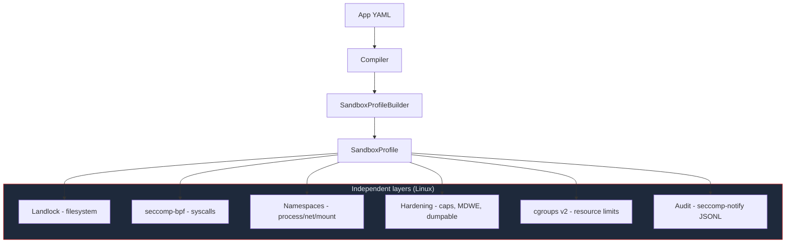
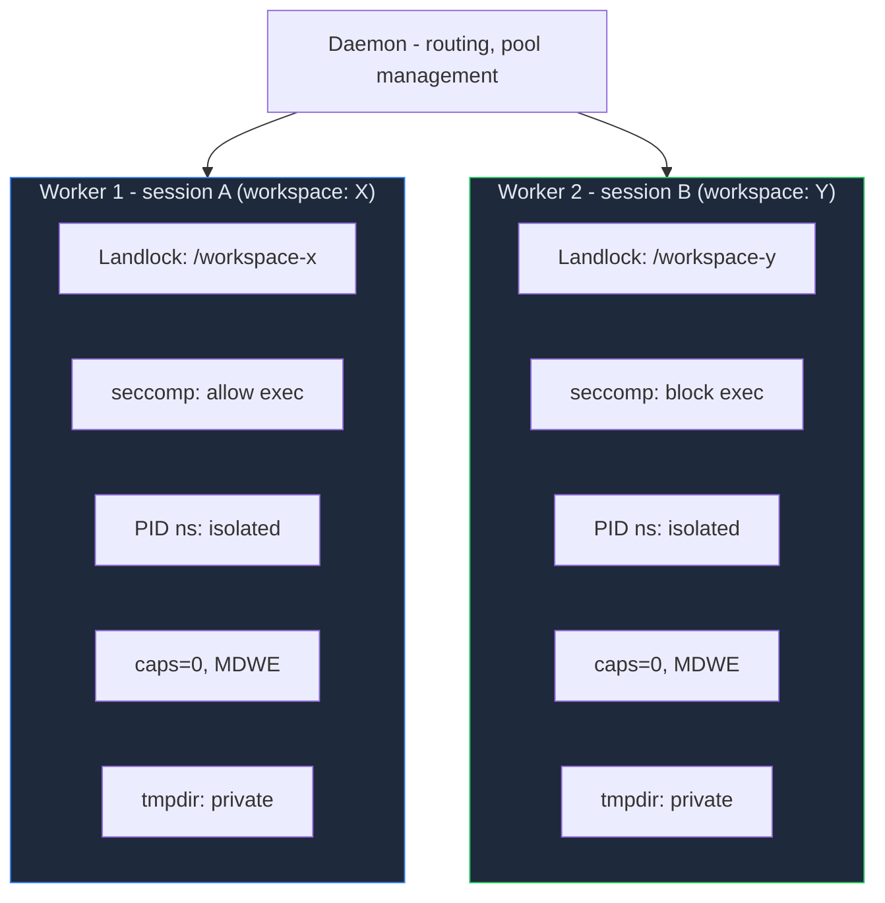
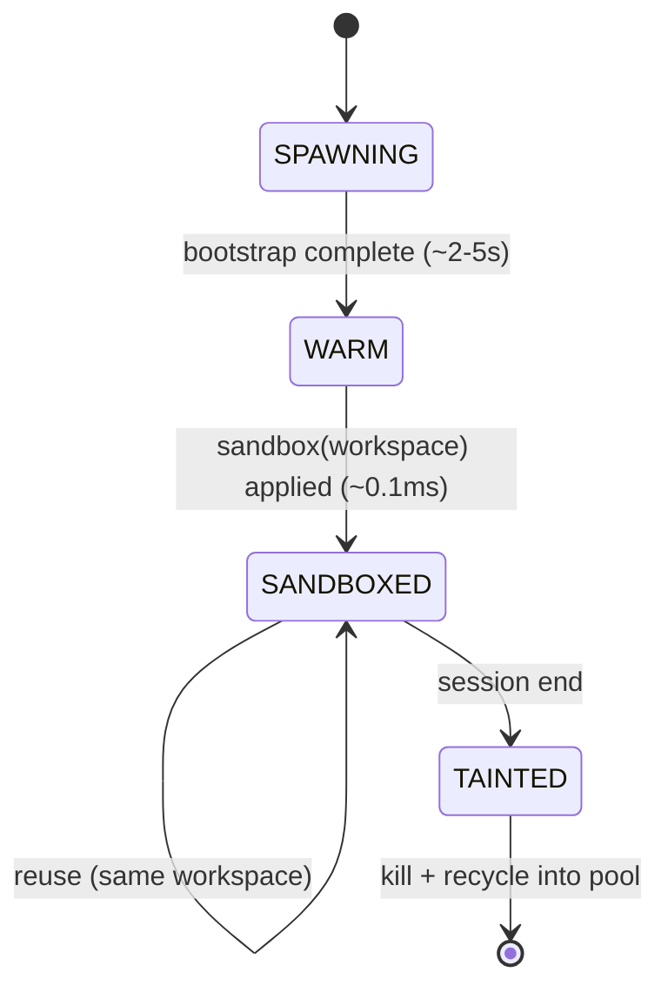

# OS-Level Sandbox

Digitorn enforces security at the **kernel level** using native
OS mechanisms (Landlock + seccomp + namespaces on Linux,
Seatbelt on macOS, Job Objects on Windows). Even if a Python
exploit lands in the agent loop, the operating system itself
blocks unauthorised filesystem reads, syscalls, and network
sockets.

The full stack lives under
 (22 files). Every claim on
this page maps to real code; entries are cited with file + line.

## Architecture



## Quick start

```yaml
runtime:
  workdir: ./my-project

security:
  sandbox:
    level: strict
    allow_paths:
      - /data/models
      - ~/datasets:rw
```

```bash
digitorn start --sandbox
```

`--sandbox` / `--no-sandbox` overrides
`server.sandbox` (, default `true`).

## Sandbox levels

`SandboxConfig.level`.

| Level | Layers added |
|-------|--------------|
| `off` | None - software-level enforcement only. |
| `standard` (default) | Landlock + seccomp + cgroups + hardening (single worker). |
| `strict` | + warm pool + user/PID namespaces + per-session Landlock. |
| `maximum` | + network namespace + seccomp-notify audit + workspace snapshot (CoW). |

### What each level adds

**`standard`** - single worker, kernel-level isolation:

- Landlock restricts the filesystem to workspace + declared paths
- seccomp blocks dangerous syscalls (mount, ptrace, reboot, ...)
- seccomp blocks `execve` / network unless the relevant module is loaded
- Process hardening: capabilities dropped, `PR_SET_NO_NEW_PRIVS`,
  `PR_SET_DUMPABLE=0`, `PR_SET_MDWE` (kernel 6.3+)
- Optional cgroups resource limits (memory, CPU, max processes)

**`strict`** adds:

- **Warm worker pool** - pre-bootstrapped workers,
  ~0.1 ms sandbox activation (Landlock = 3 syscalls)
- **User namespace** - UID isolation without root
- **PID namespace** - worker can't see host processes
- **Per-session Landlock** - each session gets its own filesystem
  boundary

**`maximum`** adds:

- **Network namespace** - loopback only, no external network
  unless `allowed_hosts` resolves IPs that get iptables `ACCEPT`s
- **seccomp-notify** - daemon intercepts syscalls in real time
- **Workspace snapshots** (`workspace_snapshot: true`) -
  copy-on-write per session (overlayfs → reflink → rsync cascade)
- **Audit trail** - append-only JSONL per session

## The 6 security layers

### 1. Landlock - filesystem

Kernel-level filesystem access control (Linux 5.13+). Once
applied, the process can never lift the restriction -
irreversible by design.

```yaml
tools:
  modules:
    filesystem:
      constraints:
        paths:
          - "{{workspace}}"
          - /data/reports

security:
  sandbox:
    allow_paths:
      - /data/models
      - /data/models:ro
      - ~/datasets:rw
```

What the kernel actually allows
(`add_system_paths`):

| Bucket | Sources |
|--------|---------|
| **Writable** | The workspace, every `:rw` entry in `allow_paths`, MCP per-server `paths.write`, `~/.digitorn/app_state/<app_id>/`, the worker's private tmpdir. |
| **Readable** | Every `:ro` entry in `allow_paths` (or no suffix), MCP per-server `paths.read`, `~/.digitorn/` (read-only - server.key, jwt.key, credentials are protected at kernel level), `/usr`, `/lib`, `/lib64`, `/bin`, `/sbin`, `/etc`, `/run/systemd/resolve`, every Python `sys.path` entry. |
| **Everything else** | EPERM at kernel level. |

Each app gets its own writable state directory at
`~/.digitorn/app_state/<app_id>/`; each worker gets its own
private tmpdir. Shared `/tmp` is **not writable** - this blocks
both cross-app data leaks and `/tmp` staging attacks.

Landlock ABI degrades gracefully based on kernel version:

| Kernel | ABI | Capabilities |
|--------|-----|--------------|
| 6.7+ | v4+ | Full FS + TCP network filtering. |
| 6.2+ | v3 | Full FS, including `LANDLOCK_ACCESS_FS_TRUNCATE`. |
| 5.19+ | v2 | FS + cross-directory rename protection. |
| 5.13+ | v1 | Basic FS access control. |
| < 5.13 | - | No Landlock; seccomp + cgroups still apply. |

### 2. seccomp-bpf - syscalls

Hand-built BPF filter - no
external dependency. Blocks dangerous syscalls at the kernel
level (Linux 3.17+). Per-arch syscall numbers for **x86_64**
and **aarch64**.

**Always blocked** (every level, every app):

| Syscall | Purpose blocked |
|---------|-----------------|
| `mount`, `umount2`, `pivot_root` | Filesystem reorganisation. |
| `reboot`, `kexec_load` | System restart, kernel injection. |
| `init_module`, `finit_module`, `delete_module` | Kernel module load/unload. |
| `ptrace` (+ `process_vm_readv`/`writev` on x86_64) | Process introspection / memory peek. |
| `swapon`, `swapoff` | Swap device manipulation. |
| `sethostname`, `setdomainname` | Identity tampering. |
| `keyctl`, `add_key`, `request_key` | Kernel keyring. |
| `iopl`, `ioperm` (x86_64 only) | Direct port I/O. |

**Conditionally blocked**:

- `execve`, `execveat` → blocked unless `tools.modules.shell`
  is present.
- `socket`, `connect`, `bind`, `listen`, `accept`, `accept4` →
  blocked unless `tools.modules.web` / `http` / `database` is
  present.

Even a Python exploit calling `os.system` will fail at the
kernel level if the YAML doesn't grant shell access.

### 3. Namespaces - process / network / mount

Linux unprivileged namespaces (kernel 5.11+). No root needed -
the user namespace is created first, which lets the others be
created without `CAP_SYS_ADMIN`.

| Namespace | Flag | Isolates |
|-----------|------|----------|
| **User** | `CLONE_NEWUSER` | UID mapping; enables every other namespace unprivileged. |
| **PID** | `CLONE_NEWPID` | Worker can't see or signal host processes. |
| **Network** | `CLONE_NEWNET` | Loopback only - no external sockets. |
| **Mount** | `CLONE_NEWNS` | Minimal filesystem view via `pivot_root`. |

Stacking order is fixed: user → PID → network → mount. Declared
via `SandboxConfig.namespaces`:

```yaml
security:
  sandbox:
    level: strict
    namespaces: [user, pid, net]   # 'mount' is optional
```

### 4. Process hardening (prctl)

Applied inside the worker before Landlock + seccomp. Each
feature is independent - if one fails (kernel too old), the
rest still apply.

| Feature | Source | Blocks |
|---------|--------|--------|
| `PR_SET_NO_NEW_PRIVS` | | Privilege escalation via setuid binaries. |
| `PR_SET_DUMPABLE=0` | | Core dumps + `/proc/self/mem` reads. |
| `PR_CAP_BSET_DROP` (all 41 caps) | | Capability abuse even if euid=0 is regained. |
| `PR_SET_MDWE` (kernel 6.3+) | | `mmap(PROT_WRITE+PROT_EXEC)` - JIT exploitation. |

Each is gated by an independent flag on the profile
(: `hardening_drop_caps`, `hardening_no_dumpable`,
`hardening_mdwe`, all default `True`).

### 5. cgroups v2 - resource limits

Optional resource caps via systemd user scopes
(`SandboxConfig.resources`,):

```yaml
security:
  sandbox:
    resources:
      memory: 512MB     # parsed by _parse_bytes
      cpu: 2            # cores → cpu_percent = 200
      processes: 20     # max PIDs (default 10)
```

Mapped on the profile by `_apply_resource_limits`
(): `memory_limit`, `cpu_percent`,
`max_processes`.

### 6. Audit trail

Per-session append-only JSONL log
(`SandboxConfig.audit`,).

```yaml
security:
  sandbox:
    level: maximum
    audit: true
```

Events recorded: sandbox applied, namespace created, hardening
applied, syscall intercepted (from seccomp-notify), session
start / end. Stored under
`~/.digitorn/audit/<app_id>/<session_id>.jsonl`.

## Warm worker pool

`strict` and `maximum` levels run a pool of pre-bootstrapped
workers. When a session starts, a warm
worker is assigned and the per-session sandbox is applied in
~0.1 ms (Landlock is 3 syscalls).



### Worker state machine



Bootstrap is expensive (~2-5 s); Landlock is cheap. Workers sit
warm in the pool, sandbox is applied instantly when the
session's workspace is known.

### Pool configuration

`SandboxConfig` defaults:

| Field | Default | Bounds |
|-------|---------|--------|
| `pool_size` | `2` | `[1, 32]` |
| `pool_max` | `8` | `[1, 64]` |
| `session_timeout` | `3600` (1 h) | `>= 60` |
| `idle_timeout` | `300` (5 min) | `>= 30` |

```yaml
security:
  sandbox:
    level: strict
    pool_size: 4        # bumped from default 2
    pool_max: 16        # bumped from default 8
    session_timeout: 3600
    idle_timeout: 300
```

**Workspace affinity**: a sandboxed worker servicing workspace
X is reused across sessions targeting the same workspace.
Workers recycle (kill + respawn) only when the last session
on that workspace disconnects.

## Per-session isolation

With `strict` or `maximum`, each session gets:

- Its own Landlock - session A cannot read session B's
  workspace.
- Its own PID namespace - session A cannot see session B's
  processes.
- Its own network namespace (`maximum`) - separate loopback.
- Its own audit log (when `audit: true`).

### Workspace snapshots (maximum + workspace_snapshot)

```yaml
security:
  sandbox:
    level: maximum
    workspace_snapshot: true
```

Strategy cascade (, tried in order):

1. **overlayfs** in user namespace (kernel 5.11+) - zero-copy,
   instant.
2. **`cp --reflink=auto`** (btrfs / xfs) - CoW at block level.
3. **rsync** - fallback, full copy.

On session end the changes can be committed back to the source
workspace or discarded.

## `allow_paths` syntax

`SandboxConfig.allow_paths`. Each entry:

| Syntax | Landlock effect |
|--------|-----------------|
| `/path` | Readable. |
| `/path:ro` | Readable (explicit). |
| `/path:rw` | Writable (implies readable). |

Supports `~` for home directory and is resolved to absolute paths.
Combined with the workspace (always writable), system paths
(Python runtime, libs), `~/.digitorn/` (read-only), and the
worker's private tmpdir.

## YAML-driven inference

The sandbox builder reads what the app declares and translates
it into the corresponding kernel flags
(`_apply_granted_permissions`):

| YAML | → Profile field | → Kernel effect |
|------|------------------|-----------------|
| `tools.modules.filesystem` (`constraints.paths: [...]`) | `writable_paths`, `readable_paths` | Landlock paths. |
| `tools.modules.shell` granted | `allow_exec = True` | seccomp `execve` allowed. |
| `tools.modules.web/http/database` granted | `allow_network = True` | seccomp `socket`/`connect` allowed. |
| `tools.capabilities.grant: [...]` with `process.spawn_daemon` | `allow_fork = True` | seccomp `fork`/`clone` allowed. |
| `egress.allowed_domains` (`web` config) | `allowed_hosts` | iptables OUTPUT rules in net namespace. |

### Network filtering (iptables)

When `allowed_hosts` is non-empty AND the worker runs in a
network namespace (`strict` / `maximum`), Digitorn enforces
host-level filtering at the OS level:

1. Hostnames are pre-resolved to IPs (IPv4 + IPv6) before the
   sandbox is applied.
2. iptables OUTPUT chain rules are installed in the namespace:

```
iptables -A OUTPUT -o lo -j ACCEPT
iptables -A OUTPUT -m state --state ESTABLISHED,RELATED -j ACCEPT
iptables -A OUTPUT -d 140.82.121.6   -j ACCEPT   # api.github.com
iptables -A OUTPUT -d 151.101.128.223 -j ACCEPT  # pypi.org
iptables -A OUTPUT -j DROP                       # everything else
```

Even if the Python process is fully compromised, the kernel
drops packets to non-allowed IPs. If iptables is not
available (missing capabilities, container that disallows it),
the system falls back to application-level enforcement with a
warning logged.

## MCP servers - deny by default

Every MCP server must declare its sandbox permissions
explicitly. A server without a `sandbox:` block has **no
OS-level rights** and the compiler refuses to ship it.

```yaml
tools:
  modules:
    mcp:
      config:
        servers:
          github:
            transport: stdio
            command: npx -y @modelcontextprotocol/server-github
            sandbox:
              permissions: [process.exec, net.http, fs.read]
              paths:
                read: ["{{workspace}}"]
              allowed_hosts: [api.github.com]

          docs_search:
            transport: stdio
            command: python -m docs_mcp_server
            sandbox:
              permissions: [process.exec, fs.read]
              paths:
                read: ["{{workspace}}/docs"]
```

### Permission categories

`_apply_module_sandbox`:

| Permission | What it grants | Required for |
|------------|----------------|--------------|
| `fs.read` (or `fs.list`) | Adds `paths.read[*]` to `readable_paths`. | Reading external files. |
| `fs.write` (or `fs.delete`) | Adds `paths.write[*]` to `writable_paths`. | Writing / deleting external files. |
| `process.exec` (or `process.spawn_daemon`) | `allow_exec = True`, `allow_fork = True`. | stdio transport (subprocess). |
| `net.http` (or `net.socket`, `net.listen`) | `allow_network = True`, merges `allowed_hosts`. | SSE / HTTP transport, outbound HTTP. |

Wildcards (`process.*`, `net.*`, `fs.*`) are also recognised by
`_apply_granted_permissions`.

### Transport-aware validation

 The compiler warns when a server's
permissions don't match its transport:

- **stdio** transport without `process.exec` (or `process.*`)
  → warning (the subprocess will fail to launch).
- **sse** / **http** transport without `net.http` (or `net.*`)
  → warning (no network = no connection).

### Typical declarations by server type

```yaml
# Local file processor (stdio, reads workspace)
sandbox:
  permissions: [process.exec, fs.read]
  paths:
    read: ["{{workspace}}"]

# API client (stdio, needs network)
sandbox:
  permissions: [process.exec, net.http]
  allowed_hosts: [api.example.com]

# Remote MCP server (HTTP/SSE - no subprocess)
sandbox:
  permissions: [net.http]
  allowed_hosts: [mcp.example.com]

# Full access - only for trusted servers
sandbox:
  permissions: [process.exec, net.http, fs.read, fs.write]
  paths:
    read:  ["{{workspace}}"]
    write: ["{{workspace}}"]
```

## Platform support

### Linux - full stack

 All six layers, all unprivileged. Most
complete isolation.

| Mechanism | Kernel |
|-----------|--------|
| Landlock | 5.13+ |
| seccomp-bpf | 3.17+ |
| Namespaces (user/PID/net/mount) | 5.11+ unprivileged |
| Hardening (caps, dumpable, NO_NEW_PRIVS) | always |
| MDWE | 6.3+ |
| cgroups v2 | 4.15+ |
| seccomp-notify audit | 5.9+ |

### macOS - partial

 Seatbelt (`sandbox-exec`) +
`setrlimit(2)`. Provides filesystem + network + process
restrictions and memory / process-count caps.

### Windows - partial

 Job Objects (memory limits, process
count, kill-on-exit). The Job-Object install at daemon startup
also doubles as a no-orphans mechanism (see
) - the
runtime attaches the daemon to a job with
`JOB_OBJECT_LIMIT_KILL_ON_JOB_CLOSE` so every child process
dies when the daemon exits, regardless of cause.

### Unsupported platforms

 The sandbox logs a warning and falls back
to software-level enforcement (the security gates +
module-level constraints from `tools.modules.<id>.constraints`).
No crash.

## Full configuration reference

```yaml
runtime:
  workdir: ./project

security:
  sandbox:
    level: strict                    # off | standard | strict | maximum
    pool_size: 4                     # default 2, bounds [1, 32]
    pool_max: 16                     # default 8, bounds [1, 64]
    namespaces: [user, pid, net]     # subset of user/pid/net/mount
    workspace_snapshot: false        # CoW per session (maximum only)
    audit: false                     # JSONL trail per session
    session_timeout: 3600            # seconds, default 3600
    idle_timeout: 300                # seconds, default 300
    allow_paths:
      - /data/models                 # read-only
      - /data/models:ro              # explicit read-only
      - ~/datasets:rw                # read-write
    resources:
      memory: 512MB                  # parsed by _parse_bytes
      cpu: 2                         # cores → cpu_percent
      processes: 20                  # max PIDs (default 10)
```

## Performance

| Operation | Latency | Notes |
|-----------|---------|-------|
| App deploy (pool warm-up) | ~2-5 s × `pool_size` (parallel) | One-time. |
| Session start (warm pool) | **~0.1 ms** | Landlock = 3 syscalls. |
| Session start (pool empty) | ~2-5 s | Must bootstrap a new worker. |
| Per chat request | ~50-200 ms | LLM-dominated. |
| Session end + recycle | ~10 ms kill, async respawn | Invisible to user. |
| Memory per worker | ~30-80 MB | Comparable to a Python process. |

## Error handling

When the OS sandbox blocks an operation, the agent gets a
clear error:

```json
{
  "success": false,
  "error": "OS sandbox blocked 'filesystem.read': [Errno 13] Permission denied. The app YAML does not grant sufficient permissions for this operation."
}
```

The agent can adjust its plan. No traceback, no crash.

## Zero dependencies

Pure standard library:

- `ctypes` for Linux syscalls (Landlock, seccomp, prctl,
  `unshare`).
- `subprocess` for macOS `sandbox-exec`.
- `ctypes.windll` for Windows Job Objects.
- `resource` for `setrlimit`.

No `pip install` needed - works as soon as the daemon starts.

## Cross-references

- Security gate (the in-process pre-tool check that runs even
  when the OS sandbox is off): [Security](11-security.md)
- App-config block reference (`security` block + every field):
  [App Configuration → security](02-app-config.md#security---runtime-boundaries)
- MCP module + per-server permission grammar:
  [modules/reference/mcp.md](../reference/modules/mcp.md)
- Production deployment checklist:
  [Production Deployment](36-production.md)
- Credentials master key + KMS modes (master key sits inside
  `~/.digitorn/`, which the sandbox makes read-only):
  [credentials.md](../reference/runtime/credentials.md)
