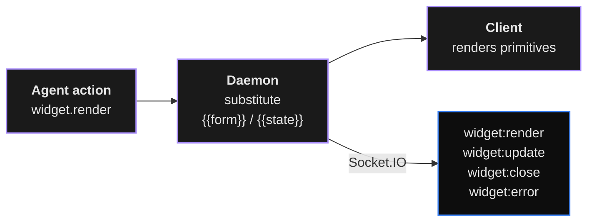

# Widgets - Declarative UI v1

Any Digitorn app can expose dynamic UIs rendered by the
chat client / web client **without writing a single line of
frontend code**. The agent declares trees of typed primitives;
the daemon validates them, substitutes templates server-side,
and pushes them to the client over Socket.IO.

Three layers, each verified in code:

- **Schema** - `ui.widgets:` (`WidgetsConfig`,
  `schema.py`, `extra: forbid`).
- **Module** - 7 agent-side actions in - **REST API** - `apps_v2/widgets.py` (data resolver, action
  dispatcher, file upload, stream bridge).

Closed sets verified at `schema.py`:

| Set | Count |
|-----|-------|
| `WIDGET_PRIMITIVES` | **43** |
| `WIDGET_ACTIONS` | **15** |
| `WIDGET_ACCENTS` | 6 |
| `WIDGET_COLORS` | 9 |
| `WIDGET_DENSITIES` | 3 |
| `WIDGET_FILTERS` | ~25 |

## 1 · Architecture



The daemon:

1. Parses `ui.widgets:` from `app.yaml` + every
   `widgets/*.yaml` file at compile time and validates the
   tree.
2. Serves the compiled tree through the widgets surface.
3. Resolves per-binding data sources (HTTP / tool / static /
   local / stream).
4. Dispatches user actions through the widget-action
   endpoint.
5. Pushes live `widget:render` / `widget:update` /
   `widget:close` / `widget:error` events on the **session
   Socket.IO room** (`module.py`,
   `events/envelope.py`).
6. Substitutes `{{form.X}}` / `{{state.X}}` / `{{ctx.X}}` /
   `{{item.X}}` server-side **before** emitting events
   (`module.py`).

## 2 · Versioning

```yaml
ui:
  widgets:
    version: 1
```

The daemon **rejects** any unknown version at compile time
(`schema.py`). Today only `1` is recognised.

## 3 · Bundle directory - `widgets/`

```
my-app/
  app.yaml                # declares ui.widgets: (optional)
  prompts/
  skills/
  widgets/                # one widget per file (optional)
    confirm_delete.yaml
    booking_modal.yaml
    source_search.yaml
```

Each file in `widgets/` is auto-loaded at compile time and
merged into `ui.widgets.inline` keyed by **file stem** (so
`confirm_delete.yaml` becomes `inline.confirm_delete`,
referenceable by the agent via
`widget.render(ref="confirm_delete")`).

Each file is one of:

```yaml
# Form 1 - full InlineWidget shape
data: {}
tree:
  type: confirm
  text: "Delete?"
```

```yaml
# Form 2 - bare tree node, auto-wrapped
type: confirm
text: "Delete?"
```

**Collision rule**: an external file with the same name as an
`inline.<key>` declared in `app.yaml` fails compilation.

## 4 · Zones

The client renders widgets in 4 zones:

| Zone | Where | YAML key | Visibility |
|------|-------|----------|------------|
| **Z1 `inline`** | Chat bubble in the message stream. | `widgets.inline.<name>` | Pushed per turn via `widget.render(zone="inline")`. |
| **Z2 `chat_side`** | Side panel next to the chat. | `widgets.chat_side` | Always visible when the block exists. |
| **Z3 `workspace`** | Workspace tab container. | `widgets.workspace_tabs[]` | Always visible when non-empty. |
| **Z4 `modal`** | Pop-up dialog. | `widgets.modals.<name>` | Pushed via action `open_modal`. |

Responsive rules:

- Below 980 px width, Z2 collapses into a popover accessible
  from a chat header button.
- Z1 widgets are **never** hidden - they're part of the chat
  history.
- Z3 is a sub-tabbed container: one outer "Widgets" tab, then
  one inner tab per entry.
- Z4 is not persistent - modals dismiss on close.

## 5 · `ui.widgets:` block

`WidgetsConfig` (`schema.py`):

```yaml
ui:
  widgets:
    version: 1

    # Z2 - optional
    chat_side:
      title: Sources
      icon: library_books        # material icon (closed set)
      collapsible: true
      default_open: true
      accent: blue               # blue|purple|green|orange|red|cyan
      density: normal            # compact|normal|roomy
      width: 300                 # 260..420 (validated)
      data: { ... }              # named data sources
      tree: { ... }              # widget tree

    # Z3 - optional list
    workspace_tabs:
      - id: dashboard
        title: Dashboard
        icon: dashboard
        accent: blue
        data: { ... }
        tree: { ... }

    # Z4 - optional dict
    modals:
      booking:
        title: New booking
        width: 640               # 420|560|640|720|"full"
        dismissible: true
        tree: { ... }

    # Z1 - optional dict, referenceable via ref:
    inline:
      confirm_delete:
        data: { ... }
        tree: { ... }
```

## 6 · Universal node fields

`WidgetNode` (`schema.py`, `extra: allow`,
`populate_by_name: true`). Every node accepts:

| Field | Purpose |
|-------|---------|
| `type` | **Required** - primitive name (must be in `WIDGET_PRIMITIVES`). |
| `id` | Optional, addressable for `set_state` / updates. |
| `when` | Conditional render expression. |
| `for` | Loop expression (collection). |
| `as` | Loop alias (default `item`). |
| `key` | Loop stability key. |
| `accent` | Override accent for this sub-tree. |
| `density` | Override density. |
| `hidden` | Static alias for `when: false`. |
| `data` | Local data sources scoped to this sub-tree. |

`when:` and `for:` are evaluated **client-side** (chat client
holds the live form / state / loop scope); the daemon
validates structure but doesn't execute the predicate.

## 7 · The 43 primitives

By category. Field details below - exhaustive validation
against `WIDGET_PRIMITIVES` happens at compile time
(`compiler.py`).

### 7.1 Layout (9)

`column`, `row`, `card`, `section`, `tabs`, `split`, `grid`,
`spacer`, `divider`.

```yaml
- type: column
  gap: 12
  align: start            # cross-axis: start|center|end|stretch
  main_align: start       # main-axis:  start|center|end|space_between|space_around
  padding: 16             # int OR [v,h] OR [t,r,b,l]
  scrollable: false
  children: [ ... ]

- type: card
  title: "Section"
  subtitle: "..."
  icon: info_outline
  elevation: 0            # 0|1|2
  action: { ... }         # whole card clickable
  children: [ ... ]

- type: split
  direction: horizontal   # horizontal|vertical
  ratio: 0.4
  first:  { ... }
  second: { ... }

- type: grid
  columns: 3              # int OR responsive {sm: 1, md: 2, lg: 3}
  gap: 12
  children: [ ... ]
```

### 7.2 Content (4)

`markdown`, `text`, `image`, `icon`.

```yaml
- type: markdown
  text: |
    ## Hello {{user.name}}
    You have **{{count}}** pending tickets.
  # OR
  source:
    type: http
    url: /docs/readme.md

- type: text
  text: "{{item.title}}"
  variant: body           # display|headline|title|body|caption|code
  weight: bold            # regular|medium|semibold|bold
  color: muted            # text|bright|muted|dim|accent|error|success|warning|info
  max_lines: 2
  selectable: true

- type: image
  src: "{{item.thumbnail}}"
  alt: "..."
  fit: cover              # cover|contain|fill
  radius: 8

- type: icon
  name: check_circle      # material icon (closed set)
  size: 20
  color: success
```

### 7.3 Data display (7)

`list`, `table`, `chart`, `stat`, `timeline`, `tree`,
`kanban`.

```yaml
- type: list
  items: "{{sources}}"
  empty:
    type: empty_state
    icon: inbox
    title: "No sources yet"
  loading:
    type: skeleton
    lines: 3
  item:
    type: card
    icon: "{{item.kind | source_icon}}"
    title: "{{item.title}}"
    subtitle: "{{item.url | truncate(60)}}"
    action:
      action: chat
      template: "Use source {{item.id}}"
  group_by: "{{item.type}}"
  search: { placeholder: "Search…", keys: [title, url, tags] }

- type: table
  rows: "{{tickets}}"
  columns:
    - { key: id,    label: "#",    width: 60, align: end }
    - { key: title, label: Title,  flex: 2 }
    - key: status
      label: Status
      render:                     # custom cell - sub-tree
        type: badge
        label: "{{row.status}}"
        color: "{{row.status | status_color}}"
  sortable: true
  selectable: false               # false|single|multi
  pagination: true
  page_size: 20
  row_action:
    action: chat
    template: "Open ticket {{row.id}}"

- type: chart
  kind: line                      # line|bar|area|pie|donut|scatter|gauge
  data: "{{metrics}}"
  x: timestamp
  series:
    - { y: p50, label: "p50 (ms)", color: blue }
    - { y: p95, label: "p95 (ms)", color: orange }
  legend: true
  height: 240
  x_format: "HH:mm"

- type: stat
  label: Active users
  value: "{{users | length}}"
  delta: "+12%"
  trend: up                       # up|down|flat
  icon: trending_up
  color: success

- type: timeline
  items: "{{events}}"
  item:
    title: "{{item.title}}"
    subtitle: "{{item.at | relative_time}}"
    icon: "{{item.icon}}"

- type: tree
  roots: "{{files}}"
  children_key: children
  label: "{{node.name}}"
  default_expanded: 1
  on_select:
    action: chat
    template: "Open {{node.path}}"

- type: kanban
  columns:
    - { id: todo,  title: "To do",       items: "{{tickets | filter('status','todo')}}"  }
    - { id: doing, title: "In progress", items: "{{tickets | filter('status','doing')}}" }
    - { id: done,  title: "Done",        items: "{{tickets | filter('status','done')}}"  }
  card:
    title: "{{item.title}}"
    subtitle: "{{item.assignee}}"
  on_move:
    action: tool
    tool: update_ticket
    args: { id: "{{item.id}}", status: "{{to}}" }
```

### 7.4 Input (14) - live inside a `form` ancestor

`form`, `text_input`, `textarea`, `select`, `multi_select`,
`radio`, `checkbox`, `switch`, `slider`, `date`, `time`,
`datetime`, `file_upload`, `code_editor`.

```yaml
- type: form
  id: booking_form
  initial: { topic: "", duration: 30 }   # optional defaults
  children: [ ... ]
  submit:
    label: Book
    loading_label: "Booking…"
    icon: check
    disabled: "{{!form.valid}}"
    action: { action: tool, tool: create_meeting, args: { ... } }
  reset: { label: Reset }                # optional
  on_success:
    action: set_state
    set: { booked: true }
  on_error:
    action: alert
    kind: error
    text: "{{error.message}}"

- type: text_input
  name: email                            # → form.email
  label: Email
  placeholder: you@example.com
  required: true
  type_hint: email                       # text|email|url|password|tel|number
  prefix_icon: mail
  validation:
    regex: "^[^@]+@[^@]+$"
    message: Invalid email
    min: 3
    max: 120

- type: textarea
  name: notes
  rows: 4
  max_chars: 500
  auto_resize: true

- type: select
  name: priority
  label: Priority
  # Static
  options:
    - { value: low,  label: Low  }
    - { value: med,  label: Medium }
    - { value: high, label: High }
  # OR dynamic
  options_from: "{{priorities}}"
  option_label: "{{item.name}}"
  option_value: "{{item.id}}"
  searchable: true                       # combobox when > N options

- type: multi_select
  name: tags
  options_from: "{{tags}}"
  max: 5

- type: radio
  name: billing
  layout: vertical                       # vertical|horizontal
  options:
    - { value: month, label: Monthly }
    - { value: year,  label: "Yearly (-20%)" }

- type: checkbox
  name: terms
  label: I agree to the terms
  required: true

- type: switch
  name: notifications
  default: true

- type: slider
  name: temperature
  min: 0
  max: 2
  step: 0.1
  default: 0.7
  marks: [0, 0.5, 1, 1.5, 2]

- type: date
  name: start
  min: "{{today}}"
  max: "{{today | plus_days(90)}}"
  format: "YYYY-MM-DD"

- type: file_upload
  name: attachments
  accept: [".pdf", ".png", ".jpg"]
  multiple: true
  max_size_mb: 10
  upload_to:                             # optional
    url: /rag/upload
    field: file
  # If omitted, falls back to the daemon's built-in
  # widget upload endpoint (see §13).

- type: code_editor
  name: query
  language: sql                          # sql|js|python|yaml|json|markdown|http
  min_lines: 4
  max_lines: 20
  line_numbers: true
```

### 7.5 Action (4)

`button`, `icon_button`, `link`, `confirm`.

```yaml
- type: button
  label: Submit
  icon: check
  variant: primary                       # primary|secondary|ghost|destructive|link
  size: md                               # sm|md|lg
  full_width: false
  loading: "{{busy}}"
  disabled: "{{!form.valid}}"
  action: { ... }

- type: icon_button
  icon: delete
  tooltip: Delete
  variant: ghost
  action:
    action: confirm
    text: "Delete {{item.name}}?"
    destructive: true
    then:
      action: tool
      tool: delete_item
      args: { id: "{{item.id}}" }

- type: link
  label: Open docs
  href: "https://example.com/docs"
  external: true

- type: confirm                          # inline confirmation card
  text: "Delete {{row.name}}? This cannot be undone."
  confirm_label: Delete
  destructive: true
  confirm_action: { ... }
  cancel_action:  { action: close }
```

### 7.6 Feedback (5)

`alert`, `badge`, `progress`, `skeleton`, `empty_state`.

```yaml
- type: alert
  kind: warning                          # info|warning|error|success
  title: Quota almost full
  text: "You've used {{quota.pct | percent}} of your budget."
  dismissible: true
  action:
    label: Upgrade
    action: open_url
    url: "https://…"

- type: badge
  label: "{{row.status}}"
  color: success                         # WIDGET_COLORS
  variant: soft                          # solid|soft|outline
  icon: check

- type: progress
  value: 0.42                            # 0..1 OR "indeterminate"
  label: "Indexing…"
  show_value: true
  kind: bar                              # bar|circle

- type: skeleton
  lines: 3
  width: 100%

- type: empty_state
  icon: inbox
  title: No sources yet
  subtitle: "Drop a file or URL to get started."
  action:
    label: Add source
    action: open_modal
    modal: add_source
```

## 8 · The 15 actions

Every widget action is dispatched through the widget-action
endpoint.

| Action | Purpose |
|--------|---------|
| `chat` | Inject a user message into the conversation. |
| `tool` | Invoke an agent tool. |
| `http` | App-scoped HTTP call. |
| `open_url` | Open an external URL. |
| `open_workspace` | Push to Z3 (existing or ephemeral tab). |
| `open_modal` | Open a Z4 modal. |
| `close` | Close the modal / unmount inline. |
| `set_state` | Mutate widget state. |
| `refresh` | Re-fetch a binding. |
| `copy` | Copy text + optional toast. |
| `download` | Download a URL with optional filename. |
| `navigate` | Navigate to another app / tab. |
| `confirm` | Wrap a destructive action with confirmation. |
| `sequence` | Run multiple actions in order. |
| `alert` | Show a toast. |

```yaml
# chat - inject a message
action: chat
template: "Use source {{item.id}}"
silent: false                            # if true, not shown in history
context:
  source_id: "{{item.id}}"

# tool - invoke a tool. If args: is omitted, body.form is auto-merged
action: tool
tool: create_meeting
args:
  when:  "{{form.date}}"
  topic: "{{form.topic}}"
on_success: { action: alert, kind: success, text: "Booked." }
on_error:   { action: alert, kind: error,   text: "{{error.message}}" }

# http - app-scoped HTTP call
action: http
method: POST
url: /rag/sources
body:  { url: "{{form.url}}" }
then_refresh: [sources]                  # re-fetch bindings after success

# open_workspace - push to Z3
action: open_workspace
tab_id: dashboard                        # existing tab id
# OR ephemeral
ephemeral:
  id: "src_{{item.id}}"
  title: "{{item.title}}"
  tree: { ... }                          # or ref: source_details
  ctx:  { source: "{{item}}" }

# open_modal - open a Z4
action: open_modal
modal: booking
ctx: { default_date: "{{today}}" }

# set_state - mutate widget state
action: set_state
set:
  filter: active
  selected_id: "{{item.id}}"
scope: widget                            # widget|global

# refresh - re-fetch bindings
action: refresh
bindings: [sources, tickets]             # or "all"

# sequence - chain actions
action: sequence
steps:
  - { action: tool, tool: save, args: { ... } }
  - { action: refresh, bindings: [items] }
  - { action: close }
stop_on_error: true                      # default true

# confirm - wrap a destructive action
action: confirm
text: "Delete this source?"
destructive: true
then:
  action: tool
  tool: delete
  args: { id: "{{item.id}}" }
```

## 9 · Expression language

Daemon evaluates these **server-side** when rendering / patching
trees (`module.py`). the chat client evaluates the same grammar
locally for `when:` / `for:` / live form substitution.

### Scopes

| Scope | Contents | Mutable |
|-------|----------|---------|
| `form.*` | Form-input values keyed by `name:` | yes |
| `form.valid / dirty / errors.<name>` | Form meta | no |
| `state.*` | Widget-local state | yes (via `set_state`) |
| `data.*` | Resolved data-source values | yes (via `refresh`) |
| `data.<k>.loading / .error / .stale` | Data meta | no |
| `row.*` / `item.*` | Loop scope | no |
| `index` / `first` / `last` | Loop meta | no |
| `ctx.*` | Context passed by the agent at render time | no |
| `session.*` | `user`, `session_id`, `app_id`, `turn_id` | no |
| `app.*` | `app.id`, `app.name`, `app.config.*` | no |
| `today` / `now` | Current date / time | no |

### Syntax

```
{{var}}                       lookup
{{a.b.c}}                     dotted path
{{list[0]}}                   index
{{form.email}}
{{count > 0}}                 comparison
{{status == "ok"}}
{{items is empty}}
{{items is not empty}}
{{!loading}}                  negation
{{a && b}}   {{a || b}}       logic
{{x | filter1 | filter2}}     pipeline
{{name | default('-')}}       filter with arg
{{a ? "yes" : "no"}}          ternary
```

No loops, no `if`/`else` inside expressions - those live at
the node level via `when:` / `for:`.

### Built-in filters

`WIDGET_FILTERS` (`schema.py`). Closed set, validated at
compile time (`compiler.py`):

| Filter | Example |
|--------|---------|
| `upper`, `lower`, `title` | `{{x \| upper}}` |
| `truncate(n)` | `{{x \| truncate(40)}}` |
| `default(v)` | `{{x \| default('-')}}` |
| `length` | `{{items \| length}}` |
| `date(fmt)` | `{{t \| date('YYYY-MM-DD')}}` |
| `relative_time` | `{{t \| relative_time}}` → `"2h ago"` |
| `money(cur)` | `{{n \| money('EUR')}}` |
| `number(p)`, `percent` | `{{n \| number(2)}}` / `{{n \| percent}}` |
| `json` | `{{obj \| json}}` |
| `filter(k,v)`, `map(k)`, `pluck(k)`, `join(sep)` | `{{items \| filter('status','ok')}}` |
| `first`, `last`, `sort(k)`, `reverse`, `slice(a,b)` | `{{l \| sort('at')}}` |
| `replace(a,b)`, `markdown` | `{{s \| replace('_',' ')}}` |
| `plus_days(n)`, `minus_days(n)` | `{{today \| plus_days(7)}}` |
| `filter_search`, `source_icon`, `tree_icon`, `kind_color`, `status_color`, `sev_color` | Aliases / safe extensions |

Unknown filters raise a compile-time error.

## 10 · Data sources

Under `data:` (at `chat_side` / `workspace_tab` / `modal` /
`inline` level). Five types:

```yaml
data:
  # 10.1 HTTP
  sources:
    type: http
    method: GET
    url: /rag/sources                  # relative to the daemon
    headers: { Accept: application/json }
    query: { limit: 50, filter: "{{state.filter}}" }
    body: { ... }                       # for POST
    poll: 5s                            # refetch every 5s (0 = off)
    cache: 30s
    debounce: 300ms
    transform: "{{response.data.sources}}"
    when: "{{state.filter != null}}"

  # 10.2 Tool - invokes the action registry
  summary:
    type: tool
    tool: summarize_docs
    args: { ids: "{{state.selected}}" }
    auto: true                          # fetch at mount

  # 10.3 Static
  priorities:
    type: static
    value:
      - { id: low,  name: Low }
      - { id: med,  name: Medium }
      - { id: high, name: High }

  # 10.4 Stream - auto-detects SSE pass-through OR HTTP poll
  live_metrics:
    type: stream
    url: /metrics/live
    reducer: append                     # replace|append|merge
    limit: 500
    poll: 5s                            # used for non-SSE upstreams
    when: "{{state.follow}}"

  # 10.5 Local - SharedPreferences (client-side only)
  cart:
    type: local
    key: cart.v1
    default: []
```

The stream binding's bridge is implemented at
`apps_v2/widgets.py`
(`GET /widgets/data/{binding}/stream`).

## 11 · State model

### Form state

- Collected automatically by the nearest `form` ancestor.
- Each input with a `name:` becomes `form.<name>`.
- `form.valid` / `form.dirty` / `form.errors.<name>` are
  auto-filled.
- Validation re-run by the daemon on every action POST
  (`apps_v2/widgets.py`): `required`, `regex` + `message`,
  `min` / `max` (string length OR numeric range OR list size),
  `type_hint` (email / url / number / tel),
  `multi_select.max`, `checkbox.required` truthiness.

### Widget state - `state.*`

- Mutated via `action: set_state` or
  `widget.set_state` (agent-side, `module.py`).
- `scope: widget` (default) - reset on unmount.
- `scope: global` - persisted client-side per `appId`
  (SharedPreferences `widget.state.<appId>`).

### Loop scope

- Inside a node with `for:`, the current item is bound to the
  alias from `as:` (default `item`). Meta vars: `index`,
  `first`, `last`.

### Data state

- `data.<k>` - the resolved value.
- `data.<k>.loading` / `.error` / `.stale` - meta.

### Context - `ctx.*`

- Read-only, passed by the agent at `widget.render(ctx=...)` /
  `widget.update(ctx=...)` time, or by the client when it
  opens a modal / ephemeral workspace.

### Per-session isolation

`WidgetSessionStore` (in `widget/store.py`) keys everything by
`session_id`. Each session has its own:

- `state` map (form, custom keys, results, uploads).
- `mounted` map (widgets currently on screen).
- `events` ring buffer (last 500 for snapshot replay).

Two users with two sessions never cross-talk.

### Widget state → agent prompt

Every turn, the daemon rebuilds the system prompt and injects
a `WIDGET CONTEXT` section:

```markdown
# WIDGET CONTEXT

## Form values
- email: alice@example.com
- topic: 1:1 sync

## Session state
- selected_sources: ["doc1.md", "doc2.md", "spec.pdf"]

## Last widget tool result
- rag.query: {"hits": 12, "score": 0.94}

## Currently mounted widgets
- w_q_42 (zone=workspace, ref=source_picker)
```

The agent reads this on every turn - it can reference form
values, selections, and tool results without any templating.

## 12 · The 7 widget actions (agent-side). All marked
`risk_level: low`, tagged `widget, ui`.

| Tool | Source | Purpose |
|------|--------|---------|
| `widget.render` | | Mount a widget in a zone (inline / chat_side / workspace / modal). |
| `widget.update` | | Patch a previously mounted widget (`patch: {data.X: ..., state.X: ...}`). |
| `widget.close` | | Unmount a widget. |
| `widget.error` | | Surface an error in a widget without closing it. |
| `widget.get_state` | | Read session state (or one key via dotted path). |
| `widget.set_state` | | Write into session state - visible to the agent + every other module. |
| `widget.clear` | | Clear all mounted widgets + state for the session. |

Render flow (`module.py`):

1. Validate `zone` against the closed set.
2. Validate `ref` XOR `tree`.
3. Build scope bag from session state + supplied `ctx`.
4. **Substitute `{{...}}` tokens** in the tree against scopes.
5. Persist into `sess.mounted[widget_id]`.
6. Publish a `widget:render` event on the session room.
7. Return `{widget_id}`.

## 13 · Widget surface

The daemon exposes a per-app widget surface for:

- The compiled widget tree.
- Per-binding data resolution (http / tool / static / local
  / stream first frame).
- Stream bridges for `type: stream` bindings.
- User-action dispatch (every action kind).
- Multipart file upload (default backing for `file_upload`
  primitive).
- Serving previously uploaded files back, per-user scoped.

Public clients use the SDK; the route shapes are not
documented publicly. JWT-authenticated (Authorization header
OR `?token=<jwt>` query for iframes).

Real-time push happens through the **session Socket.IO room**
(see [API Integration → Real-time](14-api-integration.md)).
The dedicated `/widget-events` SSE endpoint from older docs no
longer exists - events flow through the same socket the chat uses.

## 14 · Socket.IO events

Emitted from `module.py` via `_publish` →
`session_event_bus`. Filtered by session room
(`events/session_bus.py`).

### `widget:render` - mount or replace

```json
{
  "event": "widget:render",
  "data": {
    "zone": "inline",
    "target": null,
    "widget_id": "w_abc123",
    "ref": "confirm_delete",
    "tree": { "type": "card", ... },
    "ctx": { "path": "/foo" },
    "turn_id": "t_123"
  }
}
```

### `widget:update` - patch

```json
{
  "event": "widget:update",
  "data": {
    "widget_id": "w_abc123",
    "patch": {
      "data.sources": [ ... ],
      "state.filter": "active"
    }
  }
}
```

### `widget:close` - unmount

```json
{ "event": "widget:close",
  "data": { "widget_id": "w_abc123", "was_mounted": true } }
```

### `widget:error` - non-fatal error

```json
{
  "event": "widget:error",
  "data": {
    "widget_id": "w_abc123",
    "binding": "sources",
    "message": "Backend timeout"
  }
}
```

### `widget:state` / `widget:cleared`

`set_state` emits `widget:state` with the full state map.
`clear` emits `widget:cleared` with no payload - the next
`/widgets` call returns the empty snapshot.

## 15 · Compile-time validation

`compiler.py`. The compiler **rejects** a deploy
with a precise YAML path on:

1. `type:` not in the 43-primitive set.
2. `action:` not in the 15-action set.
3. `accent:` not in the 6-accent set.
4. `density:` not in the 3-density set.
5. `version:` not `1`.
6. Two inputs in the same form sharing a `name:`.
7. An external `widgets/X.yaml` colliding with an inline
   entry.
8. A form's `submit.action` malformed.
9. A filter referenced in a `{{...}}` pipeline not in the
   filter set.
10. `ref:` pointing to an inline widget that doesn't exist.
11. A `for:` without `key:` on a list > 100 entries (warning).
12. `icon:` not in the material icon set (warning).

Error format:

```
ui.widgets.chat_side.tree.children[1].action.action:
  unknown action "chatt" (did you mean "chat"?)
  at app.yaml:42:8
```

## 16 · Server-side runtime

### Template substitution

When the agent calls `widget.render(tree=...)` or
`widget.update(patch=...)`, the daemon walks every string
leaf in the tree / patch and substitutes `{{...}}` tokens
against the live session state **before** publishing
(`module.py`, `module.py`).

```python
await widget.render(
    zone="inline",
    tree={"type": "card", "title": "Hello {{form.name}}"},
)
```

If `session.state.form.name == "Alice"`, the client receives
`title: "Hello Alice"` already baked. No client-side
state coordination needed.

### Form re-validation

`POST /widgets/action` with a non-empty `body.form` re-runs
the same validation rules client-side ran (see
[State model → Form state](#form-state)). On failure:
`400` with a structured payload:

```json
{
  "detail": {
    "error": "form_validation_failed",
    "fields": {
      "email": "must be a valid email",
      "topic": "topic must be at least 3 characters"
    }
  }
}
```

### File upload pipeline

`POST /widgets/upload` (`apps_v2/widgets.py`) - multipart
fields:

- `file` - the uploaded file.
- `session_id` - optional, defaults to `_default_`.
- `binding` - optional, recorded in state for traceability.

Stored at:

```
~/.local/share/digitorn/uploads/{user_id}/{session_id}/{file_id}/{filename}
```

Returns:

```json
{
  "data": {
    "file_id": "abc123",
    "filename": "spec.pdf",
    "size": 240384,
    "content_type": "application/pdf",
    "url": "<per-user widget upload URL>"
  }
}
```

The `file_id` is also promoted into `state.uploads[file_id]`
so the agent / next form submission can reference it without
a round-trip. The serve URL is per-user scoped - only the
owner (or admin) can read it back.

### Form auto-merge into tool args

When `submit.action` is `tool`-typed and `args:` omits some
fields, the daemon auto-merges `body.form` entries into
`payload.args` (without overwriting existing keys). Smallest
form just works:

```yaml
type: form
children:
  - { type: text_input, name: topic }
  - { type: text_input, name: when }
submit:
  label: Book
  action:
    action: tool
    tool: create_meeting
    # no args: → daemon passes {topic, when} straight to the tool
```

## 17 · Integration patterns

### Form → tool round-trip

1. User fills the form in `modals.booking`.
2. Client validates locally.
3. Client `POST /widgets/action` with `type: tool`, the tool
   name, and `form: {...}`.
4. Daemon re-validates server-side.
5. Daemon persists `form.*` into `state.form` +
   `state.last_form`.
6. Daemon merges `form` into tool args, resolves the tool via
   the action registry, calls it.
7. Daemon stores the result in `state.results.<tool>` +
   `state.last_result`.
8. Next agent turn → `WIDGET CONTEXT` block in the system
   prompt contains the form values + tool result.

### Agent pushes a widget live

```python
await widget.render(
    zone="inline",
    tree={
        "type": "card",
        "title": "Query results",
        "children": [
            {"type": "stat", "label": "Rows", "value": "{{ctx.count}}"},
            {"type": "chart", "kind": "bar", "data": "{{ctx.rows}}",
             "x": "label", "series": [{"y": "value", "color": "blue"}]},
        ],
    },
    ctx={"count": 128, "rows": [{"label": "A", "value": 12}]},
)
```

Daemon substitutes `{{ctx.*}}`, publishes `widget:render`,
the client renders. The action returns a `widget_id` the
agent can pass to `widget.update` / `widget.close` later.

### RAG - the canonical bidirectional bus

The user picks sources via the side panel; the agent reads
the selection from `WIDGET CONTEXT`:

```yaml
agents:
  - id: assistant
    role: coordinator
    brain:
      provider: deepseek
      model: deepseek-chat
      backend: openai_compat
      config: { api_key: "{{secret.DEEPSEEK_API_KEY}}" }
    system_prompt: |
      You are a RAG assistant. The user picks sources via the side panel.
      Look at the WIDGET CONTEXT section below. If state.selected_sources
      is empty, ask the user to pick sources first. Otherwise, call
      rag.query with sources=state.selected_sources.

tools:
  modules:
    widget: {}
    rag:
      config:
        backend: { type: qdrant, path: ./.qdrant }
  capabilities:
    grant:
      - {module: widget, actions: [render, update, close, set_state, get_state]}
      - {module: rag,    actions: [query, multi_query, list_knowledge_bases]}

ui:
  widgets:
    version: 1
    chat_side:
      title: Sources
      icon: library_books
      width: 320
      accent: blue
      data:
        sources:
          type: tool
          tool: rag.list_knowledge_bases
      tree:
        type: column
        gap: 12
        padding: 16
        children:
          - { type: text, text: "Pick the sources to use", variant: caption, color: muted }
          - type: list
            items: "{{sources}}"
            item:
              type: card
              title: "{{item.name}}"
              subtitle: "{{item.doc_count}} docs"
              action:
                action: set_state
                set: { selected_sources.toggle: "{{item.id}}" }
          - type: divider
          - type: stat
            label: Selected
            value: "{{state.selected_sources | length}}"
            icon: check
```

Flow:

1. User opens the app → chat_side panel mounts.
2. Daemon resolves `data.sources` →
   `GET /widgets/data/sources` → calls
   `rag.list_knowledge_bases` → renders cards.
3. User clicks 3 source cards → each fires
   `action: set_state` with
   `selected_sources.toggle: <id>`.
4. Daemon persists
   `state.selected_sources = ["s1", "s2", "s3"]`.
5. User types a question.
6. Agent's next turn - system prompt contains
   `## Session state · selected_sources: ["s1","s2","s3"]`.
7. Agent calls `rag.query(query=..., sources=[...])`.
8. Daemon stores the result in `state.last_result`.
9. Agent reads the hits and replies.

**Zero glue code.** The widget module is the shared bus.

### Storing agent output for widgets to display

```python
await widget.set_state(set={
    "search_results": [{"title": "...", "url": "..."}, ...],
})
await widget.render(
    zone="inline",
    tree={
        "type": "list",
        "items": "{{state.search_results}}",
        "item": {
            "type": "card",
            "title": "{{item.title}}",
            "subtitle": "{{item.url | truncate(60)}}",
        },
    },
)
```

The daemon substitutes `{{state.search_results}}` before
emitting the render event - the client receives a list
already populated with the agent's output.

## 18 · Theme + icons

| Concern | Source / value |
|---------|---------------|
| Icons | Closed set = Material Icons Round (validated). |
| Semantic colors | `success`, `warning`, `error`, `info`, `accent`, `muted`. Never hex literals. |
| Accents | `WIDGET_ACCENTS` (`schema.py`): `blue`, `purple`, `green`, `orange`, `red`, `cyan`. |
| Densities | `WIDGET_DENSITIES`: `compact` (-25 % padding), `normal`, `roomy` (+25 %). |
| Radii (locked) | cards 10, inputs 7, badges 4, modals 14. |
| Fonts | Inter (UI), Fira Code (code). |

Per-app custom themes are **not** supported - the client
applies the user's theme (dark / light) plus the `accent:`
declared in the spec. Three months of development across many
apps stays visually consistent.

## 19 · Full examples

### RAG sources panel (Z2)

```yaml
ui:
  widgets:
    version: 1
    chat_side:
      title: Sources
      icon: library_books
      accent: blue
      data:
        sources:
          type: http
          url: /rag/sources
          poll: 10s
      tree:
        type: column
        gap: 10
        padding: 12
        children:
          - type: row
            gap: 8
            children:
              - { type: text_input, name: q, placeholder: "Search sources…", prefix_icon: search }
              - { type: icon_button, icon: add, tooltip: "Add source",
                  action: { action: open_modal, modal: add_source } }
          - { type: stat, label: Indexed, value: "{{sources | length}}", icon: storage }
          - type: list
            items: "{{sources | filter_search(form.q)}}"
            empty: { type: empty_state, icon: inbox, title: "No sources",
                     subtitle: "Click + to add one." }
            item:
              type: card
              icon: "{{item.kind | source_icon}}"
              title: "{{item.title}}"
              subtitle: "{{item.url | truncate(60)}}"
              action:
                action: chat
                template: "Use source {{item.id}} for my next answer"

    modals:
      add_source:
        title: Add RAG source
        width: 560
        tree:
          type: form
          initial: { kind: url }
          children:
            - type: radio
              name: kind
              label: Type
              options:
                - { value: url,  label: URL }
                - { value: file, label: File }
                - { value: text, label: "Raw text" }
            - { type: text_input, name: url,  label: URL,
                when: "{{form.kind == 'url'}}",  required: true }
            - { type: file_upload, name: file, label: File,
                when: "{{form.kind == 'file'}}", required: true,
                accept: [.pdf, .md, .txt] }
            - { type: textarea, name: text, label: Text,
                when: "{{form.kind == 'text'}}", rows: 6, required: true }
          submit:
            label: Add
            action:
              action: sequence
              steps:
                - { action: tool, tool: add_rag_source }
                - { action: refresh, bindings: [sources] }
                - { action: close }
```

### Ops dashboard (Z3)

```yaml
ui:
  widgets:
    version: 1
    workspace_tabs:
      - id: ops
        title: Ops
        icon: monitoring
        accent: blue
        data:
          metrics:    { type: http, url: /metrics/summary, poll: 5s }
          incidents:  { type: http, url: /incidents,       poll: 30s }
        tree:
          type: column
          padding: 20
          gap: 20
          children:
            - type: row
              gap: 16
              children:
                - { type: stat, label: Uptime,
                    value: "{{metrics.uptime_pct | percent}}",
                    trend: up, icon: trending_up, color: success }
                - { type: stat, label: "p95 latency",
                    value: "{{metrics.p95_ms}}ms",
                    color: "{{metrics.p95_ms > 200 ? 'warning' : 'success'}}" }
                - { type: stat, label: "Incidents 24h",
                    value: "{{incidents | length}}",
                    color: "{{incidents | length > 0 ? 'error' : 'success'}}" }
            - type: card
              title: "Latency last 60 min"
              children:
                - type: chart
                  kind: line
                  data: "{{metrics.latency_series}}"
                  x: t
                  series:
                    - { y: p50, label: p50, color: blue }
                    - { y: p95, label: p95, color: orange }
                    - { y: p99, label: p99, color: red }
                  height: 260
            - type: card
              title: "Active incidents"
              children:
                - type: table
                  rows: "{{incidents}}"
                  columns:
                    - { key: id, label: "#", width: 60 }
                    - { key: title, label: Title, flex: 2 }
                    - key: severity
                      label: Sev
                      render:
                        type: badge
                        label: "{{row.severity | upper}}"
                        color: "{{row.severity | sev_color}}"
                        variant: soft
                    - { key: opened_at, label: Opened }
                  row_action:
                    action: chat
                    template: "Incident {{row.id}}: summarize and suggest fixes"
```

### Inline confirmation pushed by the agent (Z1)

```yaml
# widgets/confirm_delete_file.yaml
tree:
  type: confirm
  text: "Delete `{{ctx.path}}`? This cannot be undone."
  confirm_label: Delete
  destructive: true
  confirm_action:
    action: sequence
    steps:
      - { action: tool, tool: delete_file, args: { path: "{{ctx.path}}" } }
      - { action: chat, template: "Deleted {{ctx.path}}", silent: true }
```

Agent push:

```python
await widget.render(
    zone="inline",
    ref="confirm_delete_file",
    ctx={"path": "/docs/a.md"},
)
```

Daemon substitutes `{{ctx.path}}` → `/docs/a.md` before
publishing - client renders the confirmation card in the chat.

## Cross-references

- App-config block reference (`ui.widgets`):
  [App Configuration → ui](02-app-config.md#ui---display-layer-daemon-never-reads)
- Client manifest (everything the the chat client / web client reads,
  including `ui.widgets`): [Client Manifest](44-client-manifest.md)
- Bundle directories (`widgets/`, `prompts/`, `skills/`,
  `behavior/`, `assets/`): [Bundle namespaces](38-bundle-namespaces.md)
- API surface (REST + Socket.IO):
  [API Integration](14-api-integration.md)
- Workspace + preview (`ui.workspace`, `ui.preview` - distinct
  from widgets): [Workspace & Preview](41-preview.md)
