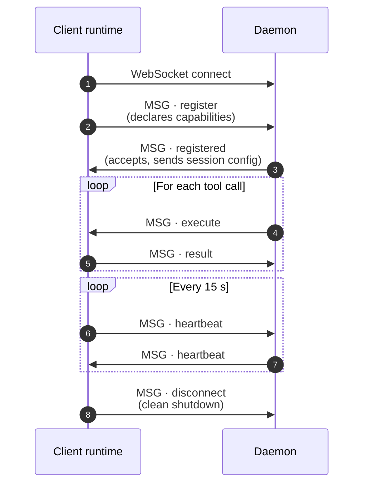
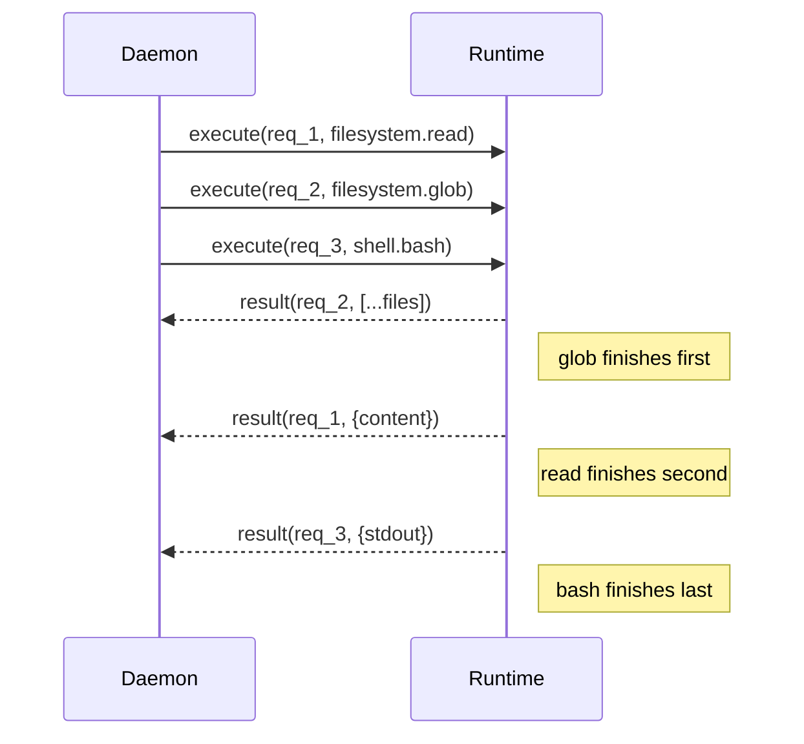

# Digitorn Action Protocol (DAP) v1.0

## Overview

DAP is the communication protocol between the Digitorn Daemon (orchestrator)
and Client Runtimes (executors). It enables remote execution of module actions
while preserving the full security stack.

**Transport:** WebSocket (binary frames with JSON payloads)
**Encoding:** UTF-8 JSON
**Auth:** HMAC-SHA256 signed messages

---

## 1. Connection Lifecycle



---

## 2. Message Format

Every message is a JSON object with a `type` field.

```json
{
  "type": "message_type",
  "id": "unique_message_id",
  "ts": 1775400000.123,
  ...payload fields
}
```

### Common Fields

| Field | Type | Required | Description |
|-------|------|:---:|---|
| `type` | string | yes | Message type |
| `id` | string | yes | Unique message ID (UUID4) |
| `ts` | float | yes | Unix timestamp (seconds) |

---

## 3. Message Types

### 3.1 `register` (Runtime → Daemon)

Sent immediately after WebSocket connection. The runtime declares what it can do.

```json
{
  "type": "register",
  "id": "msg_001",
  "ts": 1775400000.0,
  "runtime_id": "rt_abc123",
  "runtime_version": "1.0.0",
  "runtime_lang": "dart",
  "platform": "android",
  "device": {
    "os": "Android 14",
    "arch": "arm64",
    "hostname": "Pixel-8"
  },
  "capabilities": {
    "filesystem": {
      "actions": ["read", "write", "edit", "ls", "glob", "grep", "mkdir"],
      "max_file_size": 10485760,
      "allowed_paths": ["/data/user/0/com.digitorn/files"],
      "encoding": ["utf-8", "latin-1"]
    },
    "shell": {
      "actions": ["bash"],
      "allowed_commands": ["echo", "cat", "ls", "pwd", "git"],
      "timeout_max": 30
    },
    "git": {
      "actions": ["status", "diff", "log", "blame"],
      "version": "2.43.0"
    },
    "database": {
      "actions": ["connect", "sql", "schema"],
      "drivers": ["sqlite"]
    }
  },
  "workspace": "/data/user/0/com.digitorn/files/project",
  "sandbox": {
    "enabled": true,
    "type": "app_sandbox",
    "writable_paths": ["/data/user/0/com.digitorn/files"]
  },
  "mcp": {
    "supported": false,
    "servers": []
  },
  "auth": {
    "token": "jwt_token_here",
    "session_id": "session_abc123"
  }
}
```

### 3.2 `registered` (Daemon → Runtime)

Confirmation of registration. Contains the effective configuration after merging
with the app's security profile.

```json
{
  "type": "registered",
  "id": "msg_002",
  "ts": 1775400000.1,
  "runtime_id": "rt_abc123",
  "session_id": "session_abc123",
  "effective_capabilities": {
    "filesystem": ["read", "write", "edit", "ls", "glob", "grep"],
    "shell": [],
    "git": ["status", "diff", "log"],
    "database": ["connect", "sql"]
  },
  "security": {
    "workspace_root": "/data/user/0/com.digitorn/files/project",
    "writable_paths": ["/data/user/0/com.digitorn/files/project/src"],
    "readable_paths": ["/data/user/0/com.digitorn/files/project"],
    "blocked_commands": ["rm -rf", "shutdown", "reboot"],
    "max_output_bytes": 1000000,
    "tool_timeout": 120
  },
  "hmac_secret": "shared_secret_for_signing",
  "config": {
    "heartbeat_interval": 15,
    "max_concurrent_actions": 5,
    "result_max_bytes": 2000000
  }
}
```

### 3.3 `execute` (Daemon → Runtime)

The daemon asks the runtime to execute an action. This message is ONLY sent
after the daemon has already validated security, permissions, and approval.

```json
{
  "type": "execute",
  "id": "msg_003",
  "ts": 1775400001.0,
  "request_id": "req_xyz789",
  "module": "filesystem",
  "action": "read",
  "params": {
    "path": "src/app.ts",
    "start_line": 1,
    "end_line": 50
  },
  "context": {
    "session_id": "session_abc123",
    "agent_id": "main",
    "turn": 3,
    "workspace": "/data/user/0/com.digitorn/files/project"
  },
  "timeout": 30.0,
  "signature": "hmac_sha256(secret, request_id + module + action + params_json + ts)"
}
```

### 3.4 `result` (Runtime → Daemon)

The runtime returns the result of an action execution.

```json
{
  "type": "result",
  "id": "msg_004",
  "ts": 1775400001.5,
  "request_id": "req_xyz789",
  "success": true,
  "data": {
    "content": "import os\nimport sys\n...",
    "path": "/data/user/0/com.digitorn/files/project/src/app.ts",
    "lines": 50,
    "encoding": "utf-8"
  },
  "error": null,
  "duration_ms": 12.5,
  "signature": "hmac_sha256(secret, request_id + success + data_json + ts)"
}
```

### 3.5 `error` (Runtime → Daemon)

When execution fails irrecoverably.

```json
{
  "type": "error",
  "id": "msg_005",
  "ts": 1775400001.5,
  "request_id": "req_xyz789",
  "error_code": "FILE_NOT_FOUND",
  "error": "File not found: src/missing.ts",
  "recoverable": true,
  "signature": "..."
}
```

Error codes:
| Code | Description |
|------|---|
| `FILE_NOT_FOUND` | Path does not exist |
| `PERMISSION_DENIED` | OS-level permission error |
| `OUTSIDE_WORKSPACE` | Path is outside allowed workspace |
| `TIMEOUT` | Action exceeded timeout |
| `COMMAND_BLOCKED` | Shell command is in blocklist |
| `UNSUPPORTED_ACTION` | Runtime doesn't support this action |
| `EXEC_FAILED` | Execution raised an exception |
| `MAX_SIZE_EXCEEDED` | Output exceeds max_output_bytes |
| `RUNTIME_ERROR` | Internal runtime error |

### 3.6 `cancel` (Daemon → Runtime)

Cancel a running action (e.g., user pressed abort).

```json
{
  "type": "cancel",
  "id": "msg_006",
  "ts": 1775400002.0,
  "request_id": "req_xyz789",
  "reason": "User aborted"
}
```

### 3.7 `cancelled` (Runtime → Daemon)

Confirmation that the action was cancelled.

```json
{
  "type": "cancelled",
  "id": "msg_007",
  "ts": 1775400002.1,
  "request_id": "req_xyz789",
  "was_running": true
}
```

### 3.8 `heartbeat` (Bidirectional)

Keepalive. Sent every `heartbeat_interval` seconds (default 15).
If no heartbeat for 3 intervals (45s), the connection is considered dead.

```json
{
  "type": "heartbeat",
  "id": "msg_008",
  "ts": 1775400015.0,
  "metrics": {
    "cpu_percent": 23.5,
    "memory_mb": 128,
    "active_actions": 1,
    "uptime_s": 3600
  }
}
```

### 3.9 `disconnect` (Runtime → Daemon)

Clean shutdown.

```json
{
  "type": "disconnect",
  "id": "msg_009",
  "ts": 1775400100.0,
  "reason": "app_closed"
}
```

### 3.10 `config_update` (Daemon → Runtime)

Runtime configuration change (e.g., security profile updated).

```json
{
  "type": "config_update",
  "id": "msg_010",
  "ts": 1775400050.0,
  "security": {
    "writable_paths": ["/new/path"],
    "blocked_commands": ["rm -rf"]
  }
}
```

### 3.11 `stream_start` / `stream_data` / `stream_end` (Runtime → Daemon)

For large outputs (shell command, file read), the runtime can stream the result
in chunks instead of sending one giant JSON.

```json
{"type": "stream_start", "request_id": "req_xyz", "content_type": "text/plain", "total_bytes": 5000000}
{"type": "stream_data", "request_id": "req_xyz", "chunk": "first 64KB of data...", "offset": 0}
{"type": "stream_data", "request_id": "req_xyz", "chunk": "next 64KB...", "offset": 65536}
{"type": "stream_end", "request_id": "req_xyz", "success": true}
```

---

## 4. Security

### 4.1 Authentication

1. Runtime connects with JWT token in `register.auth.token`
2. Daemon verifies token (same auth as HTTP API)
3. Daemon sends `hmac_secret` in `registered` response
4. All subsequent `execute` and `result` messages are HMAC-signed

### 4.2 Message Signing

Every `execute` and `result` message includes a `signature` field:

```
signature = HMAC-SHA256(
    key: hmac_secret,
    message: request_id + type + module + action + JSON(params) + ts
)
```

The receiver verifies:
1. Signature matches (prevents tampering)
2. Timestamp within 30 seconds of current time (prevents replay)
3. request_id has not been seen before (prevents reuse)

### 4.3 Runtime-side Verification

Even though the daemon already verified security, the runtime SHOULD:
1. Check that `params.path` is within `workspace_root`
2. Check that shell commands are not in `blocked_commands`
3. Enforce `max_output_bytes` on results
4. Enforce `timeout` on each action

This is defense-in-depth. A compromised daemon cannot make the runtime
execute outside its sandbox.

---

## 5. Capability Negotiation

### 5.1 Registration

Runtime declares capabilities → Daemon intersects with app security profile
→ Daemon returns effective_capabilities.

```
Runtime says:     filesystem: [read, write, edit, rm, ls]
App profile says: filesystem: [read, write, edit, ls] (rm is blocked)
Effective:        filesystem: [read, write, edit, ls]
```

### 5.2 Dynamic Update

If the security profile changes at runtime (admin updates grants),
the daemon sends `config_update` with new effective_capabilities.
The runtime updates its local allowlist.

### 5.3 Graceful Degradation

If the daemon sends an `execute` for an unsupported action:
- Runtime returns `error` with code `UNSUPPORTED_ACTION`
- Daemon tells the agent: "This action is not available on the connected device"
- Agent adapts (uses a different tool or asks the user)

---

## 6. Concurrency

- `max_concurrent_actions` (from `registered.config`) limits parallel executions
- The daemon sends multiple `execute` messages without waiting for results
- The runtime processes them concurrently (up to the max)
- Each result is matched by `request_id`



---

## 7. Reconnection

If the WebSocket disconnects:
1. Runtime waits 1s, 2s, 4s, 8s... (exponential backoff, max 60s)
2. Re-sends `register` with same `runtime_id`
3. Daemon detects reconnection, resends any pending `execute` messages
4. Actions that were in progress when disconnected are returned with
   `error_code: "RUNTIME_DISCONNECTED"`

---

## 8. MCP Server Delegation

For runtimes that support MCP (`mcp.supported: true`):

### 8.1 MCP Server Start (Daemon → Runtime)

```json
{
  "type": "mcp_start",
  "id": "msg_020",
  "ts": 1775400005.0,
  "server_id": "sqlite-local",
  "command": "npx",
  "args": ["@modelcontextprotocol/server-sqlite", "--db", "local.db"],
  "env": {"NODE_PATH": "/usr/local/lib"},
  "timeout": 10.0
}
```

### 8.2 MCP Server Ready (Runtime → Daemon)

```json
{
  "type": "mcp_ready",
  "id": "msg_021",
  "ts": 1775400006.0,
  "server_id": "sqlite-local",
  "tools": [
    {"name": "query", "description": "Execute SQL query"},
    {"name": "schema", "description": "Get database schema"}
  ]
}
```

### 8.3 MCP Tool Call (Daemon → Runtime)

```json
{
  "type": "mcp_call",
  "id": "msg_022",
  "ts": 1775400010.0,
  "request_id": "req_mcp_001",
  "server_id": "sqlite-local",
  "tool": "query",
  "arguments": {"sql": "SELECT * FROM users LIMIT 10"}
}
```

### 8.4 MCP Tool Result (Runtime → Daemon)

```json
{
  "type": "mcp_result",
  "id": "msg_023",
  "ts": 1775400010.5,
  "request_id": "req_mcp_001",
  "result": {"rows": [...], "columns": [...]}
}
```

---

## 9. Implementation Guide

### Minimal Runtime (any language)

A minimal runtime needs to implement:

1. WebSocket client
2. JSON parse/serialize
3. HMAC-SHA256
4. Handle message types: `registered`, `execute`, `cancel`, `heartbeat`, `config_update`
5. Send message types: `register`, `result`, `error`, `cancelled`, `heartbeat`, `disconnect`
6. Execute these primitives:
   - `filesystem.read` → read file, return content
   - `filesystem.write` → write content to file
   - `filesystem.edit` → read, find/replace, write
   - `filesystem.glob` → list directory by pattern
   - `shell.bash` → spawn process, capture output

That is approximately:
- **200 lines** in Python
- **400 lines** in Rust
- **300 lines** in Go
- **250 lines** in Dart
- **350 lines** in TypeScript

### Full Runtime (with all features)

A full runtime adds:
- All filesystem actions (glob, grep, mkdir, rm, mv, cp, stat)
- Background shell execution
- Git operations
- MCP server management
- Streaming for large outputs
- OS-level sandbox enforcement
- Metrics reporting in heartbeat

That is approximately:
- **1500 lines** in Python (or reuse existing modules)
- **3000 lines** in Rust
- **2000 lines** in Go
- **1500 lines** in Dart

---

## 10. Version Negotiation

The `register` message includes `runtime_version`. The daemon checks
compatibility:

- `1.x` - must support core message types (execute, result, heartbeat)
- Future versions add new message types (backward compatible)
- Unknown message types are silently ignored (forward compatible)

```json
{
  "type": "register",
  "protocol_version": "1.0",
  ...
}
```

If the daemon requires a newer protocol version:
```json
{
  "type": "error",
  "error_code": "PROTOCOL_VERSION_MISMATCH",
  "error": "Daemon requires protocol >= 1.2, runtime has 1.0",
  "min_version": "1.2"
}
```
