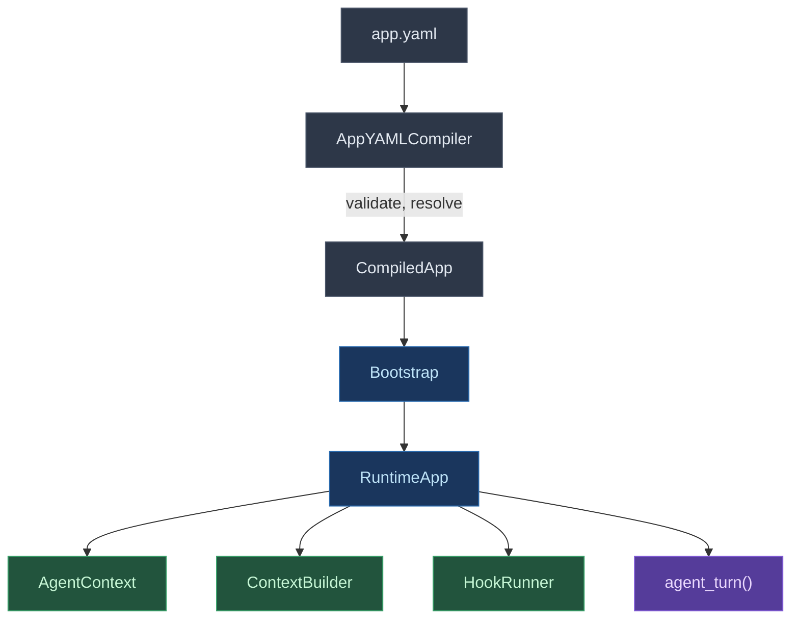
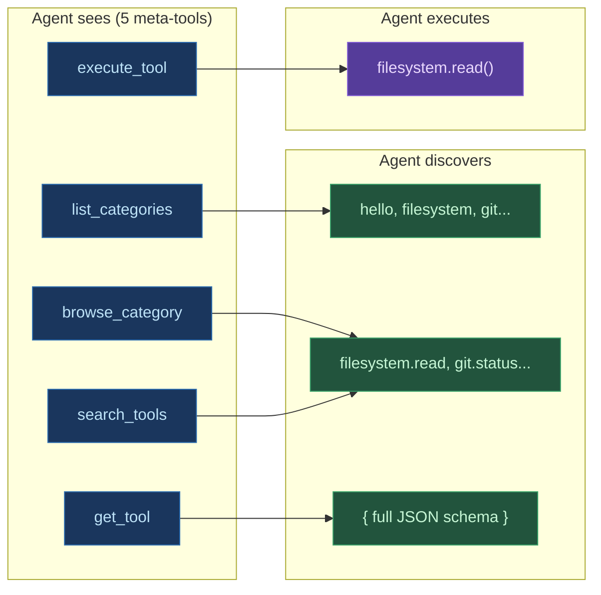

# Digitorn App Language Reference

The Digitorn App Language is a declarative YAML-based language for building AI applications. Define agents, modules, execution modes, context management, and security - all without writing a single line of code.

## Documentation

| # | Guide | Description |
|---|-------|-------------|
| 1 | [Getting Started](01-getting-started.md) | Installation, first app, running |
| 2 | [App Configuration](02-app-config.md) | `app:`, `variables:`, `modules:`, `execution:`, triggers, I/O contracts |
| 3 | [Agents](03-agents.md) | Agent definition, brain, providers, context management |
| 4 | [Tools](04-tools.md) | Adaptive tool injection, discovery, semantic search, meta-tools |
| 4b | [Built-in Tools](04b-builtin-tools.md) | Delegation, memory, todo, messaging builtins |
| 4c | [Execution Primitives](04c-primitives.md) | Parallel execution, background tasks, watchers, scheduler, remember |
| 4d | [MCP Servers](04d-mcp.md) | Model Context Protocol - connect external MCP servers, auto-index tools, security, OAuth2 |
| 5 | [Cognitive Memory](05-memory.md) | Working memory, tasks, notes, checkpoints, semantic facts, compaction survival |
| 5b | [Output Channels](05-channels.md) | *(Legacy)* Output-only delivery - see [Channels (Bidirectional I/O)](40-channels.md) for the unified module |
| 6 | [Context Management](06-context-management.md) | Compaction, summary brain, tool result truncation, hooks |
| 7 | [Security](11-security.md) | Capabilities, policies, grants/denials |
| 8 | [Multi-Agent](12-multi-agent.md) | Coordinator + specialists, spawn, parallel agents, isolation |
| 9 | [API Integration](14-api-integration.md) | REST API (200+ endpoints), Socket.IO `/events` streaming, SDK integration pattern |
| 10 | [Examples](15-examples.md) | Complete real-world application examples |
| 11 | [Middleware Pipeline](17-middleware.md) | App/module/MCP middleware: secret masking, content filter, RAG, custom |
| 12 | ~~Git Module~~ | Removed - use [shell](../modules/reference/shell.md) module with native git commands |
| 13 | [Web Module](19-web.md) | Web search + fetch + parse: DuckDuckGo, Brave, Tavily, SearXNG |
| 14 | ~~Notebook Module~~ | Removed - use filesystem + shell for notebook manipulation |
| 15 | [Skills System](21-skills.md) | Reusable workflow commands (/commit, /review, /audit) |
| 16 | [App-as-MCP-Server](16-app-as-mcp-server.md) | *(Planned)* Expose deployed apps as MCP servers |
| 17 | [Daemon Configuration](23-configuration.md) | ServerConfig, RuntimeConfig, KV backends, CORS, logging, database |
| 18 | [Observability & Monitoring](24-observability.md) | Metrics, Prometheus, health checks, tracing, structured logging |
| 19 | [Workspace & Preview](41-preview.md) | Virtual filesystem streamed live to the client (`WsWrite`, `WsRead`, `WsEdit`, `WsGlob`, `WsGrep`, `WsDelete`) + `@digitorn/preview-sdk` |
| 20 | ~~Sidecar~~ | Removed as a standalone doc - LSP subprocess lifecycle is covered in the [lsp](../modules/reference/lsp.md) reference |
| 21 | [LSP Diagnostics](27-lsp.md) | Real-time code diagnostics via language servers (pyright, gopls) + fallback linters |
| 22 | ~~Notebook Kernel~~ | Removed - use [shell](../modules/reference/shell.md) `Bash` with `python` or an external Jupyter kernel |
| 23 | ~~Shell Session~~ | Removed - [shell](../modules/reference/shell.md) `Bash` exposes 5 modes (sync / async / status / kill / stream) instead of a persistent session |
| 24 | ~~Database Interactive~~ | Removed - see [database](../modules/reference/database.md) for `browse`, `search_data`, `relations`, `sql` actions |
| 25 | [Tool Hooks](31-tool-hooks.md) | Pre/post tool hooks - auto-lint, auto-log, auto-validate around tool calls |
| 26 | ~~New Actions~~ | Removed - features (`multi_edit`, `patch`, `worktrees`) never landed in code |
| 27 | [Rules](33-rules.md) | Modular project instructions via .digitorn/rules/*.md with path scoping |
| 28 | [OS Sandbox](35-sandbox.md) | Kernel-level isolation: Landlock, seccomp, Seatbelt, Job Objects |
| 29 | [Production Deployment](36-production.md) | TLS, CI security, rate limiting, Socket.IO hardening, checklist |
| 30 | [Advanced RAG](37-rag.md) | Multi-source RAG: hybrid retrieval, citations, semantic cache, Text2SQL, 5 backends, DB sync |
| 31 | [Channels (Bidirectional I/O)](40-channels.md) | Unified bidirectional I/O: webhooks, cron, email, file watchers, RSS, queues - receive events and respond through the same or different channels |
| 32 | [Bundle namespaces](38-bundle-namespaces.md) | Compile-time injection: `{{prompt.X}}`, `{{skill.X}}`, `{{asset.X}}`, `{{asset_b64.X}}`, `{{include:}}`, `capabilities:`, i18n locales, frontmatter, hot reload, live preview, CLI scaffold |
| 33 | [Widgets](42-widgets.md) | Declarative UI spec v1 - 43 primitives, 15 actions, server-side template substitution, live `widget:*` Socket.IO events |
| 34 | [Behavior Engine](43-behavior.md) | Fully YAML-driven behavioral enforcement - declarative rules for any action, generic state tracking, semantic classifier with custom complexity/approaches/risk, custom profiles via `./behavior/` |
| 35 | [Client Manifest](44-client-manifest.md) | YAML→UI contract read by the Flutter/web client: `features:`, `theme:`, `slash_commands:`, `workspace_mode`, `quick_prompts` |
| 36 | [Multi-Tenant Installs](45-multi-tenant.md) | Per-user vs system-wide app installs - composite `(app_id, scope, owner_user_id)`, scope-aware deploy/delete/disable/enable, isolation guarantees |
| 37 | [Dev CLI](46-dev-cli.md) | Test apps against the real daemon - deploy, chat, auto-approve, multi-turn, Python API for Builder agent |

## Quick Example

```yaml
app:
  app_id: my-assistant
  name: "My Assistant"

modules:
  filesystem:
    constraints:
      allowed_actions: [read, glob, grep]

agents:
  - id: assistant
    role: assistant
    brain:
      provider: deepseek
      model: deepseek-chat
      backend: openai_compat
      config:
        api_key: "{{env.DEEPSEEK_API_KEY}}"
    system_prompt: |
      You are a helpful coding assistant.
      Workspace: {{workspace}}

variables:
  workspace: "{{env.PWD}}"

execution:
  mode: conversation
  greeting: "Hello! How can I help?"

capabilities:
  default_policy: auto
```
Run it:

```bash
digitorn run my-assistant.yaml
```

## Architecture Overview



### How Tools Work

Digitorn uses a **tool discovery architecture**. The agent does not see all tools directly -- it uses meta-tools to discover and execute them:



This approach scales to any number of modules and tools without bloating the context window. The meta-tools are generated dynamically from the `context_builder` module's `@action` registry -- adding a new meta-tool requires zero changes elsewhere.

### LLM Compatibility

Digitorn supports **any LLM** - from cloud APIs to local models:

- **Native tool calling** (OpenAI, DeepSeek, Groq, Mistral, Together): Tools passed via API `tools=` parameter
- **Text-based tool calling** (Ollama, LM Studio, vLLM, small models): Tool schemas injected in the system prompt, tool calls parsed from text output

The system automatically detects which mode to use based on the provider. A robust multi-format parser recovers tool calls from any LLM output format (Llama `<function=...>` tags, `{tool_call}` XML, JSON blocks, markdown code blocks).

## CLI Commands

```bash
# Run an app (by YAML path or deployed app ID)
digitorn run <app.yaml> [message]
digitorn run <app.yaml> --input file.txt
digitorn run <app.yaml> --image screenshot.png

# Validate without running
digitorn app validate <app.yaml>

# Show module schema (actions, params, constraints)
digitorn app schema <module_id>

# Deploy to daemon
digitorn app deploy <app.yaml>
digitorn app list
digitorn app undeploy <app_id>

# Manage per-app secrets
digitorn secret set <app_id> <key> [value]
digitorn secret list <app_id>
digitorn secret delete <app_id> <key>

# Middleware management
digitorn middleware list
digitorn middleware info <middleware_id>
digitorn middleware create <name> --level app
digitorn middleware install <path>
digitorn middleware uninstall <middleware_id>

# MCP server management
digitorn mcp install <server>
digitorn mcp list
digitorn mcp uninstall <server_id>

# Start/stop daemon
digitorn start
digitorn stop
```
