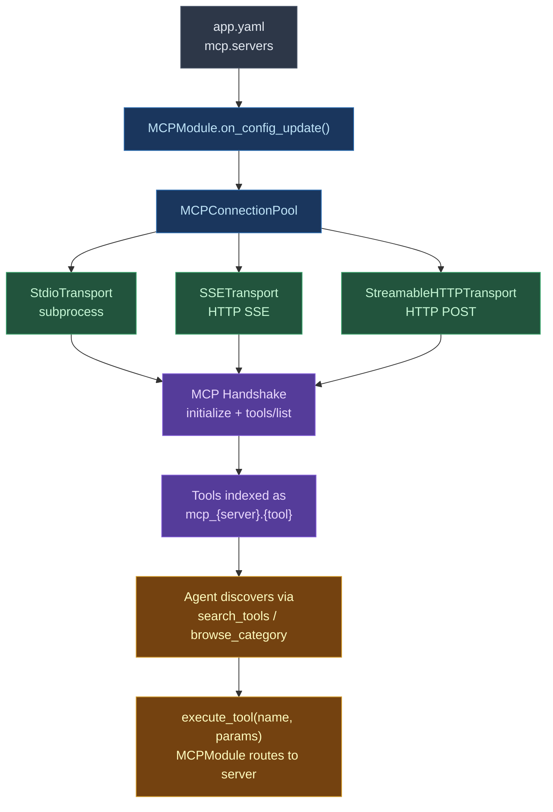

# MCP (Model Context Protocol)

The MCP module connects external MCP servers to Digitorn agents. Tools, resources, and prompts from these servers are automatically indexed and accessible as native tools via the context_builder.

## Architecture



## CLI -- MCP Server Management

The `digitorn mcp` CLI manages installation, configuration, authentication, and testing of MCP servers before using them in a YAML app. Installed servers are persisted in the database.

### Commands

| Command | Description |
|----------|-------------|
| `digitorn mcp search {query}` | Search the internal catalog + remote registry |
| `digitorn mcp install {server_id}` | Install a server (catalog, registry, or custom) |
| `digitorn mcp config {server_id} --set key=val` | Configure credentials |
| `digitorn mcp config {server_id} --show` | Show required and current credentials |
| `digitorn mcp auth {server_id}` | Launch OAuth flow (opens browser) |
| `digitorn mcp test {server_id}` | Test connection, discover tools |
| `digitorn mcp requirements {server_id}` | Show prerequisites BEFORE installation |
| `digitorn mcp list [--status S] [--json]` | List installed servers (filter by status) |
| `digitorn mcp info {server_id}` | Server details + tools |
| `digitorn mcp pool` | MCP pool status on daemon (live connections) |
| `digitorn mcp remove {server_id}` | Uninstall a server |

### Server Sources

Servers are resolved in this order:

1. **Catalogue interne** — ~30 pre-configured servers (github, slack, notion, google, stripe, etc.)
2. **Registre distant** — `registry.modelcontextprotocol.io` (~800 serveurs)
3. **Smithery** — hosted servers via the Smithery Connect API
4. **Custom** — local or remote server configured manually

During installation, required npm/pip packages are **automatically installed** if missing.

### Installation Examples

```bash
# From internal catalog (command, args, env mapping pre-configured)
digitorn mcp install github
digitorn mcp config github --set token=ghp_xxxxx
digitorn mcp test github

# From remote registry (automatic resolution)
digitorn mcp install todoist-mcp
digitorn mcp config todoist-mcp --set todoist_api_token=xxxxx
digitorn mcp test todoist-mcp

# Local Python server
digitorn mcp install mon-serveur --command python3 --args "server.py"
digitorn mcp test mon-serveur

# Local Node.js server
digitorn mcp install mon-serveur --command node --args "dist/index.js"

# Remote HTTP server
digitorn mcp install mon-api --url http://localhost:3000/mcp

# With OAuth (Google, Notion, etc.)
digitorn mcp install google_drive
digitorn mcp config google_drive --set auth.client_id=xxx auth.client_secret=xxx
digitorn mcp auth google_drive   # ouvre le navigateur
digitorn mcp test google_drive
```

### Auto-detection des credentials

A l'installation, Digitorn **probe le code source** du serveur pour decouvrir les variables d'environnement requises. Cela corrige les cas ou le registre distant declare un nom different de ce que le serveur lit reellement (ex: le registre dit `YOUR_API_KEY` mais le serveur lit `TODOIST_API_TOKEN`).

La probe scanne :
- `process.env.XXX` dans les fichiers JS (dist/, build/, src/)
- `os.environ.get("XXX")` dans les fichiers Python

### Using MCP in an Application YAML

Les serveurs installes et testes via le CLI peuvent etre references par leur nom :

```yaml
modules:
  mcp:
    config:
      servers:
        - github       # serveur daemon-managed
        - notion
        - todoist-mcp
```
## YAML Configuration

### Syntaxe shorthand (catalogue)

Le catalogue interne auto-resout command, args, transport et env mapping :

```yaml
modules:
  mcp:
    config:
      servers:
        # Zero config (pas de credentials)
        memory: {}
        puppeteer: {}

        # Token simple
        github:
          token: "{{secret.GITHUB_TOKEN}}"
        brave_search:
          api_key: "{{secret.BRAVE_API_KEY}}"

        # OAuth
        notion:
          auth:
            client_id: "{{secret.NOTION_CLIENT_ID}}"
            client_secret: "{{secret.NOTION_CLIENT_SECRET}}"

        # Avec overrides
        github:
          token: "{{secret.GITHUB_TOKEN}}"
          timeout: 60
```
### Syntaxe explicite (full control)

```yaml
modules:
  mcp:
    config:
      servers:
        # --- Transport stdio (subprocess) ---
        slack:
          transport: stdio
          command: npx
          args: ["@anthropic/mcp-server-slack"]
          env:
            SLACK_TOKEN: "{{env.SLACK_TOKEN}}"
          timeout: 30  # secondes

        # --- Transport SSE ---
        my_sse_server:
          transport: sse
          url: "http://localhost:3000/sse"
          headers:
            Authorization: "Bearer {{env.SSE_TOKEN}}"

        # --- Transport HTTP streamable ---
        my_http_server:
          transport: streamable_http
          url: "http://localhost:8080/mcp"
          headers:
            Authorization: "Bearer {{env.MCP_TOKEN}}"
```
### Champs de configuration par serveur

| Champ | Type | Defaut | Description |
|-------|------|--------|-------------|
| `transport` | string | `"stdio"` | Type de transport : `stdio`, `sse`, `streamable_http` |
| `command` | string | — | Commande a executer (stdio uniquement) |
| `args` | list | `[]` | Arguments de la commande (stdio uniquement) |
| `env` | dict | `{}` | Variables d'environnement (stdio uniquement, supporte `{{env.VAR}}`) |
| `url` | string | — | URL du serveur (SSE et HTTP uniquement) |
| `headers` | dict | `{}` | Headers HTTP (SSE et HTTP uniquement) |
| `timeout` | float | `30.0` | Timeout de connexion en secondes |
| `buffer_size` | int | `10485760` | Taille max du buffer stdout en octets (stdio uniquement, defaut 10 MB). Augmenter pour les serveurs retournant de tres grosses reponses (ex: Notion search sur un workspace volumineux) |
| `auth` | dict | — | Configuration OAuth2 (voir section OAuth2 ci-dessous) |

## Transports

### stdio (le plus courant)

Le serveur MCP est lance comme un sous-processus. La communication se fait via stdin/stdout en JSON-RPC 2.0. C'est le transport utilise par la majorite des serveurs MCP publics (Anthropic, community).

```yaml
slack:
  transport: stdio
  command: npx
  args: ["-y", "@anthropic/mcp-server-slack"]
  env:
    SLACK_TOKEN: "{{env.SLACK_TOKEN}}"
```
Le processus est :

1. `asyncio.create_subprocess_exec(command, *args, env=safe_env, limit=buffer_size)`
2. Handshake MCP (`initialize` -> `initialized`)
3. Decouverte des capabilities (`tools/list`, `resources/list`, `prompts/list`)
4. Communication JSON-RPC via stdin/stdout
5. Arret propre au undeploy (SIGTERM puis SIGKILL apres timeout)

Les variables d'environnement sont sanitisees : seules les variables declarees dans `env:` et un ensemble de variables systeme securisees (PATH, HOME, etc.) sont transmises au subprocess.

> **Buffer stdout** : Par defaut, le buffer stdout est de 10 MB (vs 64 KB par defaut dans asyncio). Certains serveurs MCP comme Notion retournent de tres grosses reponses JSON-RPC. Si une reponse depasse la taille du buffer, la connexion est coupee. Augmentez `buffer_size` si necessaire :
>
> ```yaml
> notion:
>   transport: stdio
>   command: mcp-notion
>   buffer_size: 52428800  # 50 MB
> ```

### SSE (Server-Sent Events)

Le serveur MCP est un service HTTP qui expose un endpoint SSE. Le client se connecte au flux SSE pour recevoir les messages, et envoie les requetes JSON-RPC via POST.

```yaml
my_server:
  transport: sse
  url: "http://localhost:3000/sse"
  headers:
    Authorization: "Bearer {{env.TOKEN}}"
```
### Streamable HTTP

Transport HTTP simple : chaque requete est un POST, la reponse peut etre streamed via SSE ou retournee directement.

```yaml
my_server:
  transport: streamable_http
  url: "http://localhost:8080/mcp"
  headers:
    X-API-Key: "{{env.API_KEY}}"
```
## Convention de nommage (FQN)

Chaque serveur MCP cree un **module virtuel** dans l'index avec l'ID `mcp_{server_id}`. Ses tools sont indexes avec le FQN :

```
mcp_{server_id}.{tool_name}
```

Par exemple :
- `mcp_slack.post_message`
- `mcp_github.create_issue`
- `mcp_brave.search`
- `mcp_filesystem.read_file`

Ceci permet :
- Chaque serveur MCP apparait comme sa propre **categorie** dans `list_categories`
- `search_tools("post message")` trouve `mcp_slack.post_message`
- `browse_category("mcp_slack")` liste tous les tools de Slack
- La securite s'applique par module virtuel (`mcp_slack`, `mcp_github`)

### Indexation

Les tools MCP sont indexes **exactement** comme les tools natifs :

- **Keyword index** : nom + description + tags
- **Semantic index** : embeddings multilangues pour la recherche par sens
- **Tag index** : chaque tool MCP est tague `["mcp", "{server_id}"]`
- **FQN index** : lookup direct par nom complet

L'agent ne fait **aucune difference** entre un tool natif et un tool MCP. La decouverte et l'execution suivent le meme workflow.

## Integration avec le Context Builder

### Mode discovery

En mode discovery (toolsets larges), les tools MCP sont decouverts via les meta-tools :

```
1. list_categories()
   -> ["filesystem", "database", "mcp_slack", "mcp_github", "mcp_brave"]

2. browse_category(category="mcp_slack")
   -> [{ name: "mcp_slack.post_message", description: "Post a message to Slack" }, ...]

3. execute_tool(name="mcp_slack.post_message", params={"channel": "#general", "text": "Hello"})
   -> { success: true, data: { content: [...], text: "Message posted" } }
```

### Mode direct

En mode direct (toolsets petits), les tools MCP apparaissent directement dans la liste des tools de l'agent, sanitises pour l'API :

```
tools: [..., mcp_slack__post_message, mcp_github__create_issue, ...]
```

Le double underscore `__` est la convention de sanitisation (remplace le `.` dans le FQN).

## Routage des appels

Quand l'agent appelle un tool MCP, le routage est automatique :

1. L'agent appelle `execute_tool(name="mcp_slack.post_message", params={...})`
2. Le `context_builder` trouve l'`IndexedTool` avec `module=MCPModule`
3. Le MCPModule recoit `action_name="mcp_slack__post_message"`
4. Le regex `mcp_([^_]+(?:_[^_]+)*)__(.+)` parse : `server_id=slack`, `tool_name=post_message`
5. `pool.call_tool("slack", "post_message", params)` envoie le JSON-RPC au serveur

## Security

Les tools MCP passent par les **memes gates de securite** que les tools natifs. Le module virtuel `mcp_{server_id}` est traite comme n'importe quel module dans `capabilities:`.

### Configuration

```yaml
capabilities:
  # Grant automatique pour Slack
  grant:
    - module: mcp_slack
      actions: [list_channels, post_message, search_messages]

  # Approbation requise pour GitHub
  approve:
    - module: mcp_github
      actions: [create_issue, create_pull_request]

  # Interdit la suppression de repos
  deny:
    - module: mcp_github
      actions: [delete_repository]
```
### Comportement

| Policy | Effet sur les tools MCP |
|--------|------------------------|
| `auto` | Le tool MCP s'execute immediatement |
| `approve` | L'agent doit obtenir l'approbation de l'utilisateur avant l'execution |
| `block` | Le tool MCP est **invisible** — l'agent ne peut ni le trouver ni l'utiliser |

### Niveau de risque

Par defaut, tous les tools MCP ont un niveau de risque `medium` (appels API externes). Cela signifie :
- Avec `default_policy: auto`, ils s'executent normalement
- Avec `default_policy: approve`, ils necessitent une approbation
- Avec `max_risk_level: low`, tous les tools MCP sont bloques (sauf grants explicites)

### Sans `capabilities:`

Sans bloc `capabilities:`, pas de profil de securite — tous les tools MCP sont visibles et s'executent sans restriction (mode developpement).

## Actions de gestion

Le module MCP expose aussi des actions de gestion pour controler les connexions a runtime :

| Action | Description | Parametres cles |
|--------|-------------|-----------------|
| `mcp.connect` | Connecter un nouveau serveur MCP | `server_id`, `transport`, `command`/`url` |
| `mcp.disconnect` | Deconnecter un serveur | `server_id` |
| `mcp.reconnect` | Reconnecter un serveur en erreur | `server_id` |
| `mcp.list_servers` | Lister tous les serveurs et leur statut | — |
| `mcp.list_tools` | Lister les tools d'un serveur | `server_id` |
| `mcp.call_tool` | Appeler un tool directement | `server_id`, `tool_name`, `arguments` |
| `mcp.list_resources` | Lister les resources d'un serveur | `server_id` |
| `mcp.read_resource` | Lire une resource | `server_id`, `uri` |
| `mcp.list_prompts` | Lister les prompt templates | `server_id` |
| `mcp.get_prompt` | Obtenir un prompt rempli | `server_id`, `prompt_name`, `arguments` |
| `mcp.health_check` | Verifier la sante des serveurs | `server_id` (optionnel) |

Ces actions sont utiles pour la connexion dynamique de serveurs a runtime (hot-reload). Apres un `mcp.connect`, les nouveaux tools sont immediatement disponibles dans le context_builder apres un rebuild de l'index.

## Resources et Prompts MCP

Au-dela des tools, le protocole MCP expose aussi des **resources** (fichiers, documents, donnees) et des **prompts** (templates de prompts parametrisables).

### Resources

```
mcp.list_resources(server_id="filesystem")
-> [{ uri: "file:///tmp/readme.md", name: "readme.md", mime_type: "text/markdown" }]

mcp.read_resource(server_id="filesystem", uri="file:///tmp/readme.md")
-> { content: "# Mon fichier..." }
```

### Prompts

```
mcp.list_prompts(server_id="my_server")
-> [{ name: "code_review", description: "Review code", arguments: [{name: "code", required: true}] }]

mcp.get_prompt(server_id="my_server", prompt_name="code_review", arguments={"code": "def foo(): ..."})
-> { messages: [{ role: "user", content: "Please review this code: def foo(): ..." }] }
```

## Cycle de vie

### Au deploy

1. Le module MCP est instancie (un par app, isole)
2. `on_config_update(config)` lit les `servers:` du YAML
3. Chaque serveur declare est connecte automatiquement
4. Le `context_builder` indexe les tools MCP via `_index_mcp_servers()`
5. Les tools apparaissent dans les meta-tools et/ou en mode direct

### A l'execution

1. L'agent decouvre et appelle les tools MCP normalement
2. Le MCPModule route les appels vers le bon serveur via le pool
3. Les resultats sont retournes a l'agent comme des `ActionResult` standards

### Au undeploy

1. `on_stop()` ferme toutes les connexions MCP
2. Les sous-processus stdio recoivent SIGTERM, puis SIGKILL apres timeout
3. Les connexions SSE/HTTP sont fermees proprement

## Exemples

### Minimal — daemon-managed (recommande)

Installez les serveurs via le CLI, puis referencez-les par nom :

```bash
# Preparation (une seule fois)
digitorn mcp install github
digitorn mcp config github --set token=ghp_xxxxx
digitorn mcp test github
```

```yaml
app:
  app_id: mcp-demo
  name: "MCP Demo"

modules:
  mcp:
    config:
      servers:
        - github       # daemon-managed, deja configure

agents:
  - id: assistant
    brain:
      provider: openai
      model: gpt-4o-mini
      backend: openai_compat
      config:
        api_key: "{{env.OPENAI_API_KEY}}"
    system_prompt: "Assistant GitHub. Utilise search_tools pour decouvrir les outils."

execution:
  mode: conversation
```
### Shorthand — catalogue inline

Le catalogue auto-resout tout (command, args, env) a partir du nom + credentials :

```yaml
modules:
  mcp:
    config:
      servers:
        github:
          token: "{{secret.GITHUB_TOKEN}}"
        brave_search:
          api_key: "{{secret.BRAVE_API_KEY}}"
        filesystem:
          path: "{{workspace}}"
        memory: {}
```
### Multi-serveurs avec securite

```yaml
modules:
  mcp:
    config:
      servers:
        - github
        - slack
        - brave_search

capabilities:
  grant:
    - module: mcp_slack
      actions: [list_channels, post_message]
    - module: mcp_brave_search
      actions: [search]
  approve:
    - module: mcp_github
      actions: [create_issue, create_pull_request]
  deny:
    - module: mcp_github
      actions: [delete_repository]
```
### Explicite — full control

Pour les serveurs non references dans le catalogue ni le registre :

```yaml
modules:
  mcp:
    config:
      servers:
        my_server:
          transport: streamable_http
          url: "http://localhost:8080/mcp"
          headers:
            Authorization: "Bearer {{env.MCP_TOKEN}}"
```
### MCP + modules natifs

Les serveurs MCP coexistent avec les modules natifs :

```yaml
modules:
  filesystem:
    constraints:
      allowed_actions: [read, glob, grep]
  database:
    setup:
      - action: connect
        params:
          driver: sqlite
          database: "{{workspace}}/data.db"
  mcp:
    config:
      servers:
        - brave_search
```
L'agent voit alors :

- `filesystem.read`, `filesystem.ls`, etc. (natif)
- `database.fetch_results`, etc. (natif)
- `mcp_brave_search.search`, etc. (MCP)

Tous accessibles via le meme workflow de decouverte.

## Catalogue interne

Le catalogue interne pre-configure ~30 serveurs. L'utilisateur ecrit juste le nom + ses credentials :

**Productivite**

| ID | Package | Credentials | OAuth |
|----|---------|-------------|-------|
| `github` | `@modelcontextprotocol/server-github` | `token` | — |
| `notion` | `mcp-notion` (pip) | `token` ou OAuth | notion |
| `slack` | `@modelcontextprotocol/server-slack` | `bot_token`, `team_id` | — |
| `linear` | `mcp-linear` | `api_key` | — |
| `clickup` | `clickup-mcp-server` | `api_key`, `team_id` | — |
| `atlassian` | `mcp-atlassian` (pip) | `jira_url`, `jira_email`, `jira_token` | — |

**Google Suite**

| ID | Package | Credentials | OAuth |
|----|---------|-------------|-------|
| `google_drive` | `@modelcontextprotocol/server-gdrive` | OAuth | google |
| `google_calendar` | `@modelcontextprotocol/server-google-calendar` | OAuth | google |
| `gmail` | `@gongrzhe/server-gmail-autoauth-mcp` | OAuth | google |
| `google_maps` | `@modelcontextprotocol/server-google-maps` | `api_key` | — |

**E-Commerce / Paiement**

| ID | Package | Credentials | OAuth |
|----|---------|-------------|-------|
| `stripe` | `@stripe/agent-toolkit` | `secret_key` | — |
| `shopify` | `shopify-mcp-server` | `access_token`, `store_domain` | — |
| `paypal` | `@anthropic/mcp-server-paypal` | `client_id`, `client_secret` | — |

**Recherche / Web**

| ID | Package | Credentials | OAuth |
|----|---------|-------------|-------|
| `brave_search` | `@modelcontextprotocol/server-brave-search` | `api_key` | — |
| `fetch` | `@anthropic/mcp-server-fetch` | — | — |
| `puppeteer` | `@modelcontextprotocol/server-puppeteer` | — | — |
| `apify` | `@apify/actors-mcp-server` | `token` | — |

**Bases de donnees**

| ID | Package | Credentials | OAuth |
|----|---------|-------------|-------|
| `postgres` | `@modelcontextprotocol/server-postgres` | `connection_string` (arg) | — |
| `sqlite` | `@modelcontextprotocol/server-sqlite` | `database` (arg) | — |
| `qdrant` | `mcp-server-qdrant` (pip) | `url`, `api_key` | — |

**Outils locaux**

| ID | Package | Credentials | OAuth |
|----|---------|-------------|-------|
| `filesystem` | `@modelcontextprotocol/server-filesystem` | `path` (arg) | — |
| `memory` | `@modelcontextprotocol/server-memory` | — | — |
| `git` | `@modelcontextprotocol/server-git` | `path` (arg) | — |
| `docker` | `mcp-server-docker` (pip) | — | — |
| `sequential_thinking` | `@modelcontextprotocol/server-sequential-thinking` | — | — |

**Cloud / Deploiement**

| ID | Package | Credentials | OAuth |
|----|---------|-------------|-------|
| `vercel` | `@vercel/mcp` | `token` | — |
| `cloudflare` | `@anthropic/mcp-server-cloudflare` | `api_token`, `account_id` | — |
| `aws` | `@anthropic/mcp-server-aws-kb` | `access_key_id`, `secret_access_key` | — |
| `kubernetes` | `mcp-server-kubernetes` (pip) | — | — |

**Divers**

| ID | Package | Credentials | OAuth |
|----|---------|-------------|-------|
| `mailgun` | `mcp-mailgun` | `api_key`, `domain` | — |
| `everart` | `@modelcontextprotocol/server-everart` | `api_key` | — |

Les serveurs non presents dans le catalogue sont resolus automatiquement depuis le [registre MCP](https://registry.modelcontextprotocol.io/) (~800 serveurs).

> La liste complete des serveurs MCP est disponible sur [registry.modelcontextprotocol.io](https://registry.modelcontextprotocol.io/).

## OAuth2 — Authentification par utilisateur

Certains serveurs MCP (Google Calendar, GitHub user-scope, Slack user tokens) necessitent un token OAuth **par utilisateur**. Le module MCP supporte le flow OAuth2 Authorization Code avec PKCE.

### Configuration

```yaml
modules:
  mcp:
    config:
      servers:
        google_calendar:
          transport: sse
          url: "http://localhost:3000/sse"
          auth:
            type: oauth2
            provider: google          # provider connu (Google, GitHub, Slack, Microsoft)
            client_id: "{{secret.GOOGLE_CLIENT_ID}}"
            client_secret: "{{secret.GOOGLE_CLIENT_SECRET}}"
            scopes:
              - "https://www.googleapis.com/auth/calendar.readonly"
            # redirect_uri: auto-construit si omis

        slack_user:
          transport: sse
          url: "http://localhost:3001/sse"
          auth:
            type: oauth2
            provider: slack
            client_id: "{{secret.SLACK_CLIENT_ID}}"
            client_secret: "{{secret.SLACK_CLIENT_SECRET}}"
            scopes: ["channels:read", "chat:write"]

        custom_provider:
          transport: streamable_http
          url: "https://mcp.example.com/v1"
          auth:
            type: oauth2
            provider: custom
            client_id: "{{secret.CUSTOM_CLIENT_ID}}"
            client_secret: "{{secret.CUSTOM_CLIENT_SECRET}}"
            authorize_url: "https://auth.example.com/authorize"
            token_url: "https://auth.example.com/token"
            scopes: ["read", "write"]
```
### Providers connus

Les providers connus ont leurs URLs pre-configurees (authorize, token). Il suffit de specifier `provider:` :

| Provider | PKCE | URLs auto-configurees |
|----------|------|----------------------|
| `google` | Oui (S256) | `accounts.google.com/o/oauth2/v2/auth`, `oauth2.googleapis.com/token` |
| `github` | Non | `github.com/login/oauth/authorize`, `github.com/login/oauth/access_token` |
| `slack` | Non | `slack.com/oauth/v2/authorize`, `slack.com/api/oauth.v2.access` |
| `microsoft` | Oui (S256) | `login.microsoftonline.com/common/oauth2/v2.0/authorize`, `.../token` |
| `notion` | Non | `api.notion.com/v1/oauth/authorize`, `api.notion.com/v1/oauth/token` (Basic auth + JSON body) |
| `custom` | Non | Requires `authorize_url` + `token_url` explicites |

### OAuth pour serveurs stdio (`env_token_var`)

Les serveurs MCP en transport **stdio** ne recoivent pas de headers HTTP — le token doit etre injecte comme **variable d'environnement** du subprocess. Utilisez `env_token_var` pour specifier le nom de la variable :

```yaml
notion:
  transport: stdio
  command: mcp-notion
  auth:
    type: oauth2
    provider: notion
    client_id: "{{secret.NOTION_OAUTH_CLIENT_ID}}"
    client_secret: "{{secret.NOTION_OAUTH_CLIENT_SECRET}}"
    env_token_var: "NOTION_API_KEY"    # token injecte ici
    redirect_uri: "http://localhost:8913/callback"
```
Apres le flow OAuth :

1. Le token est stocke dans `env_token_var` de l'environnement du subprocess
2. Le subprocess est **redemarre** automatiquement avec le nouveau token
3. Les tools MCP sont re-decouverts

En mode **standalone** (`digitorn run --standalone`), le flow OAuth est gere par un serveur HTTP local temporaire sur le port 8913 qui ouvre automatiquement le navigateur de l'utilisateur.

### Flow OAuth

```
1. Agent appelle mcp_google_calendar.list_events
2. MCPModule detecte auth_config sur le serveur
3. Verifie si l'utilisateur a un token valide (via UserStore)
   a. Token valide -- injecte dans le header Authorization, execute le tool
   b. Token expire -- refresh automatique via refresh_token
   c. Pas de token -- retourne requires_oauth avec auth_url
4. L'utilisateur ouvre l'auth_url -- autorise -- callback avec code
5. Le callback echange le code contre des tokens -- stockes chiffres (Fernet)
6. L'agent re-essaie -- token injecte -- tool s'execute
```

### Reponse `requires_oauth`

Quand un utilisateur n'a pas de token, l'agent recoit un `ActionResult` avec :

```json
{
  "success": false,
  "error": "User needs to authorize google for server 'google_calendar'.",
  "metadata": {
    "requires_oauth": true,
    "provider": "google",
    "auth_url": "https://accounts.google.com/o/oauth2/v2/auth?client_id=...&scope=...&state=...",
    "state": "abc123...",
    "server_id": "google_calendar"
  }
}
```

L'agent peut presenter l'`auth_url` a l'utilisateur (via CLI ou UI).

### Endpoints API

| Endpoint | Methode | Description |
|----------|---------|-------------|
| `/api/apps/{app_id}/oauth/authorize` | GET | Demarre le flow OAuth. Params: `provider`, `server_id`, `session_id` |
| `/api/apps/{app_id}/oauth/callback` | GET | Callback du provider. Params: `code`, `state` |

### PKCE (Proof Key for Code Exchange)

Pour les providers qui le supportent (Google, Microsoft), le flow utilise PKCE S256 :
- Un `code_verifier` (128 chars aleatoires) est genere
- Un `code_challenge = BASE64URL(SHA256(code_verifier))` est envoye avec la requete d'autorisation
- Le `code_verifier` est envoye lors de l'echange du code
- Ceci empeche l'interception du code d'autorisation

### Stockage et persistance des tokens

Les tokens OAuth sont **persistes en base de donnees** et chiffres avec Fernet (AES-128-CBC + HMAC-SHA256). La cle de chiffrement est :

- Auto-generee au premier lancement (`~/.digitorn/server.key`)
- Overridable via `server.token_encryption_key`
- Les tokens ont un TTL automatique base sur `expires_in` du provider

#### Persistance automatique

Au premier lancement, l'utilisateur s'authentifie via le navigateur. Le token obtenu est **automatiquement stocke en DB**. Aux lancements suivants :

1. Le module MCP charge les tokens stockes depuis la DB (`_preload_oauth_tokens`)
2. Si un token valide existe -- il est injecte dans le transport, **pas de re-authentification**
3. Si le token est expire mais a un `refresh_token` -- refresh automatique
4. Si aucun token valide -- le flow OAuth classique est declenche

Cela fonctionne dans les deux modes :

- **Standalone** (`digitorn run`) — la DB est initialisee localement, `UserStore` est injecte dans le module MCP, les tokens sont persistes apres le flow OAuth local
- **Daemon** (`digitorn start` + `digitorn app deploy`) — le `UserStore` est injecte par le `AppManager`, les tokens sont persistes via le callback OAuth de l'API

#### Stockage des secrets OAuth

Les credentials OAuth (`client_id`, `client_secret`) peuvent etre stockes dans le **secret store** par app :

```bash
digitorn secret set my-app NOTION_OAUTH_CLIENT_ID "..."
digitorn secret set my-app NOTION_OAUTH_CLIENT_SECRET "..."
```

Puis references dans le YAML avec `{{secret.XXX}}` — plus besoin d'`export` a chaque session.

### Refresh automatique

Avant chaque appel MCP sur un serveur avec OAuth, le module :

1. Verifie si le token expire dans les 5 prochaines minutes
2. Si oui, appelle le token endpoint avec le `refresh_token`
3. Stocke le nouveau token en DB
4. Continue l'execution du tool

Ce refresh est **transparent** pour l'agent — il ne voit jamais l'expiration.

## Smithery — Serveurs MCP heberges

[Smithery](https://smithery.ai/) est une plateforme d'hebergement de serveurs MCP. Digitorn supporte deux modes d'acces :

### Smithery Connect (recommande)

Acces direct via l'API Smithery Connect. Le serveur MCP est heberge par Smithery et accessible via HTTP :

```yaml
modules:
  mcp:
    config:
      servers:
        github:
          via: smithery
          smithery_key: "{{secret.SMITHERY_API_KEY}}"
          smithery_namespace: my-team    # optionnel
```
Le champ `via: smithery` active la resolution Smithery. Le catalogue interne mappe automatiquement les IDs connus (github, slack, etc.) vers les slugs Smithery correspondants.

### Smithery Proxy (legacy)

Pour les serveurs Smithery non presents dans le catalogue, utilisez l'URL directe :

```yaml
servers:
  custom_smithery:
    transport: streamable_http
    url: "https://server.smithery.ai/my-custom-server"
    headers:
      Authorization: "Bearer {{secret.SMITHERY_API_KEY}}"
```
## Schema Probing — Exemples API automatiques

Pour les modeles LLM qui ne connaissent pas nativement les APIs MCP (Qwen3, Llama, etc.), le module effectue un **schema probing** a la connexion : il appelle quelques tools du serveur pour decouvrir la structure reelle des donnees, puis injecte ces exemples dans le system prompt de l'agent.

### Fonctionnement

1. Detection des tools "writer" (ceux qui prennent du JSON en parametre)
2. Appel de tools "reader" (search, list) pour obtenir des IDs reels
3. Appel de tools "getter" (get_page, get_block) avec ces IDs
4. Extraction de templates (suppression des metadonnees, troncature)

### Exemple

Pour un serveur Notion, le probing decouvre automatiquement la structure d'une page :

```json
{
  "properties": {
    "Name": {"title": [{"text": {"content": "..."}}]},
    "Status": {"select": {"name": "..."}}
  },
  "children": [
    {"type": "paragraph", "paragraph": {"rich_text": [{"text": {"content": "..."}}]}}
  ]
}
```

Cet exemple est injecte dans le system prompt, permettant au LLM de generer des appels corrects sans connaitre l'API Notion a priori.

### Limites du probing

- Maximum 3 appels par serveur (pour limiter le temps de startup)
- Templates tronques a 2500 chars chacun, 5000 chars total
- Les metadonnees (id, timestamps, created_by, url, etc.) sont supprimees

## Partage du pool daemon

En mode daemon (`digitorn start`), les connexions MCP sont **partagees** entre les apps qui utilisent le meme serveur. Le pool du daemon maintient les connexions actives et les reference counts :

- `digitorn mcp pool` affiche les connexions live et leur nombre de references
- Quand une app est deployee, elle reutilise les connexions existantes du daemon
- Quand une app est undeployee, le reference count diminue (deconnexion quand il atteint 0)

Cela evite de lancer N sous-processus pour le meme serveur MCP quand N apps l'utilisent.

## SDK Fix Wrapper

Certains serveurs MCP Python (comme `mcp-notion`) declarent des parametres JSON comme `Optional[str]` au lieu de `str`. Le SDK MCP officiel a un bug qui convertit ces parametres en `dict` au lieu de garder le string JSON brut, ce qui casse l'appel.

Digitorn inclut un **wrapper automatique** (`sdk_fix_wrapper.py`) qui patche ce comportement au lancement des serveurs Python :

```bash
# Au lieu de lancer directement :
mcp-notion
# Digitorn lance :
python3 -m digitorn.modules.mcp.sdk_fix_wrapper mcp-notion
```

Ce wrapper est **transparent** : il detecte le type de chaque parametre et ne patche que ceux qui acceptent `str`. Les serveurs npm ne sont pas affectes.

## Smart Cache

The MCP module includes a built-in smart cache with **explicit tool whitelisting**. Only tools listed in `cacheable_tools` are cached — live data (emails, issues, messages) can change from outside the agent, so it must never be cached automatically.

```yaml
modules:
  mcp:
    config:
      cache:
        ttl: 300          # time-to-live in seconds (default: 5 min)
        max_size: 200     # max entries per server
        enabled: true     # false to disable cache entirely
      servers:
        gmail:
          cacheable_tools: [list_labels, get_profile]
          cache_ttl: 60
        github:
          cacheable_tools: [list_repos, get_repo, get_file_contents]
          cache_ttl: 600
```
### Quoi cacher ?

Seuls les tools retournant des **donnees statiques ou quasi-statiques** doivent etre listes :

| Cacheable (metadata) | NON cacheable (live data) |
|---|---|
| `list_labels`, `get_profile` | `search_emails`, `get_email` |
| `list_repos`, `get_file_contents` | `list_issues`, `search_code` |
| `get_schema`, `list_tools` | `list_messages`, `search` |

**Regle** : si le resultat peut changer sans action de l'agent (email recu, issue creee par un collegue), ne pas cacher.

### Fonctionnement

- Chaque resultat est indexe par `sha256(tool_name + params)` — memes parametres = meme cache key
- Expiration par TTL (defaut 300s, override par serveur via `cache_ttl`)
- Eviction LRU quand `max_size` est atteint (defaut 200 entrees par serveur)
- Seuls les resultats **success** sont caches (pas les erreurs)
- Metadata `cache_hit: true/false` sur chaque retour

## Result Normalization

All MCP results pass through `_normalize_mcp_result()` which ensures the LLM receives a clear, unambiguous format:

- `status`: "ok" or "empty" -- the LLM always knows if data exists
- `output`: unified text -- no confusion with raw MCP formats
- `result_count`: element count (if JSON array)
- `images` / `resources`: separated and structured content
- `_source` : provenance (`mcp_server:{id}`)

## Middleware Pipeline MCP

The MCP module supports a configurable middleware pipeline. See the [middleware documentation](17-middleware.md) for details.

```yaml
modules:
  mcp:
    middleware:
      - retry:
          max_attempts: 3
      - timeout:
          seconds: 30
      - budget:
          max_calls_per_hour: 100
          server_limits:
            github: 50
      - cross_context:
          max_entries: 20
      - auto_heal:
          max_suggestions: 3
      - audit:
          log_params: true
    config:
      servers:
        github: {}
```
Middlewares MCP disponibles (tous opt-in) :

- **`retry`** / **`timeout`** / **`audit`**: basic resilience and observability
- **`budget`**: per-server and global quotas, cost tracking, alerts
- **`cross_context`** : partage automatique de contexte entre serveurs MCP
- **`auto_heal`**: when a tool fails, suggests alternatives
- **`circuit_breaker`**: auto-disable failing servers (closed -> open -> half-open -> closed)
- **`semantic_cache`**: cache by semantic similarity (uses FastEmbed) -- "list repos" = "show repositories"
- **`dedup`**: prevents duplicate calls in the same turn (anti-loop)
- **`streaming`**: slow call detection + progress notifications

## Limitations

- **Partial hot-reload**: `mcp.connect` adds a server at runtime, but the semantic index is not rebuilt automatically (new tools are accessible via keyword search and browse, but not via semantic search until redeploy)
