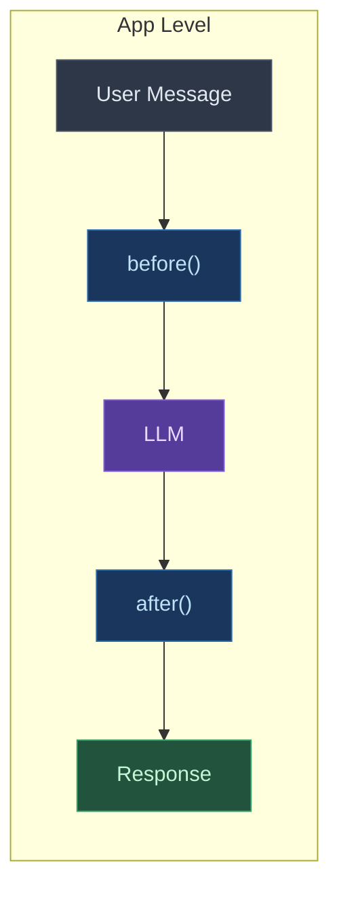

# Middleware Pipeline

The Digitorn middleware system intercepts and transforms data at 3 levels: application, module, and MCP. Middlewares are installable packages, referenced by name in YAML.

## Architecture



## Trois niveaux de middleware

### 1. App-level -- before/after each LLM call

App middlewares intercept in the agent loop, before sending to the LLM and after the response.

```yaml
app:
  app_id: my-app

middleware:
  - mask_secrets:
      patterns: ["credentials", "mot_de_passe"]
  - content_filter:
      block_patterns: ["DROP TABLE", "rm -rf /"]
      rejection_message: "Request blocked."
  - prompt_inject:
      system: "Always respond in French."
      position: append
  - rag_inject:
      max_chunks: 5
      max_chars: 2000
  - response_filter:
      max_length: 5000
      mask_secrets: true
```
### 2. Module-level — wraps chaque action de module

```yaml
modules:
  filesystem:
    middleware:
      - audit:
          log_params: true
      - retry:
          max_attempts: 3
          backoff: exponential
      - timeout:
          seconds: 30
```
### 3. MCP-level — wraps les appels aux serveurs MCP

```yaml
modules:
  mcp:
    middleware:
      - retry:
          max_attempts: 3
          base_delay: 1.0
      - timeout:
          seconds: 30
      - budget:
          max_calls_per_hour: 100
          server_limits:
            github: 50
          cost_per_call: 0.001
      - cross_context:
          max_entries: 20
      - auto_heal:
          max_suggestions: 3
      - audit:
          log_params: true
    config:
      servers:
        github:
          token: "{{secret.GITHUB_TOKEN}}"
```
## Built-in Middlewares

### App-level

| Middleware | Description | Key Options |
|------------|-------------|-------------|
| `mask_secrets` | Masque mots de passe, API keys, tokens dans les messages utilisateur | `patterns`, `replacement` |
| `content_filter` | Blocks messages matching forbidden patterns | `block_patterns`, `rejection_message` | `block_patterns`, `rejection_message` |
| `prompt_inject` | Injects rules into system prompt dynamically | `system`, `user` | `system`, `position` (append/prepend) |
| `rag_inject` | Injects relevant context from a RAG source | `source`, `max_chunks` | `max_chunks`, `max_chars` |
| `response_filter` | Filters LLM response (length, secrets) | `max_length`, `mask_secrets` |

### Module & MCP-level

| Middleware | Description | Key Options |
|------------|-------------|-------------|
| `audit` | Structured logging with timing | `log_params`, `log_result` |
| `retry` | Retry avec backoff exponentiel ou fixe | `max_attempts`, `base_delay`, `backoff` |
| `timeout` | Timeout par appel | `seconds` |
| `budget` | Call quotas and cost control (MCP) | `max_calls_per_hour`, `server_limits`, `cost_per_call` |
| `cross_context` | Partage de contexte entre serveurs MCP | `max_entries`, `include_servers`, `exclude_servers` |
| `auto_heal` | Suggests alternatives when a tool fails (MCP) | `max_suggestions`, `include_cross_server` |
| `circuit_breaker` | Auto-disables failing servers with gradual recovery (MCP) | `failure_threshold`, `recovery_timeout`, `half_open_calls` |
| `semantic_cache` | Cache by semantic similarity (MCP) | `similarity_threshold`, `ttl`, `max_entries` |
| `dedup` | Prevents duplicate calls in the same agent turn (MCP) | `window_seconds`, `max_entries` |
| `streaming` | Slow call detection + progress notifications (MCP) | `slow_threshold`, `notify_interval` |

> **Opt-in**: all middlewares above are disabled by default. They activate only when declared in the YAML.

### Advanced Configuration Examples

```yaml
modules:
  mcp:
    middleware:
      # Resilience : circuit breaker + retry
      - circuit_breaker:
          failure_threshold: 3
          recovery_timeout: 60
      - retry:
          max_attempts: 3

      # Performance: semantic cache + dedup
      - semantic_cache:
          similarity_threshold: 0.85
          ttl: 300
      - dedup:
          window_seconds: 5

      # Control: budget + timeout
      - budget:
          max_calls_per_hour: 200
          server_limits:
            github: 100
      - timeout:
          seconds: 30

      # Observability: streaming + audit
      - streaming:
          slow_threshold: 5.0
      - audit:
          log_params: true

    config:
      servers:
        github: {}
        slack: {}
```
## Creating a Custom Middleware

### 1. Generate the Skeleton

```bash
digitorn middleware create mon_middleware --level app
```

This creates:

```
mon_middleware/
 digitorn-middleware.toml    # Manifest
 middleware.py               # Code
```

### 2. Edit the Manifest (`digitorn-middleware.toml`)

```toml
[middleware]
middleware_id = "mon_middleware"
version = "1.0.0"
description = "My custom middleware"
author = "Mon Nom"
level = "app"                              # app | module | mcp | all
class_path = "middleware:MonMiddleware"     # fichier:Classe
tags = ["custom"]
enabled = true

[middleware.config_schema]
option1 = { type = "str", default = "valeur", description = "Ma config" }
```

### 3. Write the Code (`middleware.py`)

**App-level** :

```python
class MonMiddleware:
    def __init__(self, option1="valeur"):
        self.option1 = option1

    async def before(self, ctx):
        """Avant l'appel LLM.

        ctx.system_prompt — modifiable
        ctx.messages      — modifiable (list de dicts role/content)
        ctx.agent_id      — lecture seule
        ctx.turn           -- turn number

        Retourner None = continuer vers le LLM
        Retourner str  = court-circuiter (pas d'appel LLM)
        """
        return None

    async def after(self, ctx, response, tool_calls):
        """After the LLM response. Return the response (modified or not)."""
        return response
```

**Module-level** :

```python
class MonMiddleware:
    def __init__(self, **kwargs):
        self.config = kwargs

    async def __call__(self, ctx, next_):
        """Wrapper around module execution.

        ctx.module_id — ex: "filesystem"
        ctx.action    — ex: "read"
        ctx.params    — dict, modifiable
        """
        # Avant
        result = await next_(ctx)
        # After
        return result
```

### 4. Installer et utiliser

```bash
# Installer
digitorn middleware install ./mon_middleware/

# Verify
digitorn middleware list
digitorn middleware info mon_middleware

# Utiliser dans le YAML
# middleware:
#   - mon_middleware:
#       option1: "valeur"

# Uninstall
digitorn middleware uninstall mon_middleware
```

## Structure sur disque

```
packages/digitorn/middleware/        # Built-ins (shipped with the package)
 mask_secrets/
    digitorn-middleware.toml
    middleware.py
 content_filter/
 audit/
 budget/
 ...

~/.local/share/digitorn/middleware/  # User-installed
 mon_middleware/
     digitorn-middleware.toml
     middleware.py
```

User middlewares take priority over built-ins (same ID = override).

## CLI

```bash
digitorn middleware list                     # Lister tous les middlewares
digitorn middleware list --level app         # Filtrer par niveau
digitorn middleware info <id>                # Details + config schema
digitorn middleware create <id> --level app  # Generate a skeleton
digitorn middleware install <chemin>         # Installer depuis un dossier
digitorn middleware uninstall <id>           # Uninstall
```

## Smart Cache MCP

In addition to the middleware pipeline, the MCP module has a **smart cache** integrated :

```yaml
modules:
  mcp:
    config:
      cache:
        ttl: 300          # time-to-live in seconds (default: 5 min)
        max_size: 200     # max entries per server
        scope: auto       # auto | all | disabled
      servers:
        github:
          cache_ttl: 60   # override par serveur
```
- **`auto`** (default): caches read-only calls (risk=low: get, list, search, read)
- **`all`** : cache tous les appels
- **`disabled`** : pas de cache
- Write operations (risk=medium/high) automatically invalidate the cache du serveur

## MCP Result Normalization

All MCP results pass through `_normalize_mcp_result()` which transforms raw content into a structured `ActionResult`:

- `status`: "ok" or "empty" -- the LLM always knows if data exists
- `output`: unified text -- no confusion between content types
- `result_count`: element count if JSON array
- `images` / `resources`: separated and structured
- `_source` : provenance (`mcp_server:{id}`)

## Tests de validation

The middleware system is covered by **228 automated tests** that verify the real behavior through the actual execution flow (not isolated mocks):

### MCP Integration Tests (traverse `MCPModule._execute_mcp_tool()`)

| Test | Ce qu'il prouve |
|------|----------------|
| `test_cache_hit_avoids_server_call` | 2nd read-only call -> cache hit, server NOT called again |
| `test_write_invalidates_cache` | `create_issue` invalide le cache -- `list_repos` refrappe le serveur |
| `test_circuit_opens_on_repeated_failures` | 2 failures -> circuit opens -> 3rdcall blocked instantly (server NOT contacted) |
| `test_circuit_resets_on_success` | Successful calls -> failure counter reset to zero |
| `test_duplicate_call_returns_cached` | Same tool+params in 5s -> server called only once |
| `test_different_params_not_deduped` | Different params -> both calls go to au serveur |
| `test_slow_call_detected` | Call > threshold -> marked slow in metadata |
| `test_budget_exceeded_returns_error` | Budget exceeded -> `ActionResult(success=False)` propre |
| `test_config_parses_middleware` | YAML `middleware:` -- pipeline construit correctement |
| `test_all_new_middlewares_from_config` | All 4 new middlewares are parseds depuis le YAML |

### Tests e2e app-level (YAML -- compile -- bootstrap -- agent turn)

| Test | Ce qu'il prouve |
|------|----------------|
| `test_content_filter_blocks_dangerous_input` | `DROP TABLE` -> middleware short-circuits, LLM never called |
| `test_mask_secrets_in_messages` | Password and API key masked in message sent to the LLM |
| `test_prompt_inject_modifies_system_prompt` | LLM receives the injected prompt par le middleware |
| `test_multiple_middlewares_compose` | 3 middlewares (mask + filter + inject) fonctionnent ensemble |
| `test_scaffold_install_use_uninstall` | Cycle complet : create -- install -- discover -- instantiate -- uninstall |
