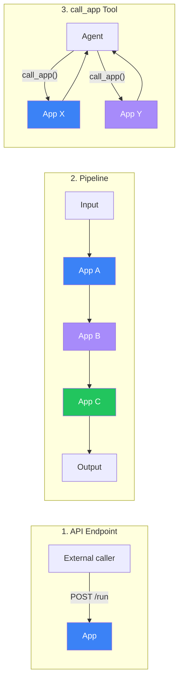

# App Composition

Digitorn supports three ways to compose applications together. Each approach
serves a different use case.

## Overview



## Approach 1: API Endpoint

Every deployed app is accessible as a REST endpoint. External systems, scripts,
or other applications can call it directly.

```bash
# Deploy the app
digitorn app deploy code-analyzer.yaml

# Call it from anywhere
curl -X POST http://localhost:8000/api/apps/code-analyzer/run \
  -H "Content-Type: application/json" \
  -d '{"input": "Analyze src/auth.py for security vulnerabilities"}'
```

Response:

```json
{
  "success": true,
  "data": {
    "content": "Found 3 vulnerabilities...",
    "tool_calls_count": 8,
    "turns_used": 3
  }
}
```

**Use when**: integrating with CI/CD, scripts, external services, or building
custom frontends.

## Approach 2: Pipeline

Chain multiple one_shot apps in a declarative sequence. Each step receives the
output of the previous step through template variables.

### YAML Declaration

```yaml
app:
  app_id: security-report-pipeline
  name: "Security Report Pipeline"

pipeline:
  - app: code-analyzer
    input: "{{input}}"

  - app: vulnerability-scorer
    input: "{{steps[0].output}}"

  - app: report-generator
    input: "{{steps[1].output}}"
    timeout: 300

execution:
  mode: pipeline
  input:
    type: text
    description: "Path to codebase to analyze"
  output:
    type: markdown
    description: "Complete security report"
```
### Template Variables

| Variable | Description |
| --- | --- |
| `{{input}}` | Original pipeline input |
| `{{steps[N].output}}` | Output of step N (0-indexed) |
| `{{steps[N].app_id}}` | App ID of step N |
| `{{steps[N].success}}` | Whether step N succeeded (true/false) |
| `{{steps[N].error}}` | Error message if step N failed |

### Error Handling

Each step has an `on_error` field:

```yaml
pipeline:
  - app: analyzer
    input: "{{input}}"
    on_error: stop          # stop the pipeline (default)

  - app: fallback-analyzer
    input: "{{input}}"
    on_error: continue      # continue even if this step fails
```
### API Call

```bash
# Using the app's built-in pipeline
curl -X POST http://localhost:8000/api/apps/security-report-pipeline/pipeline \
  -H "Content-Type: application/json" \
  -d '{"input": "src/"}'

# Ad-hoc pipeline (steps in request body)
curl -X POST http://localhost:8000/api/apps/any-app/pipeline \
  -H "Content-Type: application/json" \
  -d '{
    "input": "src/auth.py",
    "steps": [
      {"app": "code-analyzer", "input": "{{input}}"},
      {"app": "report-writer", "input": "{{steps[0].output}}"}
    ]
  }'
```

Response:

```json
{
  "success": true,
  "data": {
    "final_output": "# Security Report\n...",
    "steps": [
      {"app_id": "code-analyzer", "success": true, "duration": 12.3},
      {"app_id": "report-writer", "success": true, "duration": 8.1}
    ],
    "total_duration": 20.4
  }
}
```

**Use when**: building fixed workflows with predictable step sequences.

## Approach 3: call_app Tool

An agent can dynamically call other deployed apps as tools during a conversation.
The agent decides which apps to call based on the task.

```yaml
# The main app has access to call_app automatically
agents:
  - id: main
    brain:
      provider: deepseek
      model: deepseek-chat
    system_prompt: |
      You are a project manager. You can delegate tasks to specialized apps:
      - code-analyzer: analyzes code for bugs and vulnerabilities
      - test-writer: writes unit tests for Python code
      - doc-generator: generates documentation from code

      Use call_app() to delegate, then synthesize the results.
```
The agent calls:

```
call_app(app_id="code-analyzer", input="Analyze packages/digitorn/core/auth/")
call_app(app_id="test-writer", input="Write tests for the auth service")
```

The results are returned to the agent, which synthesizes them into a final
response.

**Use when**: the workflow is dynamic and the agent needs to decide which apps
to call based on context.

## Comparison

| Feature | API Endpoint | Pipeline | call_app |
| --- | --- | --- | --- |
| Caller | External (HTTP) | Declarative (YAML) | Agent (LLM) |
| Flow control | Caller decides | Fixed sequence | Agent decides |
| Error handling | Caller handles | on_error per step | Agent adapts |
| Parallelism | Caller manages | Sequential | Agent can parallelize |
| Use case | Integration | Workflows | Dynamic orchestration |
| Requires daemon | Yes | Yes | Yes |
