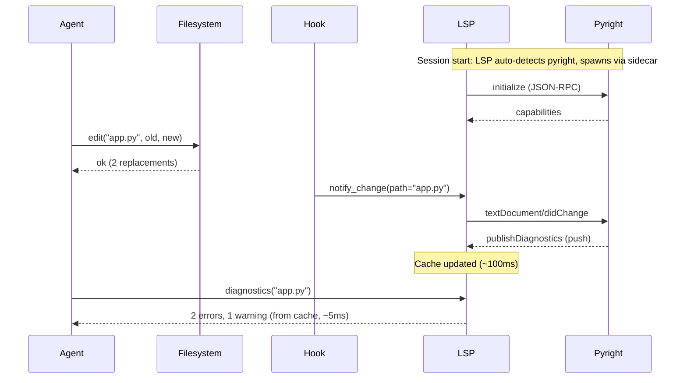

# LSP — Real-Time Code Diagnostics

The LSP module provides real-time code diagnostics (errors, warnings) by connecting to language servers (pyright, gopls, ruff, texlab, ...) as persistent subprocesses. It works automatically — just declare the module and it detects your project's language.

## Quick Start

```yaml
modules:
  filesystem: {}
  lsp: {}  # Auto-detects project language and available LSP servers

execution:
  hooks:
    - id: auto-lint
      on: tool_end
      condition:
        type: tool_match
        tools: ["filesystem.edit", "filesystem.write", "filesystem.multi_edit"]
      action:
        type: module_action
        name: lsp.notify_change
        action_params:
          path: "{{tool.params.path}}"
```
That's it. The agent now gets diagnostics automatically after every edit.

## How It Works



## Dual Mode

The module operates in two modes transparently:

### Real-Time Mode (Sidecar)

When an LSP server binary is installed (e.g. `pyright-langserver`), the module:
1. Spawns a persistent subprocess via the sidecar pool
2. Performs the LSP initialize handshake
3. Caches diagnostics from `publishDiagnostics` push notifications
4. Returns cached diagnostics instantly on `diagnostics()` calls

### Fallback Mode (Linter Shell-Out)

When no LSP server is available, the module shells out to linters:
- Python: `ruff check --output-format=json` or `mypy`
- JavaScript/TypeScript: `eslint --format=json` or `tsc --noEmit`
- Rust: `cargo check --message-format=json`
- Go: `go vet -json`

The agent gets the same structured output in both modes — it doesn't need to know which mode is active.

## Supported Languages

### Real-Time (LSP Servers)

| Language | Server | Install | Root Markers |
|----------|--------|---------|-------------|
| Python | pyright | `pip install pyright` | pyproject.toml, setup.py |
| Python | pylsp | `pip install python-lsp-server` | pyproject.toml |
| Python | ruff server | `pip install ruff` | pyproject.toml, ruff.toml |
| TypeScript/JS | typescript-language-server | `npm i -g typescript-language-server` | tsconfig.json, package.json |
| Go | gopls | `go install golang.org/x/tools/gopls@latest` | go.mod |
| Rust | rust-analyzer | `rustup component add rust-analyzer` | Cargo.toml |

### Fallback (Linters)

| Language | Linter | Install |
|----------|--------|---------|
| Python | ruff | `pip install ruff` |
| Python | mypy | `pip install mypy` |
| JS/TS | eslint | `npm i -g eslint` |
| TypeScript | tsc | `npm i -g typescript` |
| Rust | cargo check | Included with Rust |
| Go | go vet | Included with Go |

## Configuration

### Minimal (Auto-Detect)

```yaml
modules:
  lsp: {}
```
The module scans root markers (pyproject.toml, tsconfig.json, go.mod, Cargo.toml) and checks if the corresponding LSP server binary is installed.

### Explicit Language Configuration

```yaml
modules:
  lsp:
    config:
      python: "pyright-langserver --stdio"
      typescript: "typescript-language-server --stdio"
      go: "gopls"
```
### Fallback-Only (No LSP Server)

If you only have linters installed, the module falls back automatically. You can also force a specific linter:

```yaml
modules:
  lsp:
    config:
      python: "ruff check --output-format=json"  # Uses shell-out, not sidecar
```
## Actions

### `diagnostics(path?, fix?)`

Get diagnostics for a file or the whole project.

**Parameters:**
- `path` (optional): File path. If omitted, checks the project.
- `fix` (optional, default false): Auto-fix where possible (fallback mode only).

**Returns:**
```json
{
  "mode": "realtime",
  "linter": "lsp",
  "target": "src/auth.py",
  "diagnostics": [
    {
      "file": "src/auth.py",
      "line": 15,
      "column": 5,
      "severity": "error",
      "message": "Cannot find name 'foo'",
      "code": "2304",
      "source": "pyright"
    }
  ],
  "total": 1,
  "errors": 1,
  "warnings": 0
}
```

### `check(path)`

Quick pass/fail check for a single file.

**Parameters:**
- `path` (required): File path to check.

**Returns:**
```json
{
  "path": "src/auth.py",
  "mode": "realtime",
  "linter": "lsp",
  "passed": false,
  "errors": 1,
  "warnings": 2,
  "diagnostics": [...]
}
```

### `notify_change(path)`

Notify the LSP server that a file was changed. Called automatically via tool hooks after `filesystem.edit` or `filesystem.write`. Triggers fresh diagnostics.

**Parameters:**
- `path` (required): Changed file path.

**Returns:**
```json
{
  "mode": "realtime",
  "path": "src/auth.py",
  "diagnostics_count": 3
}
```

## Tool Hooks — Automatic Diagnostics

The recommended pattern is a `tool_end` hook that calls `lsp.notify_change` after every file edit:

```yaml
execution:
  hooks:
    - id: lint_after_edit
      on: tool_end
      condition:
        type: tool_match
        tools:
          - filesystem.edit
          - filesystem.write
          - filesystem.multi_edit
          - filesystem.patch
      action:
        type: module_action
        name: lsp.notify_change
        action_params:
          path: "{{tool.params.path}}"
      cooldown: 2  # Don't lint more than once every 2 seconds
```
The `{{tool.params.path}}` template is resolved from the tool call that triggered the hook.

## Diagnostic Severity Levels

| Level | LSP Code | Display |
|-------|----------|---------|
| Error | 1 | Must fix — code won't compile/run |
| Warning | 2 | Should fix — potential bug or bad practice |
| Info | 3 | Consider — style suggestion or note |
| Hint | 4 | Optional — minor improvement |

## Performance

| Operation | Real-Time Mode | Fallback Mode |
|-----------|---------------|---------------|
| First diagnostics (cold) | ~1-3s (LSP init + analysis) | ~0.5-2s (linter startup) |
| Subsequent diagnostics | **~5ms** (cached) | ~0.5-1s (re-run linter) |
| After file edit (with hook) | **~100-500ms** (incremental) | ~0.5-1s |

The real-time mode is dramatically faster for repeated checks because the LSP server maintains an in-memory representation of your project.

## Troubleshooting

### "No linter or LSP server found"

Install at least one linter or LSP server for your language:
```bash
# Python
pip install pyright  # or: pip install ruff

# TypeScript/JavaScript
npm i -g typescript-language-server typescript

# Go
go install golang.org/x/tools/gopls@latest

# Rust
rustup component add rust-analyzer
```

### Diagnostics are stale

The LSP server may not have received the file change. Ensure the `lint_after_edit` hook is configured in your YAML. You can also call `lsp.notify_change(path)` manually.

### LSP server crashes

The sidecar pool auto-restarts crashed processes (up to 3 attempts with exponential backoff). Check logs for `sidecar_health_restart` entries.

### Real-time mode not activating

Verify the LSP binary is in your PATH:
```bash
which pyright-langserver  # Should return a path
which gopls               # Should return a path
```

The module checks `shutil.which()` at startup and falls back to linters if the binary is not found.
