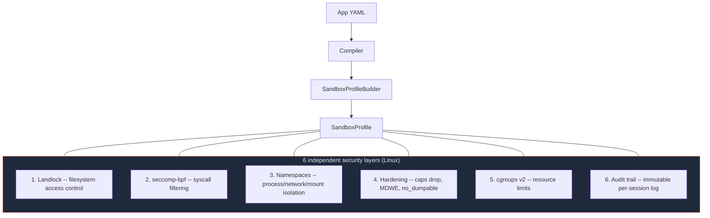
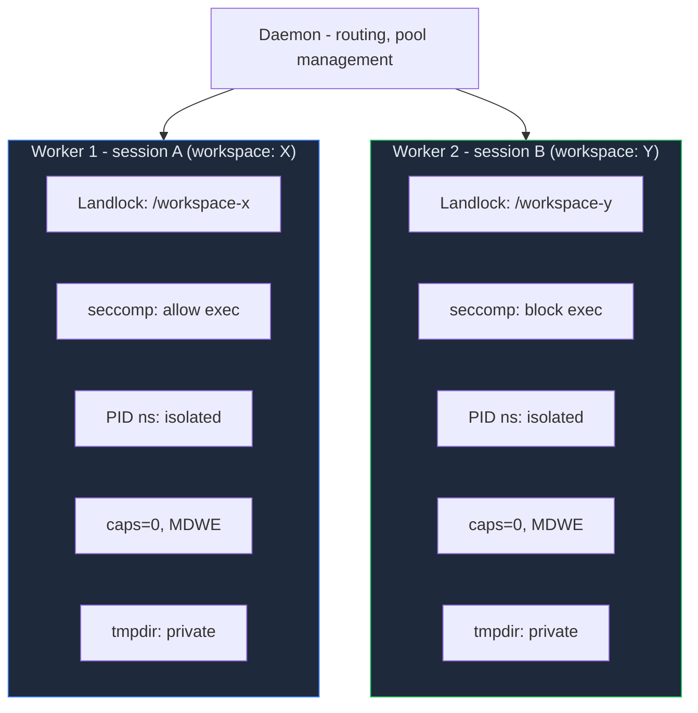
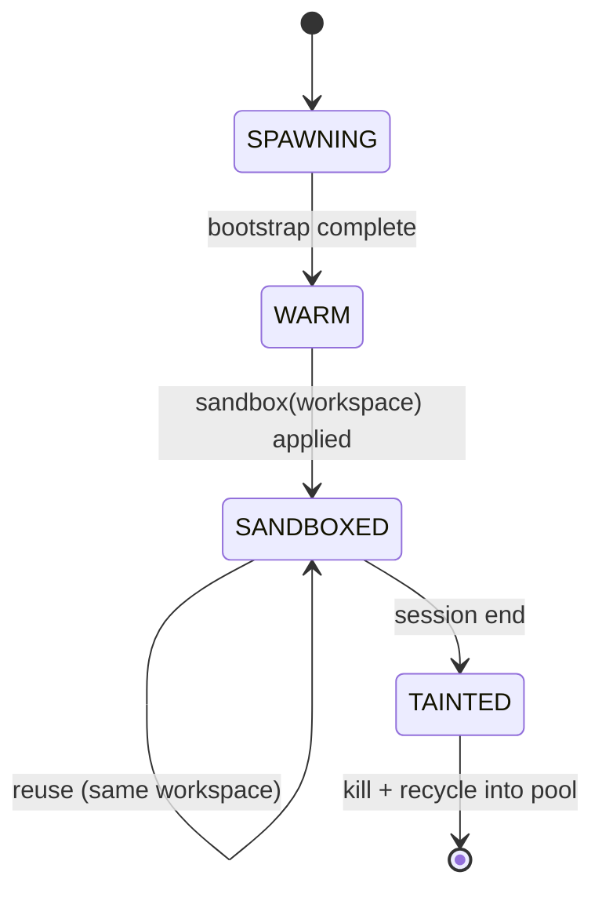

# OS-Level Sandbox

Digitorn enforces security at the **kernel level** using native OS mechanisms.
Even if a bug exists in the Python code, the operating system itself blocks
unauthorized access. No Docker required - and it goes further than Docker.

## Architecture



## Quick Start

```yaml
execution:
  workspace: "./my-project"
  sandbox:
    level: strict      # off | standard | strict | maximum
    allow_paths:
      - /data/models          # read-only
      - ~/datasets:rw         # read-write
```
```bash
digitorn start --sandbox
```

## Sandbox Levels

Four preset levels control how much isolation is applied:

| Level | What's enabled | Use case |
|-------|---------------|----------|
| `off` | No sandbox | Development, debugging |
| `standard` | Landlock + seccomp + hardening + cgroups | Single-worker production |
| `strict` | + warm pool + user/PID namespaces + per-session isolation | Multi-tenant, per-session workspaces |
| `maximum` | + network namespace + seccomp-notify audit + workspace snapshots | Maximum security, compliance |

### What each level adds

**`standard`** (default when `--sandbox` is enabled):
- Landlock restricts filesystem to workspace + declared paths
- seccomp blocks dangerous syscalls (mount, ptrace, reboot, etc.)
- seccomp blocks exec/network if app YAML doesn't grant them
- Process hardening: capabilities dropped, `PR_SET_NO_NEW_PRIVS`, `PR_SET_DUMPABLE=0`, MDWE
- Optional cgroups resource limits

**`strict`** adds:
- **Warm worker pool** - pre-bootstrapped workers, ~0.1ms sandbox activation
- **User namespace** - UID isolation without root
- **PID namespace** - worker can't see host processes
- **Per-session Landlock** - each session gets its own filesystem boundary

**`maximum`** adds:
- **Network namespace** - loopback only, no external network
- **seccomp-notify** - real-time syscall auditing (daemon intercepts syscalls)
- **Workspace snapshots** - CoW copy per session (overlayfs → reflink → full copy)
- **Audit trail** - append-only JSONL log per session

## The 6 Security Layers

### Layer 1: Landlock (Filesystem)

Kernel-level filesystem access control (Linux 5.13+). Irreversible - once applied, the process cannot lift restrictions.

```yaml
# What the app can access is derived from YAML:
modules:
  filesystem:
    constraints:
      paths: ["{{workspace}}", "/data/reports"]

execution:
  sandbox:
    allow_paths:
      - /data/models           # read-only access
      - /data/models:ro        # explicit read-only (same effect)
      - ~/datasets:rw          # read-write access
```
**OS enforcement:**
- Writable: workspace + paths declared `:rw` + `~/.digitorn/app_state/{app_id}/` + private tmpdir (per-worker)
- Readable: paths declared without suffix or `:ro` + `~/.digitorn/` (read-only) + system libraries + Python runtime
- Everything else: **EPERM at kernel level**

**Secrets isolation**: `~/.digitorn/` is **read-only** at kernel level. Apps cannot modify server config, JWT keys, or credentials. Each app gets its own writable state directory at `~/.digitorn/app_state/{app_id}/`.

**Private tmpdir**: Each worker gets its own private temporary directory via `tempfile.mkdtemp()`. The shared `/tmp` is **not writable** - this prevents cross-app data leaks and /tmp staging attacks.

Landlock ABI degrades gracefully based on kernel version:

| Kernel | ABI | Capabilities |
|--------|-----|-------------|
| 6.7+ | v4+ | Full FS + TCP network filtering |
| 6.2+ | v3 | Full FS (including TRUNCATE) |
| 5.19+ | v2 | FS + cross-directory rename protection |
| 5.13+ | v1 | Basic FS access control |
| < 5.13 | -- | No Landlock (seccomp + cgroups only) |

### Layer 2: seccomp-bpf (Syscall Filtering)

Blocks dangerous syscalls at the kernel level (Linux 3.17+). Uses a hand-built BPF filter - no external dependencies.

**Always blocked** (all levels):
- `mount`, `umount2`, `pivot_root`
- `reboot`, `kexec_load`
- `ptrace`, `process_vm_readv`, `process_vm_writev`
- `init_module`, `finit_module`, `delete_module`
- `swapon`, `swapoff`
- `sethostname`, `setdomainname`
- `keyctl`, `add_key`, `request_key`

**Conditionally blocked:**
- `execve`, `execveat` → blocked unless `shell` module is present
- `socket`, `connect`, `bind`, `listen`, `accept` → blocked unless `web`/`http`/`database` module is present

Even a Python exploit calling `os.system()` will fail if the YAML doesn't grant shell access.

### Layer 3: Namespaces (Process/Network Isolation)

Linux unprivileged namespaces - no root required (kernel 5.11+).

| Namespace | Flag | What it isolates |
|-----------|------|-----------------|
| **User** | `CLONE_NEWUSER` | UID isolation, enables other namespaces |
| **PID** | `CLONE_NEWPID` | Worker can't see or signal host processes |
| **Network** | `CLONE_NEWNET` | Loopback only - no external network |
| **Mount** | `CLONE_NEWNS` | Minimal filesystem view via `pivot_root` |

Namespaces are stacked in order: user → PID → network → mount. User namespace is always created first (it enables the others without root).

```yaml
execution:
  sandbox:
    level: strict
    namespaces: [user, pid, net]  # explicit override
```
### Layer 4: Process Hardening (prctl)

Applied inside the worker before Landlock/seccomp. Each feature is independent - if one fails (kernel too old), the rest still apply.

| Feature | prctl | What it prevents |
|---------|-------|-----------------|
| `PR_SET_NO_NEW_PRIVS` | Always | Privilege escalation via setuid binaries |
| `PR_SET_DUMPABLE=0` | Always | Core dumps, `/proc/self/mem` reads |
| `PR_CAP_BSET_DROP` | All 41 caps | Capability abuse even if euid=0 regained |
| `PR_SET_MDWE` | Kernel 6.3+ | `mmap(WRITE+EXEC)` - blocks JIT exploitation |

### Layer 5: cgroups v2 (Resource Limits)

Optional resource limits via systemd user scopes:

```yaml
execution:
  sandbox:
    resources:
      memory: "512MB"    # MemoryMax
      cpu: 2             # CPUQuota (200%)
      processes: 20      # TasksMax
```
### Layer 6: Audit Trail

Per-session append-only JSONL log recording security events:

```yaml
execution:
  sandbox:
    level: maximum
    audit: true
```
Events logged: sandbox applied, namespace created, hardening applied, syscall intercepted (from seccomp-notify), session start/end.

Stored in `~/.digitorn/audit/{app_id}/{session_id}.jsonl`.

## Warm Worker Pool

For `strict` and `maximum` levels, workers are pre-bootstrapped in a pool. When a session starts, a warm worker is assigned and the sandbox is applied in ~0.1ms (Landlock = 3 syscalls).



### Worker State Machine



**Key insight**: Bootstrap is expensive (~2-5s). Landlock is cheap (~0.1ms). Workers sit warm in the pool, sandbox is applied instantly when the session's workspace is known.

### Pool Configuration

```yaml
execution:
  sandbox:
    level: strict
    pool_size: 4         # pre-warmed workers (default: 2)
    pool_max: 16         # max under load (default: 8)
    session_timeout: 3600  # max session duration (seconds)
    idle_timeout: 300      # idle before worker recycle (seconds)
```
**Workspace affinity**: If an existing sandboxed worker has the same workspace, it's reused for multiple sessions. Workers are recycled (killed + respawned) only when the last session using that workspace disconnects.

## Per-Session Isolation

With `strict` or `maximum` level, each session gets its own sandbox:

- **Own Landlock** - session A cannot read session B's workspace
- **Own PID namespace** - session A cannot see session B's processes
- **Own network namespace** - session A has its own loopback
- **Own audit trail** - separate JSONL log per session

### Cross-Session Isolation

```yaml
# Session A: workspace = /projects/alice
# Session B: workspace = /projects/bob

# Alice's worker: Landlock allows /projects/alice only
# Bob's worker:   Landlock allows /projects/bob only
# Neither can read the other's files - enforced by the kernel
```
### Workspace Snapshots

With `maximum` level and `workspace_snapshot: true`, each session gets a copy-on-write snapshot of the workspace:

```yaml
execution:
  sandbox:
    level: maximum
    workspace_snapshot: true
```
Strategy cascade (tried in order):
1. **overlayfs** in user namespace (kernel 5.11+) - zero-copy, instant
2. **`cp --reflink=auto`** (btrfs/xfs) - CoW at block level
3. **rsync** - fallback, full copy

On session end, changes can be committed (merged back) or discarded.

## `allow_paths` - Additional Filesystem Access

Beyond the workspace, you can grant access to specific paths:

```yaml
execution:
  sandbox:
    allow_paths:
      - /data/models              # read-only
      - /data/models:ro           # explicitly read-only (same)
      - ~/datasets:rw             # read-write (~ expands to home)
      - /etc/myapp/config.yaml    # read-only (individual file)
```
| Syntax | Landlock effect |
|--------|----------------|
| `/path` | Readable (not writable) |
| `/path:ro` | Readable (explicit) |
| `/path:rw` | Writable (implies readable) |

Paths support `~` for home directory and are resolved to absolute paths. Combined with the workspace (always writable), system paths (Python runtime), `~/.digitorn/` (read-only), and the worker's private tmpdir.

## YAML-Driven Isolation

The sandbox reads what your app declares and translates it:

### Filesystem

```yaml
modules:
  filesystem:
    constraints:
      paths: ["{{workspace}}", "/data/reports"]
```
**→ Landlock**: kernel allows write to workspace + `/data/reports` only.

### Shell / Process Execution

```yaml
modules:
  shell:
    constraints:
      allowed_commands: [python, pytest]
```
**→ seccomp**: allows `execve` syscall (without shell module, it's blocked at kernel level).

### Network

```yaml
modules:
  web:
    config:
      egress:
        allowed_domains: ["api.github.com"]
```
**→ seccomp**: allows `socket`/`connect` (without web/http/database module, all network is blocked at kernel level).

### Network Filtering (iptables)

When `allowed_hosts` is configured and the worker runs in a **network namespace** (`strict` or `maximum` level), Digitorn enforces host-level filtering at the OS level via iptables OUTPUT rules:

```yaml
modules:
  web:
    config:
      egress:
        allowed_domains: ["api.github.com", "pypi.org"]
```
**How it works:**

1. Hostnames are **pre-resolved to IPs** (both IPv4 and IPv6) before the sandbox is applied
2. iptables OUTPUT chain rules are installed in the network namespace:
   - `ACCEPT` loopback (127.0.0.1, ::1)
   - `ACCEPT` established/related connections
   - `ACCEPT` each resolved IP
   - `DROP` everything else
3. Even if the Python process is compromised, the kernel drops packets to non-allowed IPs

```
iptables -A OUTPUT -o lo -j ACCEPT
iptables -A OUTPUT -m state --state ESTABLISHED,RELATED -j ACCEPT
iptables -A OUTPUT -d 140.82.121.6 -j ACCEPT    # api.github.com
iptables -A OUTPUT -d 151.101.128.223 -j ACCEPT  # pypi.org
iptables -A OUTPUT -j DROP                        # everything else
```

If iptables is not available (e.g., missing capabilities), the system falls back to application-level enforcement with a warning.

### MCP Servers (Deny-by-Default)

MCP servers are **fully controlled** by the sandbox. Every server must declare
its permissions explicitly - no declaration means **no OS-level rights** and
the server's tools will be rejected at execution time.

This applies at **two levels**:

1. **OS level** (seccomp/Landlock): the builder only grants `allow_exec`,
   `allow_network`, etc. for servers that declare them
2. **Application level** (MCP module): tools from servers without a `sandbox:`
   block are rejected before any call is made

```yaml
modules:
  mcp:
    config:
      servers:
        # ✅ Properly declared - works
        github:
          command: npx @modelcontextprotocol/server-github
          sandbox:
            permissions: [process.exec, net.http, fs.read]
            paths:
              read: ['{{workspace}}']
            allowed_hosts: [api.github.com]

        # ✅ Read-only local server - minimal permissions
        docs_search:
          command: python -m docs_mcp_server
          sandbox:
            permissions: [process.exec, fs.read]
            paths:
              read: ['{{workspace}}/docs']

        # ❌ No sandbox declared - BLOCKED at compile time (error)
        # and at runtime (tool calls rejected)
        risky_server:
          command: npx some-unknown-server
```
#### Permission Categories

| Permission | What it enables | Required for |
|---|---|---|
| `process.exec` | `execve` syscall | stdio transport (subprocess) |
| `process.*` | All process perms | stdio + spawn_daemon |
| `net.http` | `socket`/`connect` | SSE/HTTP transport |
| `net.socket` | Raw socket access | Low-level networking |
| `net.listen` | `bind`/`listen` | Servers that accept connections |
| `net.*` | All network perms | Full network access |
| `fs.read` | Read beyond workspace | Reading external files |
| `fs.write` | Write beyond workspace | Writing external files |
| `fs.delete` | Delete beyond workspace | Removing external files |
| `fs.*` | All filesystem perms | Full filesystem access |

#### Transport-aware validation

The compiler warns if a server's permissions don't match its transport:

- **stdio server** without `process.exec` → warning (subprocess will fail)
- **SSE/HTTP server** without `net.http` → warning (connection will fail)

#### What happens without sandbox declaration

```
# At compile time:
Error: modules.mcp.config.servers.risky_server: No 'sandbox' block declared.
       When the app has capabilities (security profile), every MCP server
       must declare explicit sandbox permissions.

# At runtime (if somehow bypassed):
Error: MCP server 'risky_server' has no sandbox permissions declared.
       Add a 'sandbox:' block with explicit permissions to the server
       config in your app YAML to allow execution.
```

#### Typical sandbox declarations by server type

```yaml
# Local file processor (stdio, reads workspace)
sandbox:
  permissions: [process.exec, fs.read]
  paths:
    read: ['{{workspace}}']

# API client (stdio, needs network)
sandbox:
  permissions: [process.exec, net.http]
  allowed_hosts: [api.example.com]

# Remote MCP server (SSE/HTTP, no subprocess)
sandbox:
  permissions: [net.http]
  allowed_hosts: [mcp.example.com]

# Full access (dangerous - use only for trusted servers)
sandbox:
  permissions: [process.exec, net.http, fs.read, fs.write]
  paths:
    read: ['{{workspace}}']
    write: ['{{workspace}}']
```
## Docker Comparison

| Capability | Digitorn Sandbox | Docker |
|-----------|-----------------|--------|
| Filesystem isolation | Landlock (per-path, kernel-enforced) | overlayfs (container-level) |
| Syscall filtering | seccomp-bpf with fine-grained rules | seccomp (coarser default profile) |
| Real-time syscall audit | seccomp-notify (daemon intercepts) | **Not available** |
| Process isolation | PID namespace (unprivileged) | PID namespace (requires root daemon) |
| Network isolation | Network namespace + iptables filtering | Bridge network (requires root daemon) |
| Network host filtering | Per-host iptables rules (DNS pre-resolved) | **Not available** (requires external firewall) |
| JIT exploit prevention | `PR_SET_MDWE` (blocks W+X mmap) | **Not available** |
| Capability drop | All 41 caps dropped | Partial drop |
| Secrets isolation | `~/.digitorn` read-only, per-app state dirs | Bind mounts (manual) |
| Temp directory isolation | Private tmpdir per worker | Shared `/tmp` in container |
| Cold start | ~0.1ms (warm pool) | ~500ms minimum |
| Root required | **No** (entirely unprivileged) | Yes (dockerd needs root) |
| Per-session isolation | Native (warm pool + deferred Landlock) | Requires container-per-session |
| MCP server sandbox | Deny-by-default, per-server permissions | **Not available** (must containerize each server) |
| Audit trail | Append-only JSONL + seccomp-notify events | Container logs only |

## Platform Support

### Linux (Full - 6 layers)

All mechanisms work without root. Most complete isolation.

| Mechanism | Kernel | What it does |
|-----------|--------|-------------|
| **Landlock** | 5.13+ | Filesystem access control |
| **seccomp-bpf** | 3.17+ | Syscall filtering |
| **Namespaces** | 5.11+ | User/PID/net/mount isolation (unprivileged) |
| **Hardening** | 6.3+ for MDWE | Capabilities, dumpable, MDWE |
| **cgroups v2** | 4.15+ | CPU/memory/process limits |
| **Audit** | 5.9+ for notify | Per-session event trail |

### macOS (Partial - Seatbelt + setrlimit)

```
Seatbelt (sandbox-exec) → filesystem + network + process restrictions
setrlimit              → memory + process count
```

### Windows (Partial - Job Objects)

```
Job Objects → memory limits, process count, auto-kill on exit
```

### Fallback

On unsupported platforms or old kernels, the sandbox logs a warning and relies on software-level enforcement only (the 7 security gates + module constraints). No crash, no failure.

## Full Configuration Reference

```yaml
execution:
  workspace: "./project"
  sandbox:
    # Preset level
    level: strict              # off | standard | strict | maximum

    # Worker pool (strict/maximum only)
    pool_size: 4               # pre-warmed workers (1-32, default: 2)
    pool_max: 16               # max workers under load (1-64, default: 8)

    # Namespaces (strict/maximum, or explicit override)
    namespaces: [user, pid, net]

    # Workspace snapshots (maximum only)
    workspace_snapshot: false

    # Audit trail
    audit: false

    # Timeouts
    session_timeout: 3600      # max session duration (seconds)
    idle_timeout: 300          # idle before worker recycle (seconds)

    # Additional filesystem access
    allow_paths:
      - /data/models           # read-only
      - ~/datasets:rw          # read-write

    # Resource limits
    resources:
      memory: "512MB"
      cpu: 2
      processes: 20
```
## Performance

| Operation | Latency | Notes |
|-----------|---------|-------|
| App deploy (pool warm-up) | ~2-5s × pool_size (parallel) | One-time |
| Session start (warm pool) | **~0.1ms** | Landlock = 3 syscalls |
| Session start (pool empty) | ~2-5s | Must bootstrap new worker |
| Chat request | ~50-200ms | LLM-dominated |
| Session end + recycle | ~10ms kill, async respawn | Invisible to user |
| Memory per worker | ~30-80MB | Comparable to a Python process |

## Error Handling

When the OS sandbox blocks an operation, the agent receives a clear error:

```json
{
  "success": false,
  "error": "OS sandbox blocked 'filesystem.read': [Errno 13] Permission denied. The app YAML does not grant sufficient permissions for this operation."
}
```

The agent can adjust its approach. No crash, no traceback.

## Enforcement Tests

The sandbox is proven by **37 kernel-level enforcement tests** across 7 layers:

| Layer | Tests | What's verified |
|-------|-------|----------------|
| Landlock | 8 | Read/write/mkdir/delete/rename/symlink escape blocked, readable-not-writable enforced |
| seccomp | 9 | ptrace/mount/reboot/sethostname/kernel-module blocked, exec/network conditionally blocked |
| Hardening | 5 | Capabilities dropped, no_dumpable, MDWE blocks W+X mmap, NO_NEW_PRIVS |
| Namespaces | 4 | User NS creation, PID NS hides host, network NS blocks external |
| Full Stack | 2 | All layers activate together, combined lockdown |
| Cross-Session | 3 | Different workspaces isolated, parent directory escape blocked, 3 concurrent sessions |
| Attack Scenarios | 6 | /proc/self/mem, /tmp staging, C2 socket, fork+exec chain, swap manipulation, combined 6-vector escape |

Each test forks a child process, applies the sandbox, then attempts the forbidden operation. The test passes **only if the kernel blocks it**.

## Zero Dependencies

The sandbox uses only Python standard library:
- **`ctypes`** for Linux syscalls (Landlock, seccomp, prctl, unshare)
- **`subprocess`** for macOS sandbox-exec
- **`ctypes.windll`** for Windows Job Objects
- **`resource`** for setrlimit

No extra `pip install`. Works immediately.
