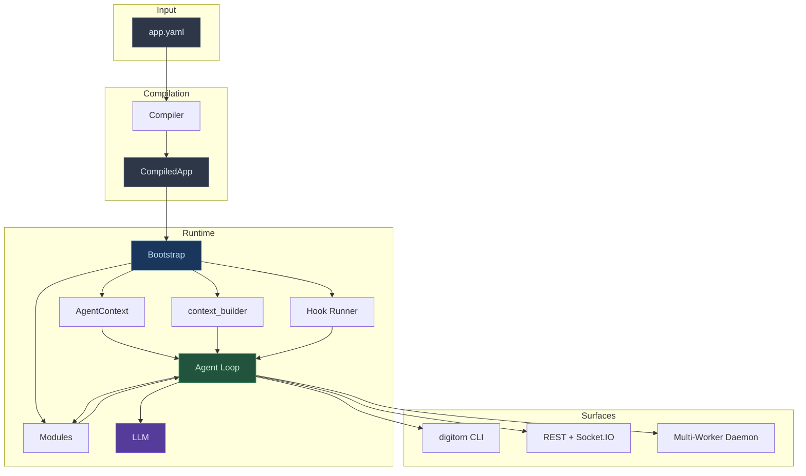
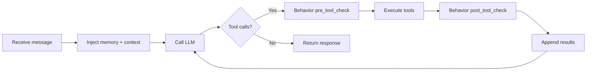
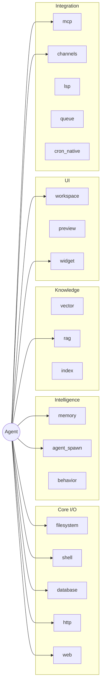

# Digitorn

A declarative framework for building AI agent applications.
Define what your agents do, how they think, and what tools
they use — entirely in YAML.

---

## What is Digitorn?

Digitorn turns a YAML file into a production-ready AI agent
application. You describe the agent's capabilities; the
framework handles LLM routing, tool discovery, memory
management, security enforcement, multi-agent orchestration,
and context-window optimisation.

```yaml
app:
  app_id: code-assistant
  name: Code Assistant

runtime:
  mode: conversation
  workdir: "{{env.PWD}}"

agents:
  - id: assistant
    role: assistant
    brain:
      provider: anthropic
      model: claude-sonnet-4-5
      backend: anthropic
      config: { api_key: "claude-code" }
      fallback:
        provider: anthropic
        model: claude-haiku-4-5
        backend: anthropic
        config: { api_key: "claude-code" }
    system_prompt: "You are a senior software engineer."

tools:
  modules:
    filesystem: {}
    shell: {}
    web: {}
    memory: {}
  capabilities:
    default_policy: auto
```

This agent reads + edits files, runs git via shell, searches
the web, tracks tasks, and survives context compaction. All
declared, not coded.

---

## The canonical 8-block YAML

`AppDefinition` (`schema.py:2619`, `extra: forbid`):

| Block | Purpose | Reference |
|-------|---------|-----------|
| `app:` | Identity (id, name, version, icon, color, category, ...). | [App Configuration → app](app-language/02-app-config.md#app--identity) |
| `runtime:` | Lifecycle + execution policy (mode, max_turns, timeout, triggers, hooks, watchers, payload_schema, workdir). | [App Configuration → runtime](app-language/02-app-config.md#runtime--lifecycle-and-execution-policy) |
| `agents:` | Who runs (brain + system_prompt + per-agent hooks + sub-agent pool). | [Agents](app-language/03-agents.md) |
| `tools:` | `modules`, `capabilities`, `channels`. | [App Configuration → tools](app-language/02-app-config.md#tools--what-the-agent-can-do) |
| `security:` | `behavior`, `sandbox`, `credentials_schema`. | [App Configuration → security](app-language/02-app-config.md#security--policy-only) |
| `ui:` | Pure display (theme, features, slash_commands, widgets, workspace, preview). Daemon never reads. | [App Configuration → ui](app-language/02-app-config.md#ui--display-layer-daemon-never-reads), [Client Manifest](app-language/44-client-manifest.md) |
| `dev:` | Variables, secrets — dev only. | [App Configuration → dev](app-language/02-app-config.md#dev--dev-time-only) |
| `flow:` | Multi-app pipeline composition. | [Flow](app-language/02-app-config.md#flow--multi-app-pipelines) |

Legacy `execution:` is auto-aliased to `runtime:` via
`schema_aliases.py`. New apps should write `runtime:`
directly.

---

## Why Digitorn?

Building an AI agent today means writing the same
infrastructure over and over: prompt engineering, tool
routing, context-window handling, memory persistence, error
recovery, security policies. Every project starts from
scratch.

Digitorn provides this infrastructure as a declarative
layer.

| What you declare | What Digitorn handles |
|------------------|----------------------|
| `brain: { provider: deepseek }` | Provider URL resolution, connection pooling, retry, fallback brain on 402. |
| `tools.modules: [filesystem, shell]` | Tool discovery, routing, parameter validation, result normalisation. |
| `tools.modules.memory: {}` | Cognitive state that survives context compaction. |
| `agents: { role: coordinator }` | Parallel sub-agent orchestration with isolated contexts. |
| `tools.capabilities: { grant, deny }` | Security policies with risk-based approval workflows. |
| `security.sandbox: { level: strict }` | Kernel-level Landlock + seccomp + namespaces — no Docker. |
| `runtime.triggers: [...]` (or `tools.modules.channels`) | Cron / webhook / file-watch / email / RSS / queue / Slack / Telegram / Discord / voice — bidirectional I/O. |

---

## Architecture



### The agent loop



---

## Core concepts

### Modules

Modules provide agent capabilities. Each one exposes a set
of `@action`-decorated methods. Mounted under
`tools.modules.<id>` in the YAML — the `config:` wrapper is
mandatory for any module that takes config.



See the [Module Reference](modules/reference/) for the full
catalogue (22 modules).

### Tool discovery

Two-mode system, chosen automatically based on the number of
tools and the context window size:

| Mode | When | How |
|------|------|-----|
| **Direct** | Few tools, large context | All tools injected as native function schemas. |
| **Discovery** | Many tools or smaller context | 5 meta-tools (`search_tools`, `get_tool`, `execute_tool`, `list_categories`, `browse_category`) backed by semantic search (FastEmbed + Qdrant). |

Force a mode via `runtime.tool_injection: direct |
compact_direct | discovery`.

### Memory

The cognitive memory module gives agents persistent
awareness across turns and compactions. Only **4 LLM-exposed
actions**: `Remember`, `TaskCreate`, `TaskUpdate`, plus
`memory.set_goal` (called via FQN — no short alias).

Working memory (goal + todos + facts + entities) is rendered
into the system prompt every turn. Compaction hooks preserve
this block verbatim.

[Cognitive Memory](app-language/05-memory.md) ·
[memory module](modules/reference/memory.md)

### Multi-agent

A coordinator agent spawns specialist sub-agents that run in
parallel with fully isolated contexts. **One `Agent` tool, 8
modes** dispatched via params (background by default,
`asyncio.gather` for concurrent calls in one turn).

5 modules are **shared** between coordinator and sub-agents
(`memory`, `web`, `lsp`, `filesystem`, `shell`); the rest get
fresh instances.

[agent_spawn module](modules/reference/agent_spawn.md)

### Security

Three layers, independently configurable:

| Layer | Where | Granularity |
|-------|-------|-------------|
| **Capabilities gate** | `tools.capabilities` | Per-action `grant` / `deny` / `approve` (with timeout). 7 security gates from app-active to rate-limit. |
| **Behaviour engine** | `security.behavior` | Per-tool runtime checks (block / warn / remind). 14 built-in rules + custom + semantic classifier. |
| **OS sandbox** | `security.sandbox` | Kernel-level Landlock + seccomp + namespaces + cgroups. 4 levels (`off`, `standard`, `strict`, `maximum`). |

[Security](app-language/11-security.md) ·
[Behavior Engine](app-language/43-behavior.md) ·
[OS-Level Sandbox](app-language/35-sandbox.md)

### Credentials

Centralised encrypted vault. Apps reference credentials by
name in YAML (`{{credential.X}}`); the daemon resolves them
at deploy time (system / per-app shared) or session start
(per-user / per-app per-user). 19 handler types (api_key,
oauth2, oauth2_pkce, bearer_token, basic_auth, multi_field,
ssh_key, mTLS, ...). 18 builtin provider templates.

[credentials.md](credentials.md)

### Background mode + channels

Two systems for trigger-driven apps:

- **Legacy `runtime.triggers`** — lightweight cron / watch /
  http (3 trigger types). Documented in
  [Triggers](app-language/09-triggers.md).
- **`channels` module** — production bidirectional I/O with
  11 adapters (webhook, cron, file_watcher, email, rss, log,
  queue, telegram, discord, slack, voice) + activation
  pipeline (filter / prepare / route / session / reply). When
  loaded, supersedes the legacy triggers.

Multi-user routing keys, per-payload validation,
per-activation event timeline, circuit breaker — see
[Background Sessions](app-language/38-background-sessions.md)
and [Channels](app-language/40-channels.md).

### UI: workspace + widgets + preview

Three coexisting surfaces:

| Surface | Purpose |
|---------|---------|
| **`ui.workspace`** | In-memory virtual filesystem renderer. 8 render modes (`auto`, `react`, `html`, `markdown`, `slides`, `code`, `latex`, `builder`). Powers Lovable-style React sandboxes, LaTeX editors, slides. |
| **`ui.widgets`** | Declarative UI tree (43 primitives, 15 actions, server-side template substitution, REST + Socket.IO). Powers forms, dashboards, source pickers. |
| **`ui.preview`** | Spawns a real Node dev server (Vite, Next, Remix) on deploy and reverse-proxies it. |

[Workspace & Preview](app-language/41-preview.md) ·
[Widgets](app-language/42-widgets.md) ·
[Client Manifest](app-language/44-client-manifest.md)

---

## Getting started

### Install

```bash
pip install digitorn
```

### Create an app

```yaml
# my-app.yaml
app:
  app_id: my-app
  name: "My First Agent"

runtime:
  mode: conversation
  greeting: "Hello! How can I help you today?"

agents:
  - id: assistant
    role: assistant
    brain:
      provider: ollama
      model: llama3.1:8b
      backend: openai_compat
      config: { base_url: "http://localhost:11434/v1" }
    system_prompt: "You are a helpful coding assistant."

tools:
  modules:
    filesystem: {}
    memory: {}
  capabilities:
    default_policy: auto
```

### Run

```bash
# Start the daemon (in another terminal)
digitorn start

# Deploy + chat
digitorn app run my-app.yaml          # equivalent to deploy --force
digitorn dev chat my-app -m "Hello!"  # one-shot
digitorn dev chat my-app              # interactive
```

[Getting Started](app-language/01-getting-started.md) ·
[Dev CLI](app-language/46-dev-cli.md)

---

## CLI reference

```bash
# Run apps (daemon must be running)
digitorn app run <app.yaml>         # deploy + arm triggers
digitorn dev chat <app-id>          # interactive REPL
digitorn dev chat <app-id> -m "msg" # one-shot

# Daemon lifecycle
digitorn start [--host ... --tls-cert ... --tls-key ...]
digitorn stop

# Dev workflow
digitorn dev deploy <yaml>
digitorn dev status <app-id>
digitorn dev history <app-id> <session-id>
digitorn dev chat <app-id> [-m "single message"]

# App management
digitorn app deploy <yaml> [--scope user|system]
digitorn app list
digitorn app undeploy <app-id>

# MCP
digitorn mcp install <name>
digitorn mcp list
digitorn mcp test <name>

# Credentials
digitorn credentials list
digitorn credentials set <name>
digitorn credentials grant <name> --app <app-id>
```

[Dev CLI](app-language/46-dev-cli.md) ·
[Production Deployment](app-language/36-production.md)

---

## Documentation map

### Guides

| Guide | Description |
|-------|-------------|
| [Getting Started](app-language/01-getting-started.md) | Install, first app, run modes. |
| [App Configuration](app-language/02-app-config.md) | Canonical 8-block YAML reference. |
| [Agents](app-language/03-agents.md) | Brain, system_prompt, sub-agent pools, capabilities. |
| [Tool Injection](app-language/04-tools.md) | Discovery vs direct, native vs text-based tool calling. |
| [Cognitive Memory](app-language/05-memory.md) | Goals, tasks, notes, facts, compaction survival. |
| [Multi-Agent](app-language/12-multi-agent.md) | Coordinator, specialists, parallel execution. |
| [Security](app-language/11-security.md) | Capabilities, gates, approval workflows. |
| [Behavior Engine](app-language/43-behavior.md) | 14 built-in rules + classifier. |
| [OS-Level Sandbox](app-language/35-sandbox.md) | Landlock + seccomp + namespaces (no Docker). |
| [Triggers](app-language/09-triggers.md) | Cron / watch / http (legacy). |
| [Background Sessions](app-language/38-background-sessions.md) | Multi-user routing, payload schema, activation timeline. |
| [Channels](app-language/40-channels.md) | 11 adapters, activation pipeline (supersedes triggers). |
| [Workspace & Preview](app-language/41-preview.md) | Virtual FS + dev-server proxy. |
| [Widgets](app-language/42-widgets.md) | 43 primitives, 15 actions, REST + Socket.IO. |
| [RAG Module](app-language/37-rag.md) | Knowledge bases, hybrid retrieval, Text2SQL. |
| [API Integration](app-language/14-api-integration.md) | REST + Socket.IO surface (every endpoint cited). |
| [Production Deployment](app-language/36-production.md) | TLS, auth, sandbox, rate limits, SSRF. |
| [Multi-Tenant Installs](app-language/45-multi-tenant.md) | `(app_id, scope, owner_user_id)` triple. |
| [Dev CLI](app-language/46-dev-cli.md) | `digitorn dev *` workflow. |
| [Examples](app-language/15-examples.md) | 14 complete real-world apps. |

### Module reference

22 modules — see [the directory](modules/reference/).
Highlights:

- **Core I/O**: [filesystem](modules/reference/filesystem.md),
  [shell](modules/reference/shell.md),
  [http](modules/reference/http.md),
  [web](modules/reference/web.md),
  [database](modules/reference/database.md).
- **Intelligence**: [memory](modules/reference/memory.md),
  [agent_spawn](modules/reference/agent_spawn.md),
  [behavior](modules/reference/behavior.md).
- **Knowledge**: [rag](modules/reference/rag.md),
  [vector](modules/reference/vector.md),
  [index_module](modules/reference/index_module.md).
- **UI**: [workspace](modules/reference/workspace.md),
  [widget](modules/reference/widget.md),
  [preview](modules/reference/preview.md).
- **Integration**: [mcp](modules/reference/mcp.md),
  [channels](modules/reference/channels.md),
  [lsp](modules/reference/lsp.md),
  [queue](modules/reference/queue.md),
  [cron_native](modules/reference/cron_native.md).
- **System**:
  [context_builder](modules/reference/context_builder.md),
  [llm_provider](modules/reference/llm_provider.md),
  [dev_tools](modules/reference/dev_tools.md).

### Top-level

- [credentials.md](credentials.md) — vault, KMS, OAuth.
- [configuration.md](configuration.md) — daemon `Settings`.
- [hooks.md](hooks.md) — 15 events, 14 conditions, 13
  actions.
- [middleware.md](middleware.md) — 5 app + 3 module
  built-ins.
- [Bundle namespaces](app-language/38-bundle-namespaces.md) —
  `{{prompt.X}}`, `{{skill.X}}`, `{{behavior.X}}`,
  `{{asset.X}}`, `{{include:...}}`.

---

## Glossary

| Term | Definition |
|------|-----------|
| **Action** | A function exposed by a module that an agent can call. Decorated `@action`. |
| **Agent** | An LLM-powered entity with its own brain, system_prompt, and tool surface. |
| **Brain** | LLM config: provider, model, backend (`openai_compat` or `anthropic`), temperature, context settings, optional `fallback`. |
| **Capability** | An action permission expressed in `tools.capabilities`: `grant`, `deny`, `approve`. |
| **Compaction** | Automatic summarisation of old messages when the context window fills up. |
| **Context window** | Max tokens an LLM can process per request. |
| **Coordinator** | An agent with `role: coordinator` that can spawn sub-agents via the `Agent` tool. |
| **Module** | A self-contained package of `@action` methods. Declared under `tools.modules.<id>`. |
| **Provider** | An LLM service backend (DeepSeek, OpenAI, Anthropic, Ollama, ...). |
| **Skill** | A reusable workflow markdown file the agent loads on demand via `use_skill`. |
| **Specialist** | A sub-agent with `role: specialist` and a constrained tool surface. |
| **Trigger** | An inbound event source: `cron`, `watch`, `http` (legacy `runtime.triggers`); for full bidirectional I/O use the `channels` module. |
| **Working memory** | Goal + todos + facts + entities — rendered into the system prompt every turn. |
| **Workspace** | Either `runtime.workdir` (real filesystem) OR `ui.workspace` (in-memory virtual FS). Distinct concepts. |
