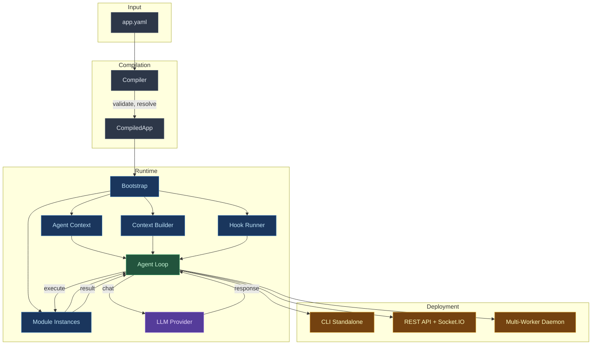
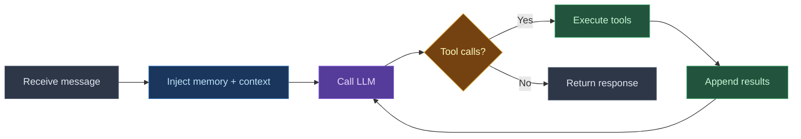
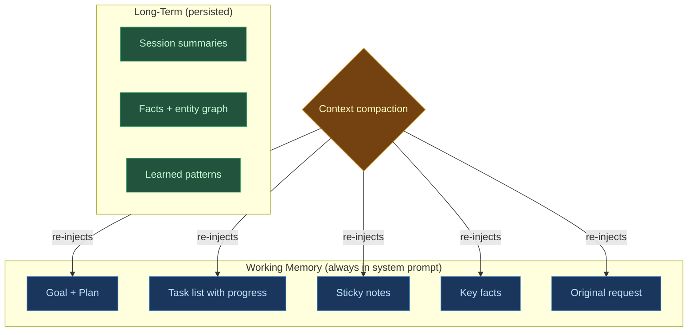
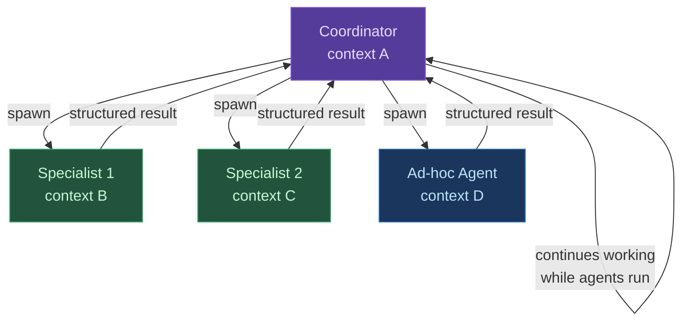

# Digitorn

A declarative framework for building AI agent applications. Define what your agents do, how they think, and what tools they use -- entirely in YAML.

---

## What is Digitorn?

Digitorn turns a YAML file into a production-ready AI agent application. You describe the agent's capabilities. The framework handles LLM routing, tool discovery, memory management, security enforcement, multi-agent orchestration, and context window optimization.

```yaml
app:
  app_id: code-assistant
  name: "Code Assistant"

modules:
  filesystem: {}
  shell: {}
  web: {}
  memory:
    config:
      working_memory: true
      todo_list: true

agents:
  - id: assistant
    role: assistant
    brain:
      provider: anthropic
      model: claude-sonnet-4-5
      config:
        api_key: "claude-code"
      fallback:
        provider: anthropic
        model: claude-haiku-4-5
        config:
          api_key: "claude-code"
    system_prompt: "You are a senior software engineer."
```
This agent can read and edit files, run git commands via shell, search the web, track its tasks, and maintain context across compactions. All declared, not coded.

---

## Why Digitorn?

Building an AI agent today means writing the same infrastructure over and over: prompt engineering, tool routing, context window handling, memory persistence, error recovery, security policies. Every project starts from scratch.

Digitorn provides this infrastructure as a declarative layer. You describe *what* your agent should do. The framework handles *how* it runs.

| What you declare | What Digitorn handles |
|---|---|
| `brain: deepseek` | Provider auto-configuration, connection pooling, retry logic |
| `modules: [filesystem, shell]` | Tool discovery, routing, parameter validation, result normalization |
| `memory: working_memory: true` | Cognitive state that survives context compaction |
| `agents: role: coordinator` | Parallel sub-agent orchestration with isolated contexts |
| `capabilities: grant/deny` | Security policies with risk-based approval workflows |

---

## Architecture



### The Agent Loop

The core runtime follows a simple cycle:



---

## Core Concepts

### Modules

Modules provide agent capabilities. Each module exposes a set of **actions** that agents discover and execute at runtime.

```mermaid
graph LR
    subgraph "Core I/O"
        FS[filesystem]
        DB[database]
        SH[shell]
        HTTP[http]
        WEB[web]
    end

    subgraph "Intelligence"
        MEM[memory]
        SPAWN[agent_spawn]
    end

    subgraph "Infrastructure"
        CACHE[cache]
        Q[queue]
        VEC[vector]
        CRON[cron_native]
        RAG[rag]
    end

    subgraph "UI / Preview"
        WS[workspace]
        PREV[preview]
        WIDG[widget]
    end

    subgraph "Integration"
        MCP[mcp]
        CH[channels]
        LSP[lsp]
    end

    Agent((Agent)) --> FS
    Agent --> DB
    Agent --> SH
    Agent --> HTTP
    Agent --> WEB
    Agent --> MEM
    Agent --> SPAWN
    Agent --> CACHE
    Agent --> Q
    Agent --> VEC
    Agent --> CRON
    Agent --> RAG
    Agent --> WS
    Agent --> PREV
    Agent --> WIDG
    Agent --> MCP
    Agent --> CH
    Agent --> LSP

    style Agent fill:#553c9a,stroke:#805ad5,color:#e9d8fd
    style FS fill:#22543d,stroke:#38a169,color:#c6f6d5
    style DB fill:#22543d,stroke:#38a169,color:#c6f6d5
    style SH fill:#22543d,stroke:#38a169,color:#c6f6d5
    style HTTP fill:#22543d,stroke:#38a169,color:#c6f6d5
    style WEB fill:#22543d,stroke:#38a169,color:#c6f6d5
    style MEM fill:#1a365d,stroke:#2b6cb0,color:#bee3f8
    style SPAWN fill:#1a365d,stroke:#2b6cb0,color:#bee3f8
    style CACHE fill:#2d3748,stroke:#4a5568,color:#e2e8f0
    style Q fill:#2d3748,stroke:#4a5568,color:#e2e8f0
    style VEC fill:#2d3748,stroke:#4a5568,color:#e2e8f0
    style CRON fill:#2d3748,stroke:#4a5568,color:#e2e8f0
    style RAG fill:#2d3748,stroke:#4a5568,color:#e2e8f0
    style WS fill:#744210,stroke:#d69e2e,color:#fefcbf
    style PREV fill:#744210,stroke:#d69e2e,color:#fefcbf
    style WIDG fill:#744210,stroke:#d69e2e,color:#fefcbf
    style MCP fill:#553c9a,stroke:#805ad5,color:#e9d8fd
    style CH fill:#553c9a,stroke:#805ad5,color:#e9d8fd
    style LSP fill:#553c9a,stroke:#805ad5,color:#e9d8fd
```



See the [Module Reference](modules/index.md) for the complete list.

### Tool Discovery

Agents discover tools through a two-mode system, chosen automatically based on the number of tools and the context window size:

| Mode | When | How it works |
|---|---|---|
| **Direct** | Few tools, large context | All tools injected as native function schemas |
| **Discovery** | Many tools, smaller context | Agent uses meta-tools backed by semantic search |

In discovery mode, the agent uses five meta-tools (`search_tools`, `get_tool`, `execute_tool`, `list_categories`, `browse_category`) to find and execute any action from any module. Semantic search is powered by FastEmbed (multilingual embeddings) and Qdrant (in-memory HNSW index).

### Memory

The cognitive memory system gives agents persistent awareness across turns and compactions.



Every layer is opt-in. Enable only what you need. See [Cognitive Memory](app-language/05-memory.md).

### Multi-Agent

A coordinator agent spawns specialist sub-agents that run in parallel with fully isolated context windows.



Each sub-agent has its own LLM provider, tools, memory, and context window. The coordinator receives structured results (findings, facts, errors) and is notified automatically on completion. See [Multi-Agent](app-language/12-multi-agent.md).

### Security

Applications declare what agents can and cannot do. Actions are classified by risk level. The security profile maps risks to policies.

| Risk Level | Examples | Default Behavior |
|---|---|---|
| Low | Read file, list directory, search | Auto-approved |
| Medium | Write file, HTTP POST, shell bash (git commit) | Depends on policy |
| High | Delete file, shell push/rm, network writes | Requires explicit grant |

See [Security](app-language/11-security.md).

---

## Getting Started

### Install

```bash
pip install digitorn
```

### Create an application

```yaml
# my-app.yaml
app:
  app_id: my-app
  name: "My First Agent"

modules:
  filesystem: {}
  memory:
    config:
      working_memory: true

agents:
  - id: assistant
    brain:
      provider: ollama
      model: llama3.1:8b
    system_prompt: "You are a helpful coding assistant."

execution:
  mode: conversation
  greeting: "Hello! How can I help you today?"
```
### Run

```bash
# Standalone (no daemon)
digitorn run my-app.yaml

# Or deploy to the daemon
digitorn service start
digitorn app deploy my-app.yaml
digitorn run my-app
```

---

## Documentation

### Guides

| Guide | Description |
|---|---|
| [Getting Started](app-language/01-getting-started.md) | Installation, first app, running |
| [App Configuration](app-language/02-app-config.md) | YAML structure reference |
| [Agents](app-language/03-agents.md) | Agent definition, brain, providers |
| [Tools](app-language/04-tools.md) | Tool discovery, meta-tools, semantic search |
| [Cognitive Memory](app-language/05-memory.md) | Goals, tasks, notes, facts, compaction survival |
| [Context Management](app-language/06-context-management.md) | Compaction strategies, hooks |
| [Multi-Agent](app-language/12-multi-agent.md) | Coordinator, specialists, parallel execution |
| [Security](app-language/11-security.md) | Capabilities, policies, approval workflows |
| [API Integration](app-language/14-api-integration.md) | REST API, Socket.IO streaming |

### Module Reference

**Core I/O**

| Module | Description |
|---|---|
| [filesystem](modules/reference/filesystem.md) | File operations, surgical edits, fast grep |
| [database](modules/reference/database.md) | SQL databases with introspection |
| [shell](modules/reference/shell.md) | Shell commands (Git Bash on Windows) |
| [http](modules/reference/http.md) | HTTP client |
| [web](modules/reference/web.md) | Web search and content extraction |

**Agent Intelligence**

| Module | Description |
|---|---|
| [memory](modules/reference/memory.md) | Cognitive memory system (goals, tasks, facts) |
| [agent_spawn](modules/reference/agent_spawn.md) | Multi-agent orchestration (coordinator/specialist) |

**Infrastructure**

| Module | Description |
|---|---|
| [queue](modules/reference/queue.md) | In-memory job queue |
| [vector](modules/reference/vector.md) | Vector embeddings |
| [cron_native](modules/reference/cron_native.md) | Native scheduler |
| [rag](modules/reference/rag.md) | RAG with Qdrant |
| [index_module](modules/reference/index_module.md) | Semantic code index |

**UI / Preview**

| Module | Description |
|---|---|
| [workspace](modules/reference/workspace.md) | Virtual filesystem for live-preview apps (6 actions: WsWrite, WsRead, WsEdit, WsGlob, WsGrep, WsDelete) |
| preview | Socket.IO transport for live UI (all actions internal=True) |
| widget | Declarative UI components (render, update, close, state) |

**Integration**

| Module | Description |
|---|---|
| [mcp](modules/reference/mcp.md) | External MCP servers |
| channels | Output delivery (Slack, Telegram, email, webhook) |
| lsp | Language Server Protocol (diagnostics) |

**System**

| Module | Description |
|---|---|
| [context_builder](modules/reference/context_builder.md) | Tool discovery, ask_user, use_skill |
| [llm_provider](modules/reference/llm_provider.md) | LLM backend abstraction |

### Advanced

| Guide | Description |
|---|---|
| [MCP Servers](app-language/04d-mcp.md) | Connect external tools via Model Context Protocol |
| [Middleware](app-language/17-middleware.md) | Request/response pipeline at app, module, and MCP levels |
| [Tool chaining](tool_chaining.md) | **Runtime primitive** — route any tool's output into any other tool via YAML. Works for native modules + MCP servers |
| [Skills](app-language/21-skills.md) | Reusable workflow commands |
| [Output Channels](app-language/05-channels.md) | Email, webhook, Slack notifications |
| [Voice Transcription](voice_transcription.md) | `POST /api/transcribe` — Whisper-backed voice-to-text endpoint |
| [Examples](app-language/15-examples.md) | Complete real-world applications |

---

## CLI Reference

```bash
# Run applications
digitorn run <app.yaml> [message]       # Standalone mode
digitorn run <app-id>                   # Daemon mode (interactive)

# Application management
digitorn app deploy <app.yaml>          # Deploy to daemon
digitorn app list                       # List deployed apps
digitorn app undeploy <app-id>          # Remove from daemon
digitorn app validate <app.yaml>        # Validate YAML syntax
digitorn app schema <module-id>         # Show module config schema

# Daemon lifecycle
digitorn service start                  # Start daemon
digitorn service stop                   # Stop daemon
digitorn service restart                # Restart daemon
digitorn service status                 # Service status
digitorn service logs                   # Tail daemon logs
digitorn service install                # Install as OS service
digitorn service uninstall              # Remove OS service

# MCP servers
digitorn mcp install <name>             # Install an MCP server
digitorn mcp list                       # List installed servers
digitorn mcp test <name>                # Test server connection
```

---

## Glossary

| Term | Definition |
|---|---|
| **Action** | A function exposed by a module that an agent can call. Defined with the `@action` decorator. |
| **Agent** | An LLM-powered entity that receives messages, reasons, and calls actions to accomplish tasks. |
| **Brain** | The LLM configuration for an agent: provider, model, temperature, context settings. |
| **Compaction** | Automatic summarization of old messages when the context window fills up. |
| **Context window** | The maximum number of tokens an LLM can process in a single request. |
| **Coordinator** | An agent that spawns and manages sub-agents for parallel work. |
| **Module** | A self-contained package of actions. Modules are declared in YAML and auto-discovered. |
| **Provider** | An LLM service backend (DeepSeek, OpenAI, Anthropic, Ollama, etc.). |
| **Skill** | A reusable workflow file (.md) that an agent loads on demand via `use_skill`. |
| **Specialist** | A pre-configured sub-agent with a specific role, brain, and skill set. |
| **Working memory** | Cognitive state (goal, tasks, notes, facts) that is always visible to the agent. |
