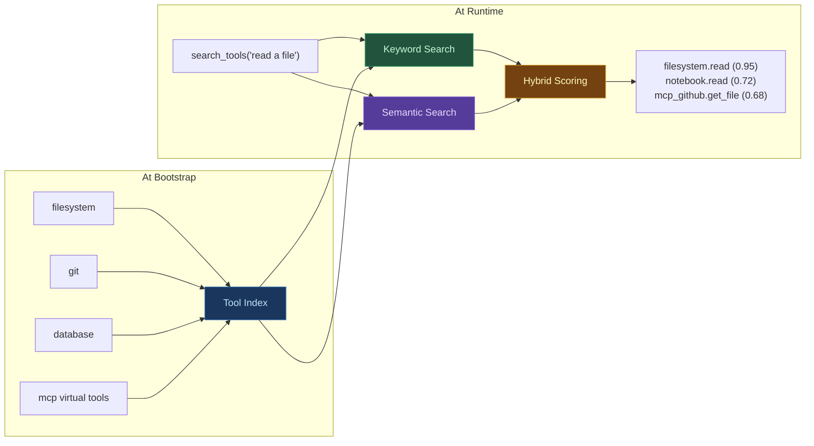
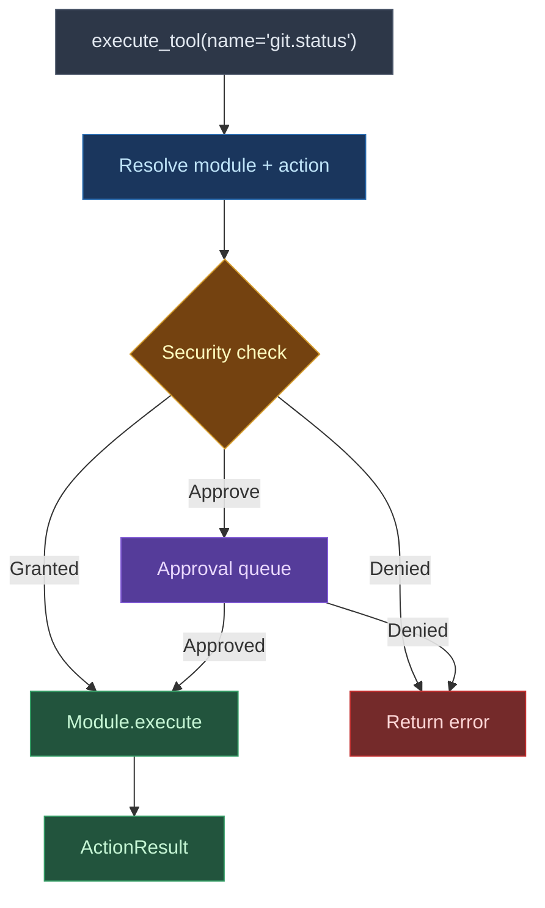
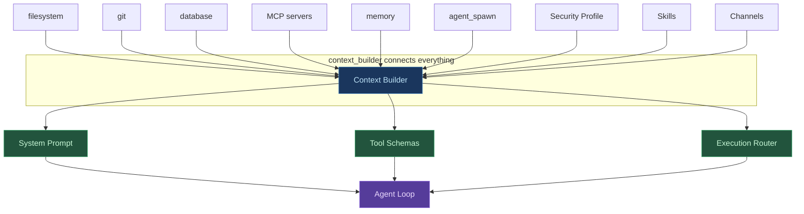

# context_builder

The context builder is the **central nervous system** of every Digitorn application. It sits between the agent and everything else: modules, providers, memory, security, and the outside world. Every tool call passes through it. Every system prompt is assembled by it. Every background task, watcher, and scheduled job is managed by it.

| Property | Value |
|----------|-------|
| **Module ID** | `context_builder` |
| **Version** | `1.0.0` |
| **Type** | system (auto-loaded for every application) |
| **Source** | `packages/digitorn/modules/context_builder/` |
| **Actions** | 17 |

---

## What It Does

The context builder is responsible for five core functions:

### 1. Tool Indexing

When an application starts, the context builder scans every loaded module and builds a searchable index of all available actions.

For each action, it indexes:
- The fully qualified name (`filesystem.read`, `git.status`)
- The description from the `@action` decorator
- All tags and aliases (including multilingual)
- Parameter names and their descriptions
- Side effects and risk levels
- Synonym expansions (e.g., "delete" indexes "remove", "destroy", "erase")

The index powers two search strategies:

**Keyword search** -- exact match, prefix match, and fuzzy match on action names, module names, and aliases. Used when the agent knows roughly what it wants.

**Semantic search** -- the description, tags, and parameter names are embedded using FastEmbed (`paraphrase-multilingual-MiniLM-L12-v2`, 384 dimensions, 50+ languages) and stored in an in-memory Qdrant HNSW index. Used when the agent describes what it needs in natural language.

The final ranking uses hybrid scoring: `semantic_score * 10 + keyword_boost`. This means semantic matches dominate, but exact name matches get a significant bonus.



### 2. System Prompt Assembly

The context builder generates the complete system prompt that the LLM receives. This is not a static string -- it is assembled dynamically from multiple sources:

```mermaid
graph TB
    subgraph "System Prompt (assembled by context_builder)"
        direction TB
        A["Memory Snapshot<br/>(goal, tasks, notes, facts)"]
        B["Memory Instructions<br/>(how to use memory tools)"]
        C["Agent Identity<br/>('You are agent X, role Y')"]
        D["Tool Instructions<br/>(discovery or direct mode)"]
        E["Structural Hints<br/>(parameter templates, JSON examples)"]
        F["Agent Pool Info<br/>(available specialists)"]
        G["Skills List<br/>(available /commands)"]
        H["Channel Info<br/>(available notification channels)"]
        I["User System Prompt<br/>(personality, behavior)"]
    end

    A --> FINAL[Final System Prompt]
    B --> FINAL
    C --> FINAL
    D --> FINAL
    E --> FINAL
    F --> FINAL
    G --> FINAL
    H --> FINAL
    I --> FINAL

    style A fill:#1a365d,stroke:#2b6cb0,color:#bee3f8
    style B fill:#1a365d,stroke:#2b6cb0,color:#bee3f8
    style D fill:#22543d,stroke:#38a169,color:#c6f6d5
    style E fill:#22543d,stroke:#38a169,color:#c6f6d5
    style F fill:#553c9a,stroke:#805ad5,color:#e9d8fd
    style G fill:#553c9a,stroke:#805ad5,color:#e9d8fd
    style I fill:#744210,stroke:#d69e2e,color:#fefcbf
```



The user's YAML `system_prompt` is always last. The context builder provides everything else automatically. This means the user only defines personality and behavior -- never tool instructions.

The prompt adapts based on:
- **Tool injection mode** (discovery vs direct): different instruction sets
- **Native vs text-based tool calling**: native mode uses JSON schemas, text mode includes tool listings in the prompt
- **Active modules**: only instructions for loaded modules appear
- **Memory state**: the current memory snapshot is injected first
- **Agent role**: coordinators see agent pool info, workers do not

### 3. Execution Routing

When the agent calls a tool, the context builder resolves and routes it:



The routing handles:
- Module resolution from the fully qualified name
- Security profile enforcement (grant/deny/approve)
- Parameter validation against Pydantic models
- MCP virtual tool routing (tools from external MCP servers)
- Error messages with schema hints when parameters are wrong
- Fuzzy name matching with "did you mean?" suggestions

### 4. Execution Primitives

The context builder provides 22 primitive actions that are available to every agent:

**Parallel execution** -- run multiple actions concurrently and collect all results.

**Background tasks** -- launch long-running actions without blocking the agent loop. The agent continues working and gets notified when tasks complete.

**Watchers** -- persistent monitors that periodically execute an action and notify on changes. Used for monitoring APIs, file changes, or system status.

**Scheduler** -- schedule actions at specific times (one-shot) or on recurring schedules (cron). Supports natural language time expressions ("in 30 minutes", "every day at 9am").

**Remember** -- a semantic shortcut for scheduling. The agent says "remind me to check the deployment in 30 minutes" and the system creates a scheduled notification.

**Notifications** -- send messages through configured output channels (Slack, email, webhook, Telegram, etc.).

**Skills** -- load reusable workflow instructions on demand.

### 5. Adaptive Tool Injection

The context builder automatically decides how to present tools to the agent based on two factors:

| Factor | Threshold | Result |
|--------|-----------|--------|
| Total tools * 200 tokens | vs 20% of context window | If tools fit: **direct mode** |
| Tools exceed context budget | | **Discovery mode** |

In **direct mode**, all tools are injected as native function schemas. The agent calls them by name. Fast, no overhead, but uses context window space.

In **discovery mode**, only 5 meta-tools are injected. The agent uses `search_tools` to find what it needs, then `execute_tool` to call it. Scales to thousands of tools.

Operational tools (memory, agent_spawn) are always injected as direct tools regardless of mode -- the agent should never need to "discover" how to manage its own memory.

---

## Actions (17)

Most are meta-tools used internally by the context builder itself. A few (`ask_user`, `background_run`, `call_app`, `use_skill`) are commonly exposed to agents via `capabilities.grant`.

### Tool Discovery (5)

| Action | Risk | Description |
|--------|------|-------------|
| `search_tools` | low | Semantic + keyword search across all indexed actions |
| `get_tool` | low | Full schema, metadata, and examples for a specific action |
| `execute_tool` | medium | Execute any action by name with parameters |
| `list_categories` | low | List all available modules with descriptions |
| `browse_category` | low | List all actions in a specific module |

### Parallel & Background (2)

| Action | Risk | Description |
|--------|------|-------------|
| `run_parallel` | medium | Execute multiple actions concurrently in one turn |
| `background_run` | medium | Launch an action as a background task; returns a task_id |

### Watchers (7)

Watchers poll a predicate and fire follow-up actions when it changes. Persistent across turns within a session.

| Action | Risk | Description |
|--------|------|-------------|
| `watch_start` | medium | Start a persistent monitor (predicate + interval + actions) |
| `watch_stop` | low | Stop and remove a watcher |
| `watch_pause` | low | Pause a running watcher |
| `watch_resume` | low | Resume a paused watcher |
| `watch_status` | low | Detailed status + metrics |
| `watch_list` | low | List all watchers |
| `watch_history` | low | Last N check results |

### Other (3)

| Action | Risk | Description |
|--------|------|-------------|
| `ask_user` | low | Pause execution and ask the user a question (approval workflow) |
| `call_app` | medium | Call another deployed app as a sub-tool |
| `use_skill` | low | Load a reusable workflow on demand |

### Removed / Moved

- **Workbench actions** (`wb_*`) - removed in the workbench → workspace migration. Use the [workspace](workspace.md) module (`WsWrite`, `WsRead`, `WsEdit`, ...).
- **Scheduler actions** (`schedule_*`) - moved to the [cron_native](cron_native.md) module (`schedule`, `cancel_schedule`, `remind`).
- **Background status/result/cancel/list/wait** - collapsed into polling semantics of `background_run`. For granular control, launch sub-agents via `Agent` and use its modes.
- **`send_notification`** - removed. Use the [channels](channels.md) module's `reply` or `send_message` instead.

### ask_user

Ask the user a question and **wait for their response**. The agent pauses until the user replies. When `content` is provided, the user can view and optionally edit it before approving (plans, code reviews, configs, etc.).

| Parameter | Type | Required | Default | Description |
|-----------|------|----------|---------|-------------|
| `question` | string | yes | - | The question to show the user |
| `content` | string | no | `null` | Reviewable/editable content (markdown). Displayed in workspace. |
| `timeout` | float | no | `300` | Max seconds to wait for response |

**Returns:**

```json
{
  "status": "approved",
  "question": "Review this plan?",
  "content": "## Plan\n1. Create middleware\n...",
  "content_was_edited": false
}
```

Or when rejected:

```json
{
  "status": "denied",
  "question": "Review this plan?",
  "user_feedback": "Use JWT instead of sessions"
}
```

**How it works:**
1. Uses the existing `ApprovalQueue` - agent execution pauses via `asyncio.Future`
2. In the TUI: question displayed with markdown rendering, sidebar shows plan steps
3. In the web client: `ApprovalBanner` renders with full markdown, workspace opens `plan.md` in split mode
4. User approves (y) or rejects with feedback

**Risk:** Low | **Tags:** meta, interaction, approval

**Note:** This is a system module action. To expose it, add `context_builder.ask_user` to your `capabilities.grant`:

```yaml
capabilities:
  grant:
    - module: context_builder
      actions: [ask_user]
```
**New in v2.1:** Enables agent-initiated approval workflows. The agent can request confirmation before proceeding with non-trivial changes, submit plans for user review, or ask clarifying questions - all with proper execution pausing.

---

## Internal Components

The context builder is implemented across five files:

| File | Lines | Responsibility |
|------|-------|---------------|
| `module.py` | 2,259 | Action implementations, background task management, watcher lifecycle, scheduler, notification delivery |
| `prompt.py` | 1,404 | System prompt assembly, tool instruction generation, structural hints, MCP workflow hints |
| `builder.py` | 608 | Tool index construction, direct tool schema generation, MCP risk inference |
| `scoring.py` | 336 | Hybrid search engine, synonym expansion, tokenization, score calculation |
| `embeddings.py` | 215 | FastEmbed model loading, semantic index (Qdrant), embedding and query |

---

## Configuration

The context builder requires no explicit configuration. It is configured implicitly by:

- The list of modules in the YAML (determines what tools are indexed)
- The agent's brain settings (determines tool injection mode)
- The security profile (determines action permissions)
- The channels block (determines available notification targets)
- The skills list (determines loadable workflows)
- The memory module presence (determines if memory snapshot is injected)
- The agent_spawn module presence (determines if pool info is injected)

---

## How It Integrates



The context builder is the single point of integration. Modules do not know about each other. The agent does not know about module internals. The context builder mediates every interaction.
